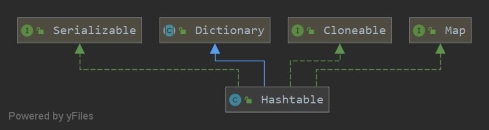
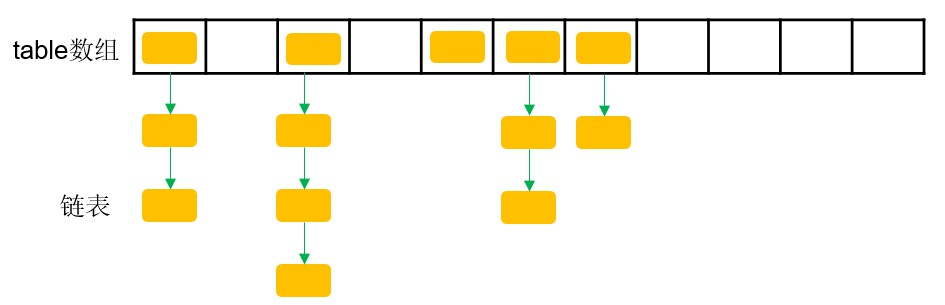

基于 JDK 1.8 的 **Hashtable** 类的源码阅读笔记，重点如下：

- Hashtable 底层结构及头插法和扩容原理。
- 获取键、值的枚举器或迭代器，以及获取键值对的迭代器。

<!--more-->

#### 1. Hashtable 的概述

Hashtable 类的类继承关系如下图，它继承自抽象类 Dictionary，实现了 Map、Cloneable 和 Serializable 接口。Hashtable 和 HashMap 都是散列表，被用来存储键值对。Hashtable 不允许键或值为 null ，而 HashMap 允许键或值为 null。




#### 2. 字段与构造方法

##### 2.1 字段与构造方法

```java
private transient Entry<?,?>[] table; // 数组，即桶
private transient int count; // 总记录数
private int threshold; // rehash操作的阈值
private float loadFactor; // 负载因子
private transient int modCount = 0; // 结构化修改次数
private static final int MAX_ARRAY_SIZE = Integer.MAX_VALUE - 8; // 最大容量

// 枚举或迭代器类型
private static final int KEYS = 0;
private static final int VALUES = 1;
private static final int ENTRIES = 2;

// 视图实例
private transient volatile Set<K> keySet; // 键的Set视图对象
private transient volatile Set<Map.Entry<K,V>> entrySet; // 键值对映射的Set视图对象
private transient volatile Collection<V> values; // 值的Collection视图对象

public Hashtable() // 创建一个空的哈希表，初始容量为11，负载因子为0.75
public Hashtable(int initialCapacity) // 指定初始容量
public Hashtable(int initialCapacity, float loadFactor) // 指定初始容量和负载因子
public Hashtable(Map<? extends K,? extends V> t)
```


##### 2.2 底层数据结构

Hashtable 的底层数据结构是：数组 + 链表，如下图所示：



保存键值对的 Entry 节点实现类如下：

```java
private static class Entry<K,V> implements Map.Entry<K,V> {
    final int hash;
    final K key;
    V value;
    Entry<K,V> next;

    protected Entry(int hash, K key, V value, Entry<K,V> next) {
        this.hash = hash;
        this.key =  key;
        this.value = value;
        this.next = next;
    }
    
    // 获取Entry对象的哈希值
    public int hashCode() {
        return hash ^ Objects.hashCode(value);
    }
}
```


##### 2.3 初始化过程

一般地，通过调用空参构造函数以获取 Hashtable 对象。

```java
public Hashtable() {
    this(11, 0.75f); // 默认的初始容量为11，负载因子为0.75
}

public Hashtable(int initialCapacity, float loadFactor) {
    // 初始容量不能为负数
    if (initialCapacity < 0)
        throw new IllegalArgumentException("Illegal Capacity: "+ initialCapacity);
    // 负载因子必须为整数
    if (loadFactor <= 0 || Float.isNaN(loadFactor))
        throw new IllegalArgumentException("Illegal Load: "+loadFactor);
	// 如果传入的初始容量为0，则将其设为1
    if (initialCapacity==0)
        initialCapacity = 1;
    this.loadFactor = loadFactor;
    table = new Entry<?,?>[initialCapacity]; // 新建table数组
    // 计算rehash操作的阈值
    threshold = (int)Math.min(initialCapacity * loadFactor, MAX_ARRAY_SIZE + 1);
}
```


#### 3. 常用方法

```java
public V put(K key, V value) // 将值映射至哈希表中指定的键
protected void rehash()
public boolean containsKey(Object key) // 判断哈希表中是否含有指定的键
public boolean contains(Object value) // 判断哈希表中是否含有指定的值
public V remove(Object key) // 从哈希表中移除指定的键（及值）
public void clear() // 清空
public Enumeration<K> keys() // 获取哈希表中键的枚举
public Enumeration<V> elements() // 获取哈希表中值的枚举
public Set<K> keySet() // 返回键的Set视图
public Set<Map.Entry<K,V>> entrySet() // 返回键值对映射的Set视图
public Collection<V> values() // 返回值的Collection视图
```

##### 3.1 put(K key, V value) 方法

覆盖旧值或以**头插法**插入新节点。

Hashtable 中计算索引的方式与 HashMap 有所不同。考虑到 `int hash = key.hashCode()` 计算得到的 `hash` 值可能为**负数**，首先将其与 `0x7FFFFFFF`（最高位为0、剩下31位为1）做**与运算**，随后对数组 `table` 长度取模。

在 HashMap 中，首先对计算得到的 `hash` 与其高 `16` 位做异或运算，随后通过 `( table.length - 1 ) & hash` 计算索引。

```java
public synchronized V put(K key, V value) {
    // 值不能为null
    if (value == null) {
        throw new NullPointerException();
    }

    Entry<?,?> tab[] = table;
    // 调用Object基类的本地hashCode方法计算哈希值。若key为null，则抛出异常
    int hash = key.hashCode();
    // 计算数组中索引
    int index = (hash & 0x7FFFFFFF) % tab.length;
    @SuppressWarnings("unchecked")
    // 遍历链表，如果键已存在则更新值，并返回旧值
    Entry<K,V> entry = (Entry<K,V>)tab[index];
    for(; entry != null ; entry = entry.next) {
        if ((entry.hash == hash) && entry.key.equals(key)) {
            V old = entry.value;
            entry.value = value;
            return old;
        }
    }
	// 如果键不存在，调用私有的addEntry方法插入新的键值对
    addEntry(hash, key, value, index);
    return null;
}
```

*调用私有方法 addEntry*

```java
private void addEntry(int hash, K key, V value, int index) {
    modCount++;

    Entry<?,?> tab[] = table;
    if (count >= threshold) {
        rehash(); // 调用rehash方法扩容
        tab = table;
        hash = key.hashCode();
        index = (hash & 0x7FFFFFFF) % tab.length; // 计算索引
    }

    @SuppressWarnings("unchecked")
    // 以头插法形式插入新节点
    Entry<K,V> e = (Entry<K,V>) tab[index];
    tab[index] = new Entry<>(hash, key, value, e);
    count++;
}
```

------

##### 3.2 rehash() 方法

当哈希表总记录数达到 rehash 操作的阈值，即 `count >= threshold` 时，执行 rehash 操作。

- 首先根据 `newCapacity = (oldCapacity << 1) + 1` 计算新数组长度。考虑到计算得到的 `newCapacity` 可能溢出或达到 `MAX_ARRAY_SIZE`，这时将 `newCapacity` 直接置为`MAX_ARRAY_SIZE`。
- 重新计算所有节点的索引，以**头插法**形式插入新数组中。

```java
protected void rehash() {
    int oldCapacity = table.length; // 旧数组长度
    Entry<?,?>[] oldMap = table;
    
    int newCapacity = (oldCapacity << 1) + 1; // 新数组长度为旧数组长度的2倍再加1
    // 若newCapacity溢出，或不小于MAX_ARRAY_SIZE
    if (newCapacity - MAX_ARRAY_SIZE > 0) {
        // 若旧数组长度已经等于MAX_ARRAY_SIZE，直接终止rehash操作并返回
        if (oldCapacity == MAX_ARRAY_SIZE)
            return;
        newCapacity = MAX_ARRAY_SIZE; // 否则，将MAX_ARRAY_SIZE赋予新数组
    }
    Entry<?,?>[] newMap = new Entry<?,?>[newCapacity];

    modCount++;
    threshold = (int)Math.min(newCapacity * loadFactor, MAX_ARRAY_SIZE + 1);
    table = newMap;

    // 重新计算所有节点的索引，以头插法形式插入新数组中
    for (int i = oldCapacity ; i-- > 0 ;) {
        // 从旧数组链表头节点开始遍历
        for (Entry<K,V> old = (Entry<K,V>)oldMap[i] ; old != null ; ) {
            Entry<K,V> e = old;
            old = old.next;
            int index = (e.hash & 0x7FFFFFFF) % newCapacity; // 重新计算索引
            e.next = (Entry<K,V>)newMap[index]; // 头插法
            newMap[index] = e;
        }
    }
}
```

------

##### 3.3 containsKey(Object key) 方法

判断哈希表中是否含有指定的键，返回判断结果。若 `key == null`，抛出 NullPointerException。

```java
public synchronized boolean containsKey(Object key) {
    Entry<?,?> tab[] = table;
    // 调用Object基类的本地hashCode方法计算哈希值。若key为null，则抛出异常
    int hash = key.hashCode();
    // 根据哈希值计算索引
    int index = (hash & 0x7FFFFFFF) % tab.length;
    for (Entry<?,?> e = tab[index] ; e != null ; e = e.next) {
        // 判断键是否相同
        if ((e.hash == hash) && e.key.equals(key)) {
            return true;
        }
    }
    return false;
}
```

------

##### 3.4 contains(Object value) 方法

containsValue(Object value) 方法与 contains(Object value) 方法在功能实现上是等效的。

最坏情况下，contains 方法需要遍历所有节点。此方法时间复杂度高于 containsKey 方法。

```java
public synchronized boolean contains(Object value) {
    if (value == null) {
        throw new NullPointerException();
    }

    Entry<?,?> tab[] = table;
    // 从数组尾部开始，从链表头部开始，遍历查找
    for (int i = tab.length ; i-- > 0 ;) {
        for (Entry<?,?> e = tab[i] ; e != null ; e = e.next) {
            if (e.value.equals(value)) {
                return true;
            }
        }
    }
    return false;
}
```

------

##### 3.5 remove(Object key) 方法

试图移除指定的键及其对应的值。若指定的键存在，则返回对应的值；否则返回 null。若 `key == null`，则抛出 NullPointerException。

```java
public synchronized V remove(Object key) {
    Entry<?,?> tab[] = table;
    int hash = key.hashCode();
    int index = (hash & 0x7FFFFFFF) % tab.length;
    
    @SuppressWarnings("unchecked")
    Entry<K,V> e = (Entry<K,V>)tab[index];
    for(Entry<K,V> prev = null ; e != null ; prev = e, e = e.next) {
        if ((e.hash == hash) && e.key.equals(key)) {
            modCount++;
            // 借助前驱节点prev，快速移除指定节点
            if (prev != null) {
                prev.next = e.next;
            } else {
                tab[index] = e.next;
            }
            count--;
            V oldValue = e.value;
            e.value = null; // 便于GC回收
            return oldValue;
        }
    }
    return null;
}
```

------

##### 3.6 clear() 方法

```java
public synchronized void clear() {
    Entry<?,?> tab[] = table;
    modCount++;
    for (int index = tab.length; --index >= 0; )
        tab[index] = null; // 清除所有桶中的头节点
    count = 0;
}
```

------

##### 3.7 keys() 方法

```java
public synchronized Enumeration<K> keys() {
    return this.<K>getEnumeration(KEYS);
}
```

*调用私有的 getEnumeration 方法*

```java
private <T> Enumeration<T> getEnumeration(int type) {
    if (count == 0) {
        return Collections.emptyEnumeration();
    } else {
        return new Enumerator<>(type, false); // 实例化枚举对象（此私有内部类源码见4.1节）
    }
}
```

------

##### 3.8 elements() 方法

类似于 Enumeration<K> keys() 方法，只是将形参由 `KEYS` 改为 `VALUES`。

```java
public synchronized Enumeration<V> elements() {
    return this.<V>getEnumeration(VALUES);
}
```

------

##### 3.9 keySet() 方法

若变量 `keySet` 为空，调用工具类 Collections 的 synchronizedSet() 方法获取**线程安全的集合对象**。

```java
public Set<K> keySet() {
    // 首先判断变量keySet是否为空
    if (keySet == null)
        keySet = Collections.synchronizedSet(new KeySet(), this);
    return keySet; // 变量keySet不为空，直接返回
}
```

------

##### 3.10 entrySet() 方法

若变量 `entrySet` 为空，调用工具类 Collections 的 synchronizedSet() 方法获取**线程安全的集合对象**。

```java
public Set<Map.Entry<K,V>> entrySet() {
    if (entrySet==null)
        entrySet = Collections.synchronizedSet(new EntrySet(), this);
    return entrySet;
}
```

------

##### 3.11 values() 方法

若变量 `values` 为空，调用工具类 Collections 的 synchronizedCollection 方法获取**线程安全的集合对象**。

```java
public Collection<V> values() {
    if (values==null)
        values = Collections.synchronizedCollection(new ValueCollection(), this);
    return values;
}
```


#### 4. 内部类

##### 4.1 Enumerator

Enumerator 是哈希表枚举器类，同时实现 Enumeration 和 Iterator 接口。

```java
private class Enumerator<T> implements Enumeration<T>, Iterator<T> {
    Entry<?,?>[] table = Hashtable.this.table; // Hashtable.this.table表示当前Hashtable实例的table数组对象
    int index = table.length;
    Entry<?,?> entry;
    Entry<?,?> lastReturned;
    int type; // 类型变量(T)，0--key, 1--value, 2--entry

    // 标识实例化枚举器还是迭代器，true表示迭代器，false表示枚举器
    boolean iterator;
	// 用于迭代器，不用于枚举器
    protected int expectedModCount = modCount;

    Enumerator(int type, boolean iterator) {
        this.type = type;
        this.iterator = iterator;
    }
}
```

接下来看 Enumerator 类提供的方法

（1）hasMoreElements & hasNext

实现 Enumeration 接口的 hasMoreElements 方法。

```java
public boolean hasMoreElements() {
    Entry<?,?> e = entry;
    int i = index;
    Entry<?,?>[] t = table;
    // 从索引高位开始向低位遍历，寻找首个非空的桶
    while (e == null && i > 0) {
        e = t[--i];
    }
    entry = e;
    index = i;
    return e != null;
}
```

迭代器 Iterator 使用的 hasNext 方法。

```java
public boolean hasNext() {
    return hasMoreElements();
}
```

（2）nextElement & next

实现 Enumeration 接口的 nextElement 方法。需要注意的是，**枚举器的 nextElement 方法在遍历过程中不需要判断** `Hashtable` **是否发生结构化修改，而迭代器的 next 方法需要先判断** `modCount != expectedModCount`。

```java
public T nextElement() {
    Entry<?,?> et = entry;
    int i = index;
    Entry<?,?>[] t = table;
    /* Use locals for faster loop iteration */
    while (et == null && i > 0) {
        et = t[--i];
    }
    entry = et;
    index = i;
    if (et != null) {
        // 将节点entry地址赋予变量e和lastReturned
        Entry<?,?> e = lastReturned = entry;
        entry = e.next;
        // 根据类型，判断返回是key还是value
        return type == KEYS ? (T)e.key : (type == VALUES ? (T)e.value : (T)e);
    }
    throw new NoSuchElementException("Hashtable Enumerator");
}
```

迭代器 Iterator 使用的 next 方法。

```java
public T next() {
    if (modCount != expectedModCount)
        throw new ConcurrentModificationException();
    return nextElement();
}
```

***代码验证***

获取枚举器后，在遍历过程中删除集合中的键值对，程序正常执行，成功删除指定键值对。

```java
import java.util.*;
public class Main {
    public static void main(String[] args) {
        Hashtable<Integer, Integer> hashtable = new Hashtable<>();
        for(int i = 0; i < 10; i++){
            hashtable.put(i, (int) Math.pow(i, 2));
        }
        Enumeration<Integer> enumeration = hashtable.keys();
        while(enumeration.hasMoreElements()){
            System.out.print(hashtable.get(enumeration.nextElement()) + " ");
            hashtable.remove(Integer.valueOf(1));
        }
    }
}
```

获取迭代器后，在遍历过程中删除集合中的键值对，抛出 `ConcurrentModificationException`。

```java
import java.util.*;
public class Main {
    public static void main(String[] args) {
        Hashtable<Integer, Integer> hashtable = new Hashtable<>();
        for(int i = 0; i < 10; i++){
            hashtable.put(i, (int) Math.pow(i, 2));
        }
        Iterator<Integer> itr = (Iterator<Integer>) hashtable.keys();
        while(itr.hasNext()){
            System.out.print(hashtable.get(itr.next()));
            hashtable.remove(Integer.valueOf(1));
        }
    }
}
```

（3）remove

迭代器 Iterator 使用的 remove 方法，枚举器无此方法！

remove 方法通过 synchronized 关键字对删除节点的代码块进行加锁，锁对象是当前 `Hashtable` 实例。此方法删除的是**刚访问过的节点**。

```java
public void remove() {
    // 判断是否是迭代器类型
    if (!iterator)
        throw new UnsupportedOperationException();
    if (lastReturned == null)
        throw new IllegalStateException("Hashtable Enumerator");
    if (modCount != expectedModCount)
        throw new ConcurrentModificationException();
	// 锁对象是当前Hashtable实例
    synchronized(Hashtable.this) {
        Entry<?,?>[] tab = Hashtable.this.table;
        int index = (lastReturned.hash & 0x7FFFFFFF) % tab.length;

        @SuppressWarnings("unchecked")
        Entry<K,V> e = (Entry<K,V>)tab[index];
        for(Entry<K,V> prev = null; e != null; prev = e, e = e.next) {
            if (e == lastReturned) { // 定位至刚访问过的节点
                modCount++;
                expectedModCount++;
                if (prev == null)
                    tab[index] = e.next;
                else
                    prev.next = e.next;
                count--;
                lastReturned = null;
                return;
            }
        }
        throw new ConcurrentModificationException();
    }
}
```


##### 4.2 KeySet

键的 Set 集合

```java
private class KeySet extends AbstractSet<K> {
    public Iterator<K> iterator() {
        return getIterator(KEYS); // fast-fail
    }
    public int size() {
        return count;
    }
    public boolean contains(Object o) {
        return containsKey(o);
    }
    public boolean remove(Object o) {
        return Hashtable.this.remove(o) != null;
    }
    public void clear() {
        Hashtable.this.clear();
    }
}
```


##### 4.3 EntrySet

键值对映射的 Set 集合

```java
private class EntrySet extends AbstractSet<Map.Entry<K,V>> {
    public Iterator<Map.Entry<K,V>> iterator() {
        return getIterator(ENTRIES);
    }

    public boolean add(Map.Entry<K,V> o) {
        return super.add(o);
    }
	......
}
```


##### 4.4 ValueCollection

值的集合

```java
private class ValueCollection extends AbstractCollection<V> {
    public Iterator<V> iterator() {
        return getIterator(VALUES);
    }
    public int size() {
        return count;
    }
    public boolean contains(Object o) {
        return containsValue(o);
    }
    public void clear() {
        Hashtable.this.clear();
    }
}
```


#### 5. 总结

- Hashtable 不允许键或值为 null。
- Hashtable 底层结构是**数组 + 链表**。
- Hashtable 不保证有序。
- Hashtable 以**头插法**插入新节点，HashMap 以尾插法插入新节点。
- Hashtable 的扩容机制：新的 `table` 数组长度是原数组长度的 2 倍且加 1，并核算其是否溢出或大于 `Integer.MAX_VALUE - 8`，若是则将新数组长度设为 `Integer.MAX_VALUE - 8`。随后重新计算每一个节点的位置，以头插形式插入新的数组中。
- Hashtable 是同步的，对外提供的方法均通过**关键字 synchronized 加锁**。如果不需要线程安全的实现，建议使用 HashMap 替代 Hashtable。如果需要线程安全的高度并发实现，建议使用 ConcurrentHashMap 替代 Hashtable。**因为 Hashtable 类中的锁对象是当前实例对象，锁粒度大于 ConcurrentHashMap**，显然后者的并发性要高于前者。
- keys() 和 elements() 方法返回的枚举器 Enumeration 不是快速失败的，而 keySet()、entrySet() 和 values() 返回的集合的迭代器方法返回的迭代器都是快速失败的，且后三种方法均是调用工具类 Collections 的静态方法获取线程安全的集合对象。