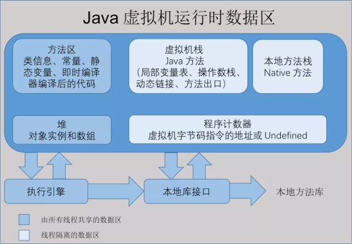
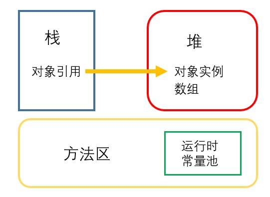
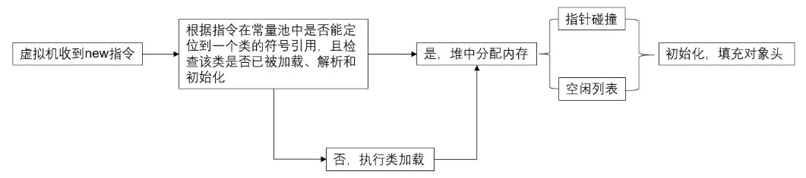
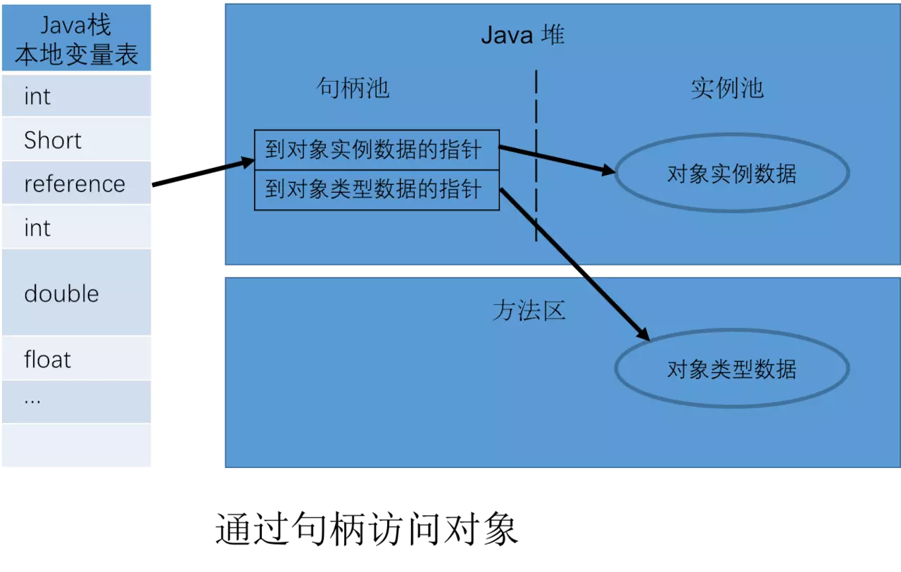
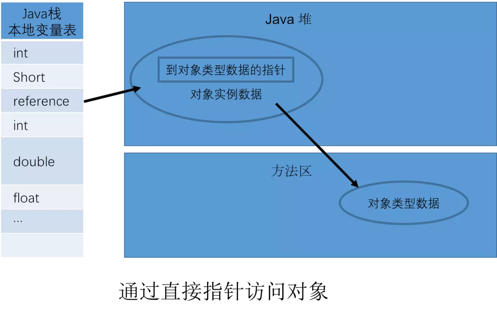
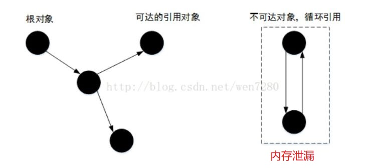
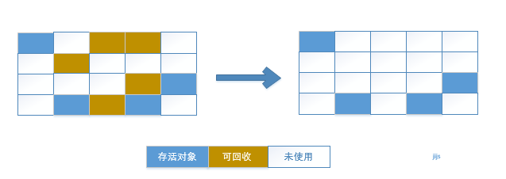
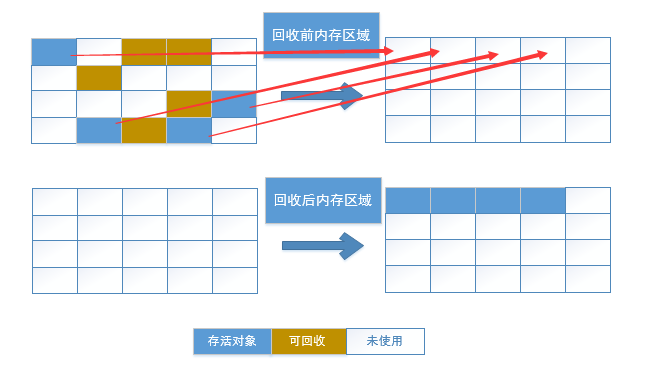
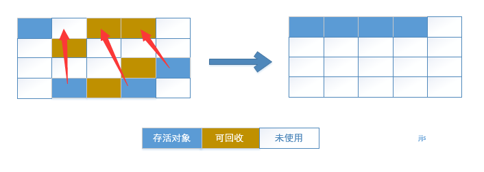
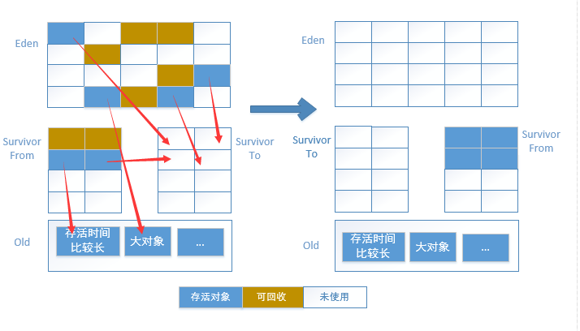

​		前段时间阅读了《深入理解Java虚拟机》一书，显然看完就忘。正好搭建了个人博客，记录自己的复习之路，也是成长之路。

Fighting！！！

<!--more-->

 **一、内存管理机制**

​		Java内存区域图示如下：

> 值得注意的是：**Java虚拟机栈（Java Virtual Machine Stacks）**、**堆（Heap）**、**方法区（Method Area）**：
>
> - 虚拟机栈主要与方法调用相关，存储的局部变量表中保存**对象引用**
> - 堆：存放所有的对象实例
> - 方法区：与编译相关，存储虚拟机加载的类信息、**静态变量**、常量等
> - 运行时常量池：编译生成的字面量和符号引用

2、HotSpot虚拟机新建对象过程

​		以常见的HotSpot为例，介绍其新建普通 Java对象的过程。

> （1）在堆中分配内存的两种方式：
>
> > 指针碰撞：内存区域规整（未使用区域与已使用区域分界）时，仅需要移动指针。
> >
> > 空闲列表：因内存区域杂乱无章，虚拟机维持记录可用内存区域的表。
>
> （2）如何保证分配内存时线程安全**？
>
> > （1）同步机制，CAS + 失败重试；
> >
> > （2）**每个线程**单独预分配一块内存区域，称之为**本地线程分配缓冲（TLAB）**。
>
> （3）对象的内存布局
>
> > （1）对象头：保存运行时数据，如哈希码、GC分代年龄等；另一部分保存指向类元数据的**类型指针**；
> >
> > （2）实例数据部分；
> >
> > （3）填充位；

**3、对象的访问方式**

​		访问对象的途径主要是通过句柄和直接访问。

> **对象类型数据**是指该实例所属的类
>
> 查找对象的元数据信息未经过对象本身
>
> 优点：垃圾收集需要调整对象所在内存地址时，不影响reference；

> 查找对象的元数据信息须经过对象本身
>
> 优点：访问速度快

**二、回收内存**

​		在 JVM中，虚拟机栈、本地方法栈和程序计数器属于线程私有，随线程结束而释放内存。JVM中的GC关注的是**方法区**和**堆**。

1、回收堆

（1）如何判断对象内存可回收？

​		**可达性分析算法**：根搜索方法，通过一些“GC Roots”对象作为起点，从这些节点开始往下搜索，搜索通过的路径成为引用链（ReferenceChain）。

​	Java中可作为GC Roots的四种对象：

> 虚拟机栈的本地变量表中引用的对象
>
> 方法区类静态属性引用的对象
>
> 方法区常量引用的对象
>
> 本地方法栈Native方法引用的对象

（2）经可达性分析后，可回收对象就一定会被回收？

> 经可达性分析后，被定为可回收的对象须经历**两次标记**方能被GC回收内存。
>
> > 重点：finalize()方法

（3）JVM为什么不采用经典的**引用计数**算法来判断对象是否可回收？

​		引用计数算法实现简单，但面临一个重要缺陷：

> 当两个对象互相引用（循环引用）时，相应的内存区域无法被回收，导致**内存泄漏**

（4）引用分类（是否回收被引用对象所在的内存区域）

> 强引用：new出来的对象引用关系，不会回收；
>
> 软引用：有用、非必需，在内存溢出前进行二次回收；
>
> 弱引用：生存至下一次GC工作前，一旦GC开始回收内存，则直接回收其对象；
>
> 虚引用：无法通过虚引用取得对象，仅能在此对象被回收时通知系统。

 2、回收方法区

​	方法区待回收的内容主要为：废弃常量 和 无用的类。

（1）废弃常量

​		当常量池中的常量不被任何对象引用时，则可以清理出常量池。

（2）无用的类

无用的类须满足下述三个条件 ：

><1> Java堆中该类所有的实例均已被回收；
><2> 该类的加载器ClassLoader已被回收；
><3> 无法通过反射机制访问该类的方法。

**三、回收算法**

​		JVM 针对 Java堆 采用的回收算法主要分为：**标记-清除算法、复制算法和标记-整理算法**；采用的策略为：分代收集算法，即新生代采用复制算法，老年代采用标记-清除算法和标记-整理算法

1、算法

（1）标记-清除（Mark-Sweep）算法

​		在标记阶段，由**根节点开始经可达性分析**，标记所有从根节点开始的可达对象，因此未被标记的对象就是未被引用的垃圾对象；

​		在清除阶段，清除所有未被标记的对象。

> 特点：
>
> > 将循环引用标记为不可达，解决了引用计数算法无法处理循环引用的问题
>
> 缺点:
>
> > 1、效率低
> >
> > 2、易导致内存区域不规整（即大量不连续的内存碎片）

（2）复制（Copying）算法

​		内存对半分，先使用一半，需要清理时先将存活对象转移至保留内存区域，随后全部回收刚使用过的一半内存。

​		**适用于新生代**中对象存活率低、可回收对象比例高的场景。

> 优点：
>
> > 1、无内存碎片
> >
> > 2、效率高
>
> 缺点：
>
> > 1、实际使用内存仅占一半，浪费资源
> >
> > 2、当对象存活率高时，需要较为频繁的复制操作，效率降低

（3）标记-整理（Mark-Compact）算法

​		针对老年代中对象存活率高，若使用复制算法，则效率低。

​		标记-整理算法（或标记-压缩算法）核心在于：标记完成后，将“分散”的存活对象移动至“端集中”区域，随后清理其端边界以外的内存。

> 优点
>
> > 1、适用于对象存活率高的场景
> >
> > 2、无内存碎片
>
> 缺点：标记、整理过程代价高昂

（4）分代收集（Generational Collection）算法

​		将 Java堆分为**新生代**和**老年代**

> 新生代：对象存活率低，垃圾多；
>
> 老年代：对象存活率高，垃圾少。

​		基于上述算法的优缺点，分代收集的策略是：*对新生代采用复制算法，对老年代采用标记-清除或标记-整理算法* 。

​		在新生代中，分为：较大的**Eden空间**和两块较小的**Survivor空间**。

> （1）在新生代中，先使用Eden和一块Survivor区域，另一Survivor区域保留，其空间比例一般为8：1：1；
>
> （2）回收时，Eden和Survivor(From)中**存活时间长和大对象直接进入老年代**，其余存活对象进入Survivor(To)区域；
>
> （3）当Survivor(To)区域空间不足时，利用**分配担保机制**，非存活时间长或大对象的存活对象同样被放入老年代中；
>
> （4）清理Eden和Survivor(From)。

2、HotSpot 的算法实现

（1）在可达性分析算法中，如何快速、精确地找出（枚举）根节点（GC Roots）？

> 精确：GC进行时停止所有 Java线程，确保分析时引用关系不再变化；
>
> 速度：OopMap（Ordinary Object Pointer Map）普通对象指针的Map数据结构，保存对象引用信息。

------

> 参考资料
>
> 1. 《深入理解Java虚拟机》周志明 著
> 2. https://blog.csdn.net/qq_41701956/article/details/81664921
> 3. https://blog.csdn.net/wen7280/article/details/54428387
> 4. https://www.jianshu.com/p/114bf4d9e59e