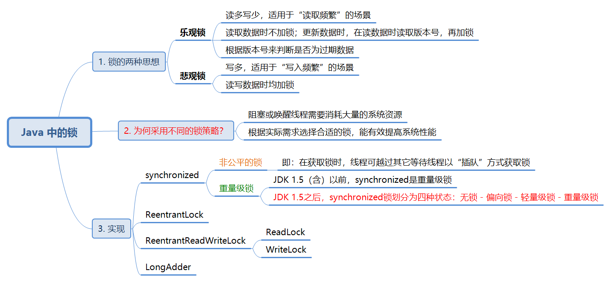

学习、理解多线程与Java并发。笔记主要基于《Java并发编程实战》一书，并结合部分优秀的文章。

<!--more-->

多线程

- 优点：多线程程序提高了资源利用效率；

- 并发安全性问题：多个线程共享进程的部分资源，对于这些共享变量的访问操作可能出现并发异常；

  > 解决途径：Java提供的同步机制

- 活跃性问题：线程陷入死循环，影响后序代码的执行；

- 性能消耗问题。


### 一、基础知识

重要概念：

- 状态访问操作：任何可能影响对象外部可见行为的操作；
- 共享：多个线程可同时访问；
- 可变：变量值可变。


#### 1. 安全性问题

##### 1.1 线程安全

（1）简单描述线程安全

> 当多个线程访问某个类时，该类始终表现出正确的行为，则该类是线程安全的。


（2）无状态对象是线程安全的

> 无状态对象：不包含任何域和对其它类中域的引用，在操作过程中不保存数据，是不变的类，线程安全。

```java
public class StatelessClass{
	// 不含域，即无成员变量（实例变量和类变量）及局部变量
    private int a; // Instance Variable(non-static variable)，实例变量，不含
    private static int b; // Class Variable(static variable)，类变量，不含
  	public void function() {
		int c = 10; // Local Variable，局部变量，不含
	}
}

// 无状态的对象示例 -- Servlet
@ThreadSafe
public class StatelessFactorizer implements Servlet{
    public void service(ServletRequest req, ServletResponse res){
        // 执行过程中，仅由线程独享的栈中保存临时数据，因而是线程安全的
        BigInteger i = extractFromRequest(req);
        BigInteger[] factors = factor(i);
        encodeIntoResponse(res, factors);
    }
}
```


##### 1.2 竞态条件（Race Condition）

（1）什么是竞态条件？

并发编程中，由于不恰当的执行时序而出现不正确的结果。

> 当两个线程竞争同一资源时，如果对资源的访问顺序敏感，就称存在竞态条件。


（2）常见的竞态条件类型

1. 先检查后执行（Check-Then-Act）：通过一个可能失效的观测结果来决定下一步的动作。

```java
@NotThreadSafe
public class LazyInitRace{
    Private ExpensiveObject instance = null;
    
    public LazyInitRace getInstance(){
        if(instance==null){
            instance = new ExpensiveObject();
        }
        return instance;
    }
}
```

对于示例 **延迟初始化** 类，两个线程交替执行过程中，可能均观测到 `instance==null`，于是分别实例化新的`ExpensiveObject` 对象，造成 `getInstance()` 方法返回不同的实例，这是异常情况。


2. 读取 - 修改 - 写入：非原子性的操作造成并发异常

```java
@NotThreadSafe
public class Demo{
    private int count = 0; // 访问计数器，线程每访问一次，加1
    ...
    count++; // count++是非原子性的操作，它包括：读取旧值、修改值、写入新值 这三个操作
    ...
}
```

两个线程交替执行时，`count++` 操作是 **非原子性** 的，最终两个线程分别执行完 `count++` 操作后得到的 `count` 是相同的，显然这出现了并发异常。


（3）对于竞态条件，如何保证并发安全性？


#### 2. 多线程的安全性

> 安全的多线程并发应保证原子性、可见性和有序性

##### 2.1 原子性、可见性和有序性

（1）原子性：对于单个或者多个操作，要么全部执行且不会被中断，要么都不执行。

> Atomic包、synchronized关键字、Lock接口

（2）可见性：对于共享的可变变量，当一个线程修改了它，其它线程能立即看到变化。

> 关键字 synchronized、volatile 和 final，Lock接口

（3）有序性: 

> happens-before原则

- 程序的执行顺序与代码顺序相同；
- JVM在实际执行时会发生 *指令重排序* ；
- 重排序对单线程程序无影响，对多线程程序可能会造成并发异常！


##### 2.2 如何保证可见性？


#### 3. Java 的同步机制

> 同步以保证线程安全。Java提供关键字**synchronized（内置锁）** 和 **Lock接口** 这两种机制实现同步。关键字**volatile** 仅保证可见性，不保证原子性。

##### 3.1 多线程并发异常演示

（1）Bank类模拟银行账户存取操作，其中未对相应的方法进行同步，使其面临并发异常的风险。

```java
/**
 * 模拟多线程并发操作银行账户，Bank类实现了取钱和存钱操作。
 * 注意：在实际应用中，涉及金融数字时不应采用任何基本数据类型，而应使用BigDecimal类。
 * @date 2020-02-17
 * @author Merlin
 */
public class Bank {

	private int count; // 账户余额
	
	public Bank(int initMoney) {
		this.count = initMoney;
		System.out.println("当前账户初始金额为 "+initMoney+" 元");
	}
	
	// 取钱操作
	public void subMoney(int money) {
		if(count < money) {
			throw new RuntimeException("当前账户余额不足"); // 当前账户余额不足时，抛出异常
		}
		count -= money;
		System.out.println(Thread.currentThread().getName()+" 支取 "+money+" 元，余额为 "+count+" 元");
	}
	
	// 存钱操作
	public void addMoney(int money) {
		count += money;
		System.out.println(Thread.currentThread().getName()+" 存入 "+money+" 元，余额为 "+count+" 元");
	}
	
}
```

（2）两个线程分别对同一个Bank实例进行反复地存、取。

```java
/**
 * TestBank类，演示在无同步前提下，多个线程并发地对Bank类实例
 * 进行操作是否会出现并发异常。
 * @date 2020-02-17
 * @author Merlin
 */
public class TestBank {
	
	public static void main(String[] args) {
		Bank bank = new Bank(1000);
		
		// 存钱线程
		Thread addThread = new Thread(new Runnable() {
			@Override
			public void run() {
				while(true) {
					try {
						Thread.sleep(500);
					}catch (Exception e) {
						e.printStackTrace();
					}
					bank.addMoney(300);
					System.out.println("***************************************");
				}
			}
		});
		
		// 取钱线程
		Thread subThread = new Thread(new Runnable() {
			@Override
			public void run() {
				while(true) {
					try {
						Thread.sleep(500);
					}catch (Exception e) {
						e.printStackTrace();
					}
					bank.subMoney(500);
					System.out.println("***************************************");
				}
			}
		});
		
		addThread.start();
		subThread.start();
	}
	
}
```

（3）随机试验结果

```
当前账户初始金额为 1000 元
Thread-0 存入 300 元，余额为 800 元
***************************************
Thread-1 支取 500 元，余额为 800 元
***************************************
Thread-0 存入 300 元，余额为 300 元
***************************************
Thread-1 支取 500 元，余额为 300 元
***************************************
Thread-0 存入 300 元，余额为 600 元
***************************************
Exception in thread "Thread-1" java.lang.RuntimeException: 当前账户余额不足
	at javasynchronization.Bank.subMoney(Bank.java:20)
	at javasynchronization.UnsafeThread$2.run(UnsafeThread.java:39)
	at java.lang.Thread.run(Thread.java:748)
Thread-0 存入 300 元，余额为 900 元
***************************************
Thread-0 存入 300 元，余额为 1200 元
***************************************
Thread-0 存入 300 元，余额为 1500 元
***************************************
```

> 结合第2行和第4行可知，并发出现异常：存入300元后余额应为1300元；在1300元的基础上支取500元恰好剩余800元。
>
> 第12行显示，支取线程因异常而中断，此后为单线程（存钱）操作，不存在并发风险。


##### 3.2 synchronized 修饰的同步方法【内置锁】

> 关键字 synchronized，Java 所有对象都有一个内置锁，重量级锁。

（1）SynchronizedBank类，通过**synchronized**实现线程安全。

```java
/**
 * SynchronizedBank类，模拟银行账户的存取操作，是线程安全的类。
 * 关键字synchronized对subMoney和addMoney方法进行修饰，即利用
 * Java内置锁对上述方法进行加锁，以实现复合操作的原子性，保证线程
 * 安全。
 * @date 2020-02-17
 * @author Merlin
 */
public class SynchronizedBank {

	private int count; // 账户余额
	
	public SynchronizedBank(int initMoney) {
		this.count = initMoney;
		System.out.println("当前账户初始金额为 "+initMoney+" 元");
	}
	
	// 取钱操作
	public synchronized void subMoney(int money) {
		if(count < money) {
			throw new RuntimeException("当前账户余额不足"); // 当前账户余额不足时，抛出异常
		}
		count -= money;
		System.out.println(Thread.currentThread().getName()+" 支取 "+money+" 元，余额为 "+count+" 元");
	}
	
	// 存钱操作
	public synchronized void addMoney(int money) {
		count += money;
		System.out.println(Thread.currentThread().getName()+" 存入 "+money+" 元，余额为 "+count+" 元");
	}
	
}
```

（2）随机试验结果（测试代码类似于3.1部分）

```
当前账户初始金额为 1000 元
Thread-0 存入 300 元，余额为 1300 元
***************************************
Thread-1 支取 500 元，余额为 800 元
***************************************
Thread-0 存入 300 元，余额为 1100 元
***************************************
Thread-1 支取 500 元，余额为 600 元
***************************************
Thread-0 存入 300 元，余额为 900 元
***************************************
Thread-1 支取 500 元，余额为 400 元
***************************************
```


##### 3.3 synchronized 同步代码块

> 与 synchronized 修饰的**同步方法**相比，**同步代码块**可**仅对涉及共享变量的操作语句进行加锁**。

（1）同步代码块示例（由于打印语句需要读取共享变量，故仍要纳入同步代码块中，造成误认为同步方法与同步代码块加锁区域是相同的！）

```java
/**
 * SynBloBank类，通过同步代码块避免并发风险。其与SynchronizedBank类中
 * synchronized关键字修饰的同步方法类似，只是同步代码块的同步范围更小（对
 * 影响并发安全性的语句进行同步）。
 * @date 2020-02-18
 * @author Merlin
 */
public class SynBloBank {

	private int count; // 账户余额
	
	public SynBloBank(int initMoney) {
		this.count = initMoney;
		System.out.println("当前账户初始金额为 "+initMoney+" 元");
	}
	
	// 取钱操作
	public void subMoney(int money) {
		// 同步代码块，锁对象是"this"，即调用此方法者
		synchronized (this) {
			if(count < money) {
				throw new RuntimeException("当前账户余额不足"); // 当前账户余额不足时，抛出异常
			}
			count -= money;
			System.out.println(Thread.currentThread().getName()+" 支取 "+money+" 元，余额为 "+count+" 元");
		}
	}
	
	// 存钱操作
	public void addMoney(int money) {
		synchronized (this) {
			count += money;
			System.out.println(Thread.currentThread().getName()+" 存入 "+money+" 元，余额为 "+count+" 元");
		}
		
	}
	
}
```

（2）随机试验结果

```
当前账户初始金额为 900 元
Thread-1 支取 500 元，余额为 400 元
***************************************
Thread-0 存入 300 元，余额为 700 元
***************************************
Thread-1 支取 500 元，余额为 200 元
***************************************
Thread-0 存入 300 元，余额为 500 元
***************************************
Thread-0 存入 300 元，余额为 800 元
***************************************
Thread-1 支取 500 元，余额为 300 元
***************************************
```

> 同步代码块：对有并发风险的操作语句进行加锁；
>
> 同步方法：对含有并发风险操作的方法进行加锁。


##### 3.4 ReentrantLock 【显示锁】

> ReentrantLock类实现Lock接口

（1）ReentrantLock加锁

```java
/**
 * LockBank类，线程安全类。
 * Lock接口定义了锁的操作（包括lock和unlock）。ReentrantLock类实现Lock接口，
 * 默认采用非公平的锁策略。
 * @date 2020-02-18
 * @author Merlin
 */
public class LockBank {
	
	private int count; // 账户余额
	private Lock lock = new ReentrantLock(); // 锁对象
	
	public LockBank(int initMoney) {
		this.count = initMoney;
		System.out.println("当前账户初始金额为 "+initMoney+" 元");
	}
	
	// 取钱操作
	public void subMoney(int money) {
		lock.lock(); // 加锁
		try {
			if(count < money) {
				throw new RuntimeException("当前账户余额不足"); // 当前账户余额不足时，抛出异常
			}
			count -= money;
			System.out.println(Thread.currentThread().getName()+" 支取 "+money+" 元，余额为 "+count+" 元");
		}finally {
			lock.unlock(); // 解锁
		}
	}
	
	// 存钱操作
	public void addMoney(int money) {
		lock.lock();
		try {
			count += money;
			System.out.println(Thread.currentThread().getName()+" 存入 "+money+" 元，余额为 "+count+" 元");
		}finally {
			lock.unlock();
		}
	}
	
}
```

（2）随机试验结果

```
当前账户初始金额为 8888 元
Thread-1 支取 500 元，余额为 8388 元
***************************************
Thread-0 存入 300 元，余额为 8688 元
***************************************
Thread-1 支取 500 元，余额为 8188 元
***************************************
Thread-0 存入 300 元，余额为 8488 元
***************************************
Thread-0 存入 300 元，余额为 8788 元
***************************************
Thread-1 支取 500 元，余额为 8288 元
***************************************
```


##### 3.5 关键字 volatile 【不行！】

> volatile 关键字可以**实现可见性**，但**无法保证原子性**。

（1）volatile 修饰成员变量

```java
/**
 * VolatileBank类，关键字volatile修饰成员变量count，保证
 * 可见性，但不能保证原子性。
 * @date 2020-02-18
 * @author Merlin
 */
public class VolatileBank {
	
	private volatile int count;
	
	public VolatileBank(int initMoney) {
		this.count = initMoney;
		System.out.println("当前账户初始金额为 "+initMoney+" 元");
	}
	
	// 取钱操作
	public void subMoney(int money) {
		if(count < money) {
			throw new RuntimeException("当前账户余额不足"); // 当前账户余额不足时，抛出异常
		}
		count -= money;
		System.out.println(Thread.currentThread().getName()+" 支取 "+money+" 元，余额为 "+count+" 元");
	}
	
	// 存钱操作
	public void addMoney(int money) {
		count += money;
		System.out.println(Thread.currentThread().getName()+" 存入 "+money+" 元，余额为 "+count+" 元");
	}
	
}
```

（2）随机试验结果

```
当前账户初始金额为 1500 元
Thread-0 存入 300 元，余额为 1800 元
***************************************
Thread-1 支取 500 元，余额为 1800 元
***************************************
Thread-1 支取 500 元，余额为 1600 元
***************************************
Thread-0 存入 300 元，余额为 1600 元
***************************************
Thread-1 支取 500 元，余额为 1400 元
***************************************
Thread-0 存入 300 元，余额为 1400 元
***************************************
```

> 随机测试结果表明：并发过程出现异常，即 *关键字 volatile 无法保证原子性！*


#### 4. Java 中的锁




##### 4.1 synchronized及锁升级过程

>JDK 1.5之后，synchronized锁被划分为四种状态：无锁 - 偏向锁 - 轻量级锁 - 重量级锁。

（1）Java普通对象的内存布局

（图源：https://blog.csdn.net/csdnnews/article/details/104471154/ & https://www.cnblogs.com/panning/p/10990502.html ）


（2）锁升级过程

Java锁升级过程（图源：https://blog.csdn.net/csdnnews/article/details/104471154/ ）


1. 无锁

   - 偏向锁标志位：0
   - 锁标志位：01

2. 偏向锁

   - 设定 -XX:BiasedLockingStartupDelay = 0，由默认轻量级锁改为偏向锁。
   - 偏向锁标志位：1
   - 锁标志位：01
   - **记录当前线程ID**

3. 轻量级锁

   - 锁标志位：00

   - 当**第二个线程**参与竞争偏向锁时，对象根据对象头markdown中记录的**线程ID**发现是新线程，**立即撤销偏向锁，升级为轻量级锁**。
   - 线程生成**LockRecord**保存在线程栈中。每个线程通过**CAS（自旋）**操作，试图将对象头中的**指向栈中锁记录的指针**记录为自己的LockRecord。成功则获取锁。

4. 重量级锁

   - 锁标志位：10
   - 锁竞争加剧（如线程自旋次数或自旋的线程数超过阈值），由轻量级锁升级为重量级锁。
   - 重量级锁开始切换用户态/内核态，开销较大。

##### 4.2 ReentrantLock

（暂无）

##### 4.3 ReentrantReadWriteLock

（暂无）

### 二、Java类库中的并发基础构建模块

#### 1. 同步容器类

- Vector
- Hashtable

同步容器类通过“封装状态，同步所有公有方法”使得每次只有一个线程可以访问容器的状态，以此实现线程安全。


##### 1.1 为什么要为同步容器类额外地进行客户端加锁？

> 客户端加锁：对于使用某个对象的客户端代码，通过对象本身用于保护其状态的锁来保护这段客户端代码。

*对于复合操作，同步容器类可能会出现并发异常，但这种异常并非是同步容器类被破坏导致的*

```java
// 同步容器类Vector，对其进行复合操作时可能会出现异常
public static Object getLast(Vector vector){
    int lastIndex = vector.siez()-1;
    return vector.get(lastIndex);
}

public static void deleteLast(Vector vector){
    int lastIndex = vector.size()-1;
    vector.remove(lastIndex);
}
```

当线程 `Thread_A` 和 `Thread_B` 并发地对 `Vector` 实例进行复合操作时，**无法破坏 vector 对象**，但从下图可以看出，对调用者 `Thread_A` 来说，出现异常。


```java
// 进行客户端加锁，以保证对同步容器类实例的复合操作是线程安全的
public static Object getLast(Vector vector){
    // 使用对象vector的锁来进行客户端加锁
    synchronized(vector){
        int lastIndex = vector.siez()-1;
   		return vector.get(lastIndex);
    }
}

public static void deleteLast(Vector vector){
    synchronized(vector){
        int lastIndex = vector.size()-1;
    	vector.remove(lastIndex);
    }
}
```


##### 1.2 对容器进行迭代操作是有并发风险的

```java
// 在迭代操作中，其它线程可能并发地修改容器，导致当前线程迭代出现异常
for (int i=0; i<vector.size(); i++){
    doSomething(vector.get(i));
}

// 客户端加锁
synchronized(vector){
    for (int i=0; i<vector.size(); i++){
    	doSomething(vector.get(i));
	}
}
```


##### 1.3 如何降低加锁带来的性能影响？

> 克隆容器，在**线程封闭**的副本上进行加锁、复合操作。


#### 2. 并发容器类

##### 2.1 并发容器类与同步容器类的比较

（1）同步容器类在执行每一个操作时均持有锁，虽保证了线程安全，但降低了并发性。

（2）多个线程竞争同步容器类的锁时，将严重降低系统吞吐量。

（3）并发容器类较同步容器类有更好地并发性能。


##### 2.2 以ConcurrentHashMap为例

（1）加锁策略 —— **分段锁（Lock Striping）**，细粒度的锁

- Hashtable（同步容器类）：执行每个操作时均持有锁，提供独占式访问；
- SynchronizedMap（同步且基于散列的Map，Collections类中定义的内部类）：独占式访问
- ConcurrentHashMap：不是将每个方法在同一个锁上同步，因此**不提供独占式访问**；多个线程可并发访问容器。

（2）分段锁策略的特性

- 多个读取线程可并发地访问容器；
- 多个写入线程可并发地修改容器；
- 读取线程和并发线程可并发地操作容器。

（3）ConcurrentHashMap的优势

- 并发环境下提高系统吞吐量；
- 迭代器不会抛出ConcurrentModificationException。


##### 2.3 ConcurrentHashMap结构及分段锁


如图所示，ConcurrentHashMap被分为多个片段（Segment），同时一个片段被分为多个HashEntry。

- Segment继承 `ReentrantLock` ，扮演锁的角色；
- HashEntry用于存储键值对数据（注意：ConcurrentHashMap中key和value均不得为null）；
- 修改HashEntry数组的数据时，线程必须**先获得对应的Segment锁**。


#### 3. 同步工具类

> 同步工具类是指能根据其自身的状态来**协调线程的控制流**的对象。

示例：阻塞队列（BlockingQueue）、信号量（Semaphore）、栅栏（Barrier）、闭锁（Latch）


##### 3.1 信号量

信号量通过管理一组虚拟的许可来控制操作，其具体实现如下：

- 控制同时访问数
- 实现资源池
- 对容器施加边界


##### 3.2 闭锁

闭锁是指可以**延迟线程的进度**直到其到达终止状态，其特性如下：

- 一次性对象，**不能被重置**；

- 闭锁到达终止状态前，不允许任何线程通过；
- 闭锁到达终止状态后，允许线程通过；
- 用以确保某些活动直到其它活动都完成后再开始，例如待所需资源全部加载后才开始执行初始化。


##### 3.3 栅栏

栅栏能**阻塞一组线程**直到某个事件发生

- 栅栏要求线程同时到达栅栏位置，方能继续执行；
- 非一次性；
- 闭锁用于*等待事件*，栅栏用于*等待线程*。


### 三、任务执行策略

#### 1. 串行与并行执行任务

##### 1.1 串行执行任务

*显然，服务器单线程串行执行任务，低吞吐量 & 低响应速度*

```java
public class SingleThreadWebServer{
    public static void main(String[] args) throws IOException{
        ServerSocket socket = new ServerSocket(80); // 监听80端口
        while(true){
            Socket connection = socket.accept(); // 接收请求
            handleRequest(connection); // 处理请求
        }
    }
}
```

如上述代码所示，服务器只有一个主线程来监听80端口、接收并处理请求。简言之，每次只能有一个请求被处理，后续请求必须等待前序请求完成后才能被服务器接收、处理。


##### 1.2 并行执行任务

*主线程监听端口、接收并分发请求，同时创建新线程来处理请求*

```java
public class MultithreadWebServer{
    public static void main(String[] args) throws IOException{
        ServerSocket socket = new ServerSocket(80); // 主线程监听80端口
        while(true){
            final Socket connection = socket.accept(); // 主线程接收请求
            Runnable command = new Runnable(){
                public void run(){
                    handleRequest(connection); // 主线程创建新线程处理请求
                }
            };
            new Thread(command).start(); // 启动新线程，处理请求
        }
}
```

特性：

- **在不超过服务器处理能力的前提下**，提高了服务器吞吐量和响应速度；
- 主线程监听端口、接收并分发请求，创建新线程；
- 处理请求的线程**并发地处理请求**。


##### 1.3 主线程频繁新建线程的风险

- 创建和销毁线程的开销非常高；
- 大量线程带来的资源消耗会降低性能；
- 线程数量超过限制会造成系统异常。


#### 2. Executor框架 —— 异步任务执行框架

> 异步任务执行：将**任务的提交过程**和**执行过程**解耦合

##### 2.1 为何使用Executor框架？

前述两种*任务执行策略*（单线程串行执行任务、新建线程并行执行任务）均存在一定的不足。在异步任务执行框架中将任务的提交和执行解耦，其中通过**线程池**实现对线程的高效管理。


##### 2.2 Executor框架的基础 —— 生产者-消费者模式

- 生产者：提交任务的操作
- 消费者：执行任务的线程

```java
public class TaskExecutorWebServer{
    private static final int NTHREADS = 50; // 线程池长度
    // newFixedThreadPool方法将返回一个固定长度的线程池，其长度不再变化
    private static final Executor exec
        = Executors.newFixedThreadPool(NTHREADS);
    
    public static void main(String[] args) throws IOException{
        ServerSocket socket = new ServerSocket(80); // 主线程监听80端口
        while(true){
            final Connection connection = socket.accept();
         	Runnable command = new Runnable(){
                public void run(){
                    handleRequest(connection);
                }
            };
            exec.execute(command); // 线程池负责管理线程以执行任务
        }
    }
}
```

*通过实现 Executor接口，可制定更丰富的执行策略*

```java
public interface Executor{
    void executor(Runnable command);
}
```


##### 2.3 Executor框架结构


*Executor框架包括以下三个部分：*

1. **任务**：被执行的任务需要实现Runnable接口或Callable接口；

2. **执行**：线程执行任务，包括Executor接口和最重要的**ThreadPoolExecutor**类；

3. **异步计算**：包括Future接口及实现Future接口的FutureTask类。


##### 2.4 Executor框架的执行过程

（1）创建任务对象

创建实现Runnable接口或Callable接口的任务对象。

*实现 Runnable接口，重写 run 方法：*

```java
class RunnableTask implements Runnable {
	@Override
	public void run() {
		System.out.println("实现Runnable接口，重写run方法，无返回值");
	}
}
```

*实现 Callable 接口，重写 call 方法：*

```java
class CallableTask implements Callable<String> {
	@Override
	public String call() throws Exception {
		String str = "实现Callable接口，重写Call方法，有返回值";
		return str;
	}
}
```


**Runnable接口与Callable接口的区别：**

- Runnable接口无返回值；
- Callable接口有返回值，需要声明抛出异常。

*通过工厂类 Executors 的 Callable(Runnable task) 方法可将 Runnable 对象包装成 Callable 对象*

```java
Callable<Object> task = Executors.callable(new RunnableTask());
```


（2）执行任务

> 通过实现java.util.concurrent.ExecutorService接口的对象来执行任务

1. 将Runnable对象交给ExecutorService执行，调用**execute**方法，无返回值。

```java
ExecutorService es = Executors.newSingleThreadExecutor();
es.execute(new RunnableTask());
```

2. 将Runnable对象交给ExecutorService执行，调用**submit**方法，返回Future对象，**但调用Future对象的get方法，返回值为null**。【源码分析见 2.5】

```java
ExecutorService es = Executors.newSingleThreadExecutor();
Future<Object> future = (Future<Object>) es.submit(new RunnableTask());
try {
    if(future.get()==null) {
        System.out.println("future.get()返回null");
    }
}catch (Exception e) {
    e.printStackTrace();
}finally {
    es.shutdown();
}
```

3. 将Callable对象交给ExecutorService执行，调用**submit**方法，返回Future对象。

```java
ExecutorService es = new ThreadPoolExecutor(5, 10, 100, TimeUnit.MILLISECONDS, 
				new ArrayBlockingQueue<Runnable>(5));
Future<String> future = es.submit(new CallableTask());
```


（3）关闭线程池

1. 对于执行ExecutorService的execute方法，调用shutdown方法。

```java
ExecutorService es = Executors.newSingleThreadExecutor();
es.execute(new RunnableTask());

es.shutdown(); // 关闭线程池
```

2. 对于执行ExecutorService的submit方法，主线程可执行FutureTask.get()方法等待任务执行完毕，也可通过FutureTask.cancel()方法取消任务的执行。

```java
try {
	System.out.println(future.get());
}catch (Exception e) {
	e.printStackTrace();
}finally {
	es.shutdown();
}
```


##### 2.5 对Runnbale对象直接调用ExecutorService的submit方法的理解

 **AbstractExecutorService**类实现了ExecutorService接口并实现了**submit()** 方法，ThreadPoolExecutor类从AbstractExecutorService类继承了submit方法。

*基于 JDK 1.8的源码，分析如下：*

AbstractExecutorService类实现了ExecutorService接口，实现submit()方法。将Runnable对象交给 ExecutorService去处理且调用`submit(Runnable task)`方法。

```java
public Future<?> submit(Runnable task) {
    if (task == null) throw new NullPointerException();
    RunnableFuture<Void> ftask = newTaskFor(task, null);
    execute(ftask); // 调用ThreadPoolExecutor类的execute方法
    return ftask;
}
```

该方法内部通过调用`newTaskFor(Runnable runnable, T value)`方法返回一个`FutureTask`对象。

```java
protected <T> RunnableFuture<T> newTaskFor(Runnable runnable, T value) {
    return new FutureTask<T>(runnable, value);
}
```

在构造`FutureTask`对象时，通过调用`Executors.callable(runnable, result)`方法**将Runnable对象包装成Callable对象**。

```java
public FutureTask(Runnable runnable, V result) {
    this.callable = Executors.callable(runnable, result);
    this.state = NEW;       // ensure visibility of callable
}
```

*对于提交的 Callable 对象，AbstractExecutorService 类同样是调用 newTaskFor 方法 返回一个 FutureTask 对象：*

```java
public <T> Future<T> submit(Callable<T> task) {
    if (task == null) throw new NullPointerException();
    RunnableFuture<T> ftask = newTaskFor(task);
    execute(ftask);
    return ftask;
}
```


#### 3. 线程池 —— 高效地管理线程的生命周期

*重要参数：*

- corePoolSize：线程池的目标大小，即无任何任务执行时线程池的大小，且仅当工作队列已满才会产生大于此值的线程数量。

- maximumPoolSize：线程池最大同时活动线程数。

- keepAliveTime：线程存活时间。线程空闲时间大于存活时间，被标记为“可回收”；活动线程数大于corePoolSize时，回收标记为“可回收”的空闲线程。


***两个重要的问题：***

1. 为什么要使用线程池，而不是直接手动创建线程？
   
   - 使用线程池的好处是减少在创建和销毁线程上所花的时间以及系统资源的开销，解决资
     源不足的问题。
   
   - 如果不使用线程池，有可能造成系统创建大量同类线程而导致消耗完内存或者
     “过度切换”的问题。


2. 为什么要通过ThreadPoolExecutor创建线程池，而不是通过工厂类Executors？
   - 使开发者更加明确线程池的运行规则，避免资源耗尽的风险。
   - FixedThreadPool 和 SingleThreadPool 允许的请求队列长度为 Integet.MAX_VALUE，可能会堆积大量的请求。
   - CachedThreadPool 和 ScheduledThreadPool 允许的创建线程数量为 Integer.MAX_VALUE，可能会创建大量的线程。
   - 上述四种方式其本质还是调用ThreadPoolExecutor。


##### 3.1 通过工厂类Executors的静态工厂方法

通过调用工厂类Executors中的静态工厂方法，可产生如下类型的线程池：

- newFixedThreadPool  固定长度
- newCachedThreadPool 可缓存
- newSingleThreadExecutor 单线程
- newScheduledThreadPool 延时/定时执行任务，固定长度


（1）newFixedThreadPool

- corePoolSize和maximumPoolSize均设为指定值nThread，keepAliveTime设为0。

- 固定长度的线程池。因corePoolSize为nThread，故每提交一个任务就创建一个线程，直到总数为nThreads。

- keepAliveTime为0，线程不会超时。

- 线程执行过程中异常中断，会新建线程以补充。

- 无边界的任务队列LinkedBlockingQueue<Runnable>。


Executors类中有两个静态方法用于生成该线程池对象：

> 两种方法的差异在于：前者使用**默认的ThreadFactory对象**，后者使用指定的ThreadFactory对象。

```java
public static ExecutorService newFixedThreadPool(int nThreads);
public static ExecutorService newFixedThreadPool(int nThreads,
                                                 ThreadFactory threadFactory);
```

该方法返回的是ThreadPoolExecutor对象。

```java
public static ExecutorService newFixedThreadPool(int nThreads) {
    return new ThreadPoolExecutor(nThreads, nThreads,
                                  0L, TimeUnit.MILLISECONDS,
                                  new LinkedBlockingQueue<Runnable>());
}
```


（2）newCachedThreadPool

- corePoolSize设为0，maximumPoolSize设为Integer.MAX_VALUE，keepAliveTime设为60秒。

- 无可用线程时新建线程，有可用线程时则复用该线程。

- 因maximumPoolSize设为Integer.MAX_VALUE，即线程数最大值为2147483647。

- 线程存活时间为60秒，避免大量空闲线程对资源的消耗。

- 同步任务队列SynchronousQueue<Runnable>。

- 此线程池适用于大量短暂的异步任务。


Executors类中有两个静态方法用于生成该线程池对象：

>两种方法的差异在于：前者使用**默认的ThreadFactory对象**，后者使用指定的ThreadFactory对象。

```java
public static ExecutorService newCachedThreadPool();
public static ExecutorService newCachedThreadPool(ThreadFactory threadFactory);
```

该方法返回的是ThreadPoolExecutor对象。

```java
public static ExecutorService newCachedThreadPool() {
    return new ThreadPoolExecutor(0, Integer.MAX_VALUE,
                                  60L, TimeUnit.SECONDS,
                                  new SynchronousQueue<Runnable>());
}
```


（3）newSingleThreadExecutor

- corePoolSize和maximumPoolSize均设为1，keepAliveTime设为0。

- 首次提交任务时创建单个线程，且仅维持一个线程。

- 当线程在关闭前异常终止，程序新建一个线程以执行后续任务。

- 确保任务串行执行。

- 无边界的任务队列LinkedBlockingQueue<Runnable>。


Executors类中有两个静态方法用于生成该线程池对象：

> 两种方法的差异在于：前者使用**默认的ThreadFactory对象**，后者使用指定的ThreadFactory对象。

```java
public static ExecutorService newSingleThreadExecutor();
public static ExecutorService newSingleThreadExecutor(ThreadFactory threadFactory)
```

该方法返回的是FinalizableDelegatedExecutorService对象，其内部保存一个ThreadPoolExecutor对象。

```java
// 调用Executors类的静态方法newSingleThreadExecutor
public static ExecutorService newSingleThreadExecutor(ThreadFactory threadFactory) {
    return new FinalizableDelegatedExecutorService
        (new ThreadPoolExecutor(1, 1,
                                0L, TimeUnit.MILLISECONDS,
                                new LinkedBlockingQueue<Runnable>(),
                                threadFactory));
}

// Executors的静态内部类FinalizableDelegatedExecutorService，其继承自Executors的静态内部类DelegatedExecutorService
static class FinalizableDelegatedExecutorService
        extends DelegatedExecutorService {
    FinalizableDelegatedExecutorService(ExecutorService executor) {
        super(executor); // 调用父类的构造函数
    }
    protected void finalize() {
        super.shutdown();
    }
}

// Executors的静态内部类DelegatedExecutorService
static class DelegatedExecutorService extends AbstractExecutorService {
    private final ExecutorService e; // 内部保存一个ExecutorService对象
    DelegatedExecutorService(ExecutorService executor) { e = executor; }
}
```


（4）newScheduledThreadPool

- 创建一个定长线程池，支持定时及周期性任务执行。

- 可延时执行阻塞任务的队列。

Executors类中有两个静态方法用于生成该线程池对象：

> 两种方法的差异在于：前者使用**默认的ThreadFactory对象**，后者使用指定的ThreadFactory对象。

```java
public static ScheduledExecutorService newScheduledThreadPool(int corePoolSize);
public static ScheduledExecutorService newScheduledThreadPool(int corePoolSize,
                                                    ThreadFactory threadFactory);
```

该方法指定线程池基本大小、返回ScheduledThreadPoolExecutor对象。

```java
public static ScheduledExecutorService newScheduledThreadPool(int corePoolSize) {
    return new ScheduledThreadPoolExecutor(corePoolSize);
}
```

对于ScheduledThreadPoolExecutor类，其调用父类ThreadPoolExecutor的构造方法。

```java
public ScheduledThreadPoolExecutor(int corePoolSize) {
    super(corePoolSize, Integer.MAX_VALUE, 0, NANOSECONDS,
          new DelayedWorkQueue());
}
```


##### 3.2 ThreadPoolExecutor

（暂无）


### 参考资料：

[1] 《Java并发编程实战》Goetz B. 著，童云兰译

[2] https://www.infoq.cn/article/ConcurrentHashMap/

[3] http://www.bubuko.com/infodetail-1518587.html

[4] https://blog.csdn.net/tongdanping/article/details/79604637

[5] https://www.cnblogs.com/xifengxiaoma/p/11477136.html

[6] https://www.cnblogs.com/jiansen/p/7351872.html

[7] https://blog.csdn.net/csdnnews/article/details/104471154/

[8] https://www.cnblogs.com/panning/p/10990502.html


​                                                                                                                                                                                                                                                                                                                                                                                                               

