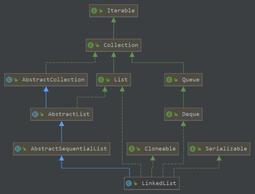

基于 JDK 1.8 的 LinkedList 类的源码阅读笔记，包括如下内容：

- LinkedList 类提供的常见方法。
- 分别比较 LinkedList 类提供的多种添加或获取元素的方法。
- 内部迭代器类 ListItr 。
- for 循环、forEach 和迭代器遍历 LinkedList 的性能比较。

<!--more-->

#### 1. LinkedList的概述



LinkedList 类继承自抽象类 AbstractSequentialList，实现了 List、Deque（双端队列）、Cloneable、和 Serializable 接口。

- 底层结构双向链表，支持 null 元素。
- 插入和删除元素的时间复杂度为 O(1)；不支持随机访问，查找操作的时间复杂度为 O(N)。
- 未实现同步，可通过 Collections 类的 synchronizedList 方法获得线程安全的类。
- 迭代器是 fail-fast 的。迭代过程中，除使用迭代器的 add 或 remove 方法，任何对集合的结构修改均会抛出 ConcurrentModificationException。
- LinkedList 可用来实现队列（Queue）和栈（Stack）。


#### 2. 字段和构造方法

```java
public class LinkedList<E> extends AbstractSequentialList<E>
    implements List<E>, Deque<E>, Cloneable, java.io.Serializable {
    
	transient int size = 0; // 元素个数
	transient Node<E> first; // 头节点指针
	transient Node<E> last; // 尾节点指针
	
	public LinkedList() {} // 空参构造函数
	
	// 构造一个包含指定集合c的LinkedList对象
	public LinkedList(Collection<? extends E> c) {
        this();
        addAll(c);
    }
}
```

LinkedList 是没有默认初始容量的，或者说其默认大小为 0。调用空参构造方法时，会初始化两个变量：

```java
transient int size = 0;
protected transient int modCount = 0; // 继承自抽象类AbstractList
```


#### 3. 内部节点结构

LinkedList 内部的节点结构为：

```java
private static class Node<E> {
    E item; // 元素值
    Node<E> next; // 前驱节点
    Node<E> prev; // 后继节点

    Node(Node<E> prev, E element, Node<E> next) {
        this.item = element;
        this.next = next;
        this.prev = prev;
    }
}
```


#### 4. 常用方法

LinkedList 对外提供的常用方法如下

```java
public boolean add(E e); // 在链表尾部添加元素
public void add(int index, E element); // 在指定位置插入元素
public void addFirst(E e); // 在链表头部添加元素
public E get(int index); // 获取指定位置的元素
public E poll(); // 获取并返回链表头部元素，且在链表中删除该元素
public E remove(int index); // 返回并移除指定位置元素
public boolean remove(Object o); // 移除首次出现的对象o，o可以是null。移除成 功返回true，否则返回false
public ListIterator<E> listIterator(int index); // 从指定位置开始返回迭代器
```


**LinkedList 提供的添加元素的方法**

|           方法            | 添加元素位置 | 返回值 |        内部实现        |
| :-----------------------: | :----------: | :----: | :--------------------: |
|         add(E e)          |     尾部     |  true  |        linkLast        |
|       addLast(E e)        |     尾部     |  void  |        linkLast        |
|        offer(E e)         |     尾部     |  true  |     add + linkLast     |
|      offerLast(E e)       |     尾部     |  true  |   addLast + linkLast   |
| add(int index, E element) |   指定位置   |  void  | linkLast 或 linkBefore |
|       addFirst(E e)       |     头部     |  void  |       linkFirst        |
|      offerFirst(E e)      |     头部     |  true  |  addFirst + linkFirst  |
|         push(E e)         |  头部、栈顶  |  void  |  addFirst + linkFirst  |


##### （1）add(E e) 方法

在链表尾部添加元素 `e` ，等效于 addLast(E e) 方法。add 方法成功添加元素后，返回 `true`；addLast 方法内部同样是调用 linkLast 方法，但它没有返回值。

```java
public boolean add(E e) {
    linkLast(e); // 新建并插入节点
    return true;
}
```

调用默认的 linkLast方法，新建并插入节点。

```java
void linkLast(E e) {
    final Node<E> l = last;
    final Node<E> newNode = new Node<>(l, e, null); // 新建节点
    last = newNode;
    if (l == null)
        first = newNode; // 插入的是第一个节点
    else
        l.next = newNode;
    size++;
    modCount++;
}
```

------

##### （2）add(int index, E element) 方法

```java
public void add(int index, E element) {
    checkPositionIndex(index);
    if (index == size)
        linkLast(element); // 在链表尾部插入新元素，调用linkLast方法
    else
        linkBefore(element, node(index)); // 在链表非尾部插入新元素
}
```

向指定位置插入元素时，首先调用私有方法 checkPositionIndex，检查指定索引是否合法。

```java
private void checkPositionIndex(int index) {
    if (!isPositionIndex(index))
        // 待插入位置不合法，抛出异常
        throw new IndexOutOfBoundsException(outOfBoundsMsg(index));
}
```

继续调用私有方法

```java
private boolean isPositionIndex(int index) {
    return index >= 0 && index <= size; // 判断待插入位置是否合法
}
```

接下来看在链表非尾部插入新元素的方法 linkBefore(E e, Node<E> succ)。

首先，在明确索引 `index` 是合法位置的前提下，调用 node 方法获得该位置处的节点。node 方法的巧妙之处在于，它需要先明确指定索引属于链表前半段还是后半段，据此决定是从链表头节点还是尾节点开始遍历寻找，以缩短查找时间。

```java
Node<E> node(int index) {
   // 指定位置在链表前半段，从头节点开始向后遍历、寻找
   if (index < (size >> 1)) {
        Node<E> x = first;
        for (int i = 0; i < index; i++)
            x = x.next;
        return x;
    } else {
        // 指定位置在链表后半段，从尾节点开始向前遍历、寻找
        Node<E> x = last;
        for (int i = size - 1; i > index; i--)
            x = x.prev;
        return x;
    }
}
```

在链表非尾部位置插入新元素，只需要修改节点的前驱、后继节点指针即可，速度快。

```java
void linkBefore(E e, Node<E> succ) {
        final Node<E> pred = succ.prev;
        final Node<E> newNode = new Node<>(pred, e, succ);
        succ.prev = newNode;
        if (pred == null)
            first = newNode; // 插入位置是头节点
        else
            pred.next = newNode;
        size++;
        modCount++;
    }
```

------

##### （3）addFirst(E e) 方法

```java
public void addFirst(E e) {
    linkFirst(e);
}
```

调用私有方法 linkFirst(E e)

```java
private void linkFirst(E e) {
    final Node<E> f = first;
    final Node<E> newNode = new Node<>(null, e, f);
    first = newNode; // 插入链表头部
    if (f == null)
        last = newNode;
    else
        f.prev = newNode;
    size++;
    modCount++;
}
```

------

**LinkedList 提供的获取元素的方法**

对于不可返回 null 的方法：

- get(int index) 方法：索引越界时，抛出 IndexOutOfBoundsException。
- 其它三种方法：链表为空时，抛出 NoSuchElementException。

|      方法      | 获取元素的位置 |     内部实现     | 是否删除元素 | 速度 | 是否可返回null |
| :------------: | :------------: | :--------------: | :----------: | :--: | :------------: |
| get(int index) |    指定位置    | node(int index)  |              |  慢  |       否       |
|   getFirst()   |      头部      |    first 节点    |      否      |  快  |       否       |
|     peek()     |      头部      |    first 节点    |      否      |  快  |       是       |
|  peekFirst()   |      头部      |    first 节点    |      否      |  快  |       是       |
|     poll()     |      头部      | unlinkFirst 方法 |      是      |  快  |       是       |
|  pollFirst()   |      头部      | unlinkFirst 方法 |      是      |  快  |       是       |
|     pop()      |   头部、栈顶   | unlinkFirst 方法 |      是      |  快  |       否       |
|   getLast()    |      尾部      |    last 节点     |      否      |  快  |       否       |
|   peekLast()   |      尾部      |    last 节点     |      否      |  快  |       是       |
|   pollLast()   |      尾部      | unlinkLast 方法  |      是      |  快  |       是       |


##### （4）get(int index) 方法

获取元素时调用的检查索引的 checkElementIndex 方法，与插入元素时调用的 checkPositionIndex 方法是不同的。前者需要满足 `index < size`，而后者需要满足 `index <= size` 。

```java
public E get(int index) {
    checkElementIndex(index); // 检查索引位置是否合法
    return node(index).item; // 查找节点，获取并返回节点元素值
}
```

------

##### （5）E poll() 方法

```java
public E poll() {
    final Node<E> f = first;
    return (f == null) ? null : unlinkFirst(f);
}
```

调用 unlinkFirst 方法，返回头节点元素值并删除头节点。

```java
private E unlinkFirst(Node<E> f) {
    // assert f == first && f != null;
    final E element = f.item;
    final Node<E> next = f.next;
    f.item = null;
    f.next = null; // help GC
    first = next;
    if (next == null)
        last = null;
    else
        next.prev = null;
    size--;
    modCount++;
    return element;
}
```

------

##### （6）remove(int index) 方法

```java
public E remove(int index) {
    checkElementIndex(index); // 检查索引是否合法
    return unlink(node(index)); // 删除节点，返回元素值
}
```

调用 unlink 方法

```java
E unlink(Node<E> x) {
    // assert x != null;
    final E element = x.item; // 待删除元素
    final Node<E> next = x.next;
    final Node<E> prev = x.prev;

    if (prev == null) {
        first = next; // 待删除节点是头节点时
    } else {
        prev.next = next;
        x.prev = null;
    }

    if (next == null) {
        last = prev; // 待删除节点是尾节点时
    } else {
        next.prev = prev;
        x.next = null;
    }

    x.item = null;
    size--;
    modCount++;
    return element;
}
```

------

##### （7）remove(Object o) 方法

> 由于 LinkedList 可以存储 null，所以待删除对象可以为 null。若链表中存有 null，则删除 null 的操作是成功的，返回 true。

```java
public boolean remove(Object o) {
    // 删除null时
    if (o == null) {
        // 从头节点开始向后遍历
        for (Node<E> x = first; x != null; x = x.next) {
            if (x.item == null) {
                unlink(x);
                return true;
            }
        }
    } else {
        // 从头节点开始向后遍历
        for (Node<E> x = first; x != null; x = x.next) {
            if (o.equals(x.item)) {
                unlink(x);
                return true;
            }
        }
    }
    return false;
}
```

------

##### （8）listIterator(int index) 方法

关于 LinkedList 类的迭代器，需要知道以下几点：

- 虽然 listIterator 方法返回从指定位置 `index` 开始的迭代器，但只要 `index > 0`，仍可调用 previous 方法向前遍历！
- LinkedList 类继承了抽象类 AbstractList 的 listIterator() 方法，使用该方法获取迭代器时，内部调用的是 listIterator(int index) 方法以获取 `ListItr` 对象，其中 `index == 0` 。
- LinedList 类继承了抽象类 AbstractSequentialList 的 iterator() 方法，其本质仍是调用 LinkedList 类的 listIterator(int index) 方法以获取 `ListItr` 对象，其中 `index == 0` 。

```java
public ListIterator<E> listIterator(int index) {
    checkPositionIndex(index); // 检查索引的合法性，允许index==size
    return new ListItr(index);
}
```


#### 5. 内部迭代器类 ListItr

内部类 ListItr 的字段及构造方法

```java
private class ListItr implements ListIterator<E> {
    private Node<E> lastReturned; // 最近被访问的节点指针
    private Node<E> next; // 下一待访问节点的指针
    private int nextIndex; // 下一待访问节点的索引
    private int expectedModCount = modCount;

    ListItr(int index) {
        // 当index==size时，next变量置为null
        next = (index == size) ? null : node(index);
        nextIndex = index;
    }
}
```

再看内部类 ListItr 的部分方法

```java
public boolean hasNext() {
    return nextIndex < size; // 判断是否有后继节点
}

public E next() {
    checkForComodification();
    if (!hasNext())
        throw new NoSuchElementException();

    lastReturned = next; // 更新最近访问过的节点
    next = next.next; // 更新下一待访问节点的指针
    nextIndex++; // 更新下一待访问节点的索引值
    return lastReturned.item; // 返回最近被访问的节点元素值
}

public boolean hasPrevious() {
    return nextIndex > 0; // 判断是否有前驱节点
}

public E previous() {
    checkForComodification();
    if (!hasPrevious())
        throw new NoSuchElementException();
	// nextIndex==size时，next==null，此时已到达链表尾部，已无后继节点
    lastReturned = next = (next == null) ? last : next.prev;
    nextIndex--;
    return lastReturned.item;
}

final void checkForComodification() {
    if (modCount != expectedModCount)
        throw new ConcurrentModificationException();
}
```


#### 6. 三种遍历方式的比较

常见的 for 循环、forEach 循环和迭代器分别遍历 LinkedList 集合，性能表现如何？

- forEach 循环和迭代器遍历速度快；
- for 循环遍历速度慢。

forEach 循环底层实现正是迭代器。比较迭代器和 for 循环。迭代器在遍历过程中，会**保存下一个待访问节点的内存地址**。for 循环在遍历过程中，每一次获取元素都要调用 node(int index) 方法查找。虽然 LinkedList 类提供的 node(int index) 方法进行了优化，最坏只需要查找一半的集合，但其性能显然不比迭代器。


#### 7. 总结

- LinkedList 底层结构是双向链表，初始容量为0。
- 在查找指定索引 `index` 处的节点时，需要先明确指定该索引属于链表前半段还是后半段，据此决定是从链表头节点还是尾节点开始遍历寻找，以缩短查找时间。
- 由于 LinkedList 可以存储 null，所以待删除对象可以为 null。
- LinkedList 类继承的 iterator() 和 listIterator() 方法，本质上均是调用 LinkedList 类的 listIterator(int index) 方法，其中 `index == 0`，得到的均是 `ListItr` 对象。
- 迭代器的 remove 方法的本质是**调用集合的 remove 方法并更新迭代器的 expectedModCount 的值。** 
- 继承抽象类 AbstractList 中的 modCount 字段，记录集合发生结构化修改（**删除、添加元素，更新已存在的元素不是结构化修改**）的次数。迭代器中维护 expectedModCount 字段，在初始化迭代器时，将集合的 modCount 赋予迭代器的 expectedModCount。在执行迭代器的方法时，首先判断二者是否相等，否的话抛出 ConcurrentModificationException 异常。