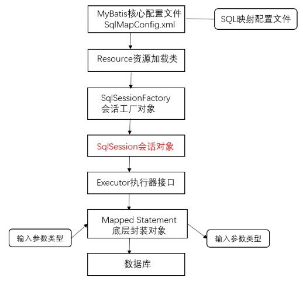
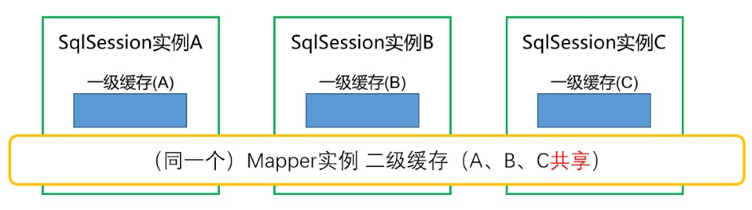
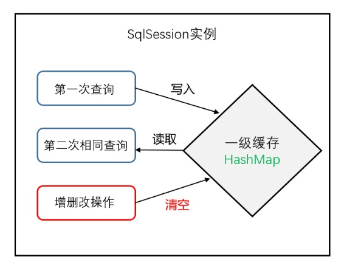
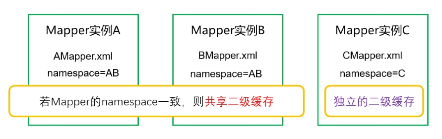
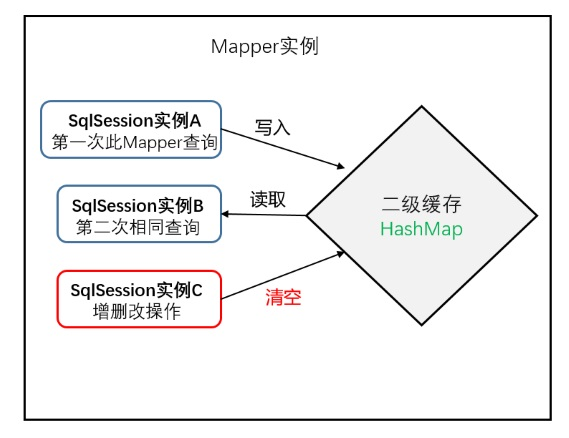

纵使前路荆棘遍野，亦将坦然无惧仗剑前行！

<!--more-->

> 参考资料：
>
> [1] Spring MVC+Mybatis开发从入门到项目实战. 朱要光 著


一些概念：

> 1、ORM
>
> > Object Relation Mapping，对象关系映射。通过操作 Java对象来操作关系型数据库。
>
> 2、POJO与 JavaBean
>
> > POJO：只有private属性和get/set方法且没有其他继承、实现的 Java对象。
> >
> > JavaBean：private成员变量、get/set方法、**空参构造函数**、**可序列化**。

------

Mybatis框架运行流程示意图如下：



------

基本配置示例：

1、日志输出环境配置文件 *log4j.properties*

```
# 日志级别
# 在开发环境下，日志级别设置为DEBUG，生产环境设置为INFO或ERROR
log4j.rootLogger=DEBUG, stdout
# 配置将日志信息打印至控制台
log4j.appender.stdout=org.apache.log4j.ConsoleAppender
# 定制打印界面格式
log4j.appender.stdout.layout=org.apache.log4j.PatternLayout
log4j.appender.stdout.layout.ConversionPattern=%5p [%t] - %m%n
```

2、数据库配置文件 *db.properties* 

```
# 数据库配置文件
jdbc.driver=com.mysql.jdbc.Driver
jdbc.url=jdbc:mysql://localhost:3306/mybatis_test
jdbc.username=root
jdbc.password=123
#c3p0.pool.maxPoolSize=400
#c3p0.pool.minPoolSize=50
#c3p0.pool.initialPoolSize=50
#c3p0.pool.acquireIncrement=100
```

3、Mybatis核心配置文件 *SqlMapConfig.xml*

```xml
<?xml version="1.0" encoding="UTF-8"?>
<!DOCTYPE configuration  
PUBLIC "-//mybatis.org//DTD Config 3.0//EN"  
"http://mybatis.org/dtd/mybatis-3-config.dtd"> 
<configuration>
	
	<!-- properties标签，引入外部配置文件 -->
	<properties resource="db.properties"></properties>
	
	<settings>
		<!-- 配置日志输出模式 -->
		<setting name="logImpl" value="LOG4J"/>
		<!-- 是否启用延迟加载（懒加载） -->
		<setting name="lazyLoadingEnable" value="true"/>
		<!-- 是否启用积极加载，false表示按需加载（即消极加载） -->
		<setting name="aggressiveLazyLoading" value="false"/>
		<!-- 是否开启二级缓存 -->
		<setting name="cacheEnabled" value="true"/>
	</settings>
	
	<!-- 配置数据类型的别名 -->
	<typeAliases>
		<!-- 自动为cn.merlin.mybatis.po包下所有的Java类配置别名，类名称s首字母小写 -->
		<package name="cn.merlin.mybatis.po"/>
	</typeAliases>
	
	<!-- 配置插件 -->
	<plugins>
		<plugin interceptor="cn.merlin.mybatis.test.QueryPlugin" />
	</plugins>
	
	<!-- 配置MyBatis环境信息 -->
	<environments default="development">
		<!-- 每一个environment标签对应一个单独的数据库环境 -->
		<environment id="development">
			<!-- 事务管理 -->	
			<transactionManager type="JDBC" />
			<!-- 数据库配置信息 -->
			<dataSource type="POOLED">
				<!-- 全局参数 -->
				<property name="driver" value="${jdbc.driver}"/>
				<property name="url" value="${jdbc.url}"/>
				<property name="username" value="${jdbc.username}"/>
				<property name="password" value="${jdbc.password}"/>
			</dataSource>
		</environment>
	</environments>
	
	<!-- 映射器，配置SQL映射文件的位置 -->
	<mappers>
		<mapper resource="UserMapper.xml" />
		<mapper resource="BankMapper.xml" />
		<mapper resource="cn/merlin/mybatis/mapper/UserMapper.xml"/>
	</mappers>
</configuration>
```

4、SQL映射文件 *UserMapper.xml*

> 加载时机：Mapper映射文件随会话工厂对象 SqlSessionFactory 时被加载

```xml
<?xml version="1.0" encoding="UTF-8"?>
<!DOCTYPE mapper  
PUBLIC "-//mybatis.org//DTD Mapper 3.0//EN"  
"http://mybatis.org/dtd/mybatis-3-mapper.dtd">

<mapper namespace="test" >
	
	<!-- 根据id查询对象 -->
	<select id="findUserById" parameterType="int" resultType="user">
		SELECT * FROM user WHERE id = #{value}
	</select>
	<!-- 当user表中仅有部分字段名称与User类的属性名对应时
		如user_id和user_name字段不对应
		需要使用resultMap标签
	 -->
	<!-- <resultMap type="user" id="UserResult">
		<id property="id" column="user_id"/>
		<result property="username" column="user_name"/>
	</resultMap>
	
	<select id="findUserById" parameterType="integer" resultMap="UserResult">
		SELECT * FROM user WHERE user_id = #{value}
	</select> -->
	
	<!-- 模糊查询 -->
	<select id="findUserListByUsername" parameterType="string" resultType="user">
		<!-- SELECT * FROM user WHERE username LIKE '%${value}%' -->
		<!-- 使用"#{}"替代"${}"可以有效避免SQL注入 -->
		SELECT * FROM user WHERE username LIKE "%" #{value} "%"
	</select>
	
	<!-- 插入 -->
	<insert id="insertUser" parameterType="user" >
		INSERT INTO user (username,password,gender,province,city) 
		VALUE (#{username},#{password},#{gender},#{province},#{city})
	</insert>
	
	<!-- 演示自定义的查询包装类 -->
	<select id="findUserByUserQueryInfo" parameterType="userQueryInfo" resultType="userInstance">
		SELECT * FROM user WHERE user.username = #{userInstance.username}
	</select>
	
</mapper>
```

> Tips:
>
> 1. 使用**"#{}"**替代"${}"可以有效**避免SQL注入攻击**
> 2. 当表中部分字段名与 Java类成员变量名不匹配时，需要使用**resultMap**完成列名转换


***获取sqlSession会话对象的三种途径：***

1、XML配置文件中set属性注入

spring配置文件：

```xml
<bean id="userDao" class="cn.merlin.ssm.dao.UserDaoImpl">
	<property name="sqlSessionFactory" ref="sqlSessionFactory">
</bean>
```

UserDaoImpl 需继承 **SqlSessionDaoSupport 类**，方能通过get方法获取sqlSession

```java
SqlSession sqlSession = this.getSqlSession(); // 调用父类（SqlSessionDaoSupport）的getSqlSession()方法
```

2、注解方式

```java
public class UserDaoImpl extends SqlSessionDaoSupport implements UserDao {
	
	@Autowired // 注入sqlSessionFactory对象
	public void setSqlSessionFactory(SqlSessionFactory sqlSessionFactory) {
		super.setSqlSessionFactory(sqlSessionFactory);
	}
 	
    // 获取sqlSession对象
    SqlSession sqlSession = this.getSqlSession();
}
```

3、手动获取

```java
// 自动装配，获取SqlSessionFactory对象
@Autowired 
private SqlSessionFactory sqlSessionFactory;
// 调用SqlSessionFactory类的openSession()方法
SqlSession sqlSession = sqlSessionFactory.openSession();
```

***SqlSessionDaoSupport原理***

抽象类SqlSessionDaoSupport中有成员变量SqlSession，并配置了get方法。通过setSqlSessionFactory方法可以获得sqlSession实例

```java
private SqlSession sqlSession;

public void setSqlSessionFactory(SqlSessionFactory sqlSessionFactory) {
    if (!this.externalSqlSession) {
      this.sqlSession = new SqlSessionTemplate(sqlSessionFactory);
    }
}
```

------

Mapper输出映射类型

1、resultType

> <1> 支持基本数据类型、基本数据包装类、自定义包装类（如 JavaBean）
>
> <2> 输出时创建自定义包装类的前提是：**表字段名与包装类属性名完全一致**
>
> <3> 当<2>不满足时，还可以输出为**HashMap**结构

2、resultMap

> 当表字段名与包装类属性名不完全一致时

```xml
<!-- id="userResultMap"唯一地标识resultMap -->
<resultMap type="cn.com.mybatis.po.User" id="userResultMap">
	<!-- id标签：与主键相对应 -->
	<id column="_id" properties="id"/>
	<!-- result：普通列 -->
	<result column="_username" properties="username"/>
</resultMap>

<select id="findUserByResultMap" parameter="int" resultMap="userResultMap">
	select id _id,username _username from user where id = #{value}
</select>
```

> 注意resultMap中的**association**、**collection**标签，在涉及 Java包装类属性含有其它包装类或 List集合时会用到。

------

延迟加载

（1）功能：对于有关联的表，先查询单表，有需要时才查询关联表，以节约资源

（2）设置：

> lazyLoadingEnabled:true 开启延迟加载
>
> aggressiveLazyLoading:false 开启消极加载（即按需加载）

------

动态代理

> 不编写DAO层操作数据库代码，在符合一定规范的前提下，由Mapper代理自动完成数据交互

示例：

1、编写名称与Mapper配置文件相同的接口

```java
public interface CustomerMapper{
    public Customer findCustomerById(int id) throws Exception;
}
```

2、编写CustomerMapper.xml文件

> namespace 设为 接口的全包名：cn.com.mybatis.mapper.CustomerMapper

```xml
<?xml version="1.0" encoding="UTF-8"?>
<!DOCTYPE mapper  
PUBLIC "-//mybatis.org//DTD Mapper 3.0//EN"  
"http://mybatis.org/dtd/mybatis-3-mapper.dtd">

<mapper namespace="cn.com.mybatis.mapper.CustomerMapper">
	<select id="findCustomerById" parameterType="int" resultType="customer">
		select * from customer where id = #{id}
	</select>
</mapper>
```

3、调用SqlSession类的getMapper()方法，获取代理对象

```java
public void testProxyMapper(){
	...
    CustomerMapper customerMapper = sqlSession.getMapper(CustomerMapper.class);
    // 执行SQL语句
    Customer customer = customerMapper.findCustomerById(id);
}
```

------

缓存（**HashMap**结构）

1、一级缓存



> 一级缓存基于SqlSession会话对象实例，sqlSession级别独立



> 查询时，sqlSession首先查询一级缓存，若无，再查询数据库，并将结果存储至一级缓存

2、二级缓存



> 二级缓存基于Mapper实例，namespace一致则共享，否则独立



> 不同的SqlSession实例，执行同一个Mapper文件中的SQL语句，共享二级缓存