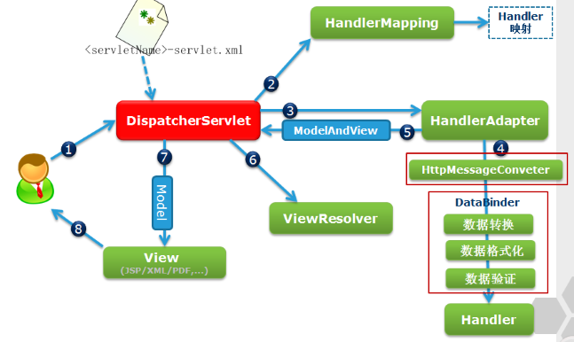

笔记基于《Spring MVC+Mybatis开发从入门到项目实战》一书，偏向于实践。

<!--more-->

**MVC模式**

> Model：数据模型层，封装用户的输入/输出数据
>
> Controller：控制层，前、后端交互
>
> View：视图层，前端显示

------

#### 1. Spring MVC流程

Spring MVC框架流程图如下，其中最核心的是**前端控制器（DispatcherServlet）**



*流程描述如下：*

1. 用户请求被拦截、发送至前端控制器（DispatcherServlet）；

2. DispatcherServlet请求处理器映射器（HandlerMapping）查找相应的处理器（Handler），HandlerMapping将Handler、Intercepter（拦截器）返回给DispatcherServlet；

3. DispatcherServlet根据返回的Handler，请求处理器适配器（HandlerAdapter）执行Handler；

4. HandlerAdapter调用自己的Handler方法，利用 Java的**反射机制**执行具体的Controller方法，获得ModelAndView 视图对象；

5. HandlerAdapter将ModelAndView 视图对象发送给DispatcherServlet；

6. DispatcherServlet请求视图处理器（ViewResolver）解析，返回结果；

7. DispatcherServlet渲染视图，**将Model中的模型数据填充到View视图的Request域**，生成最终的View视图；

8. DispatcherServlet发送Response响应至用户界面。


#### 2. DispatcherServlet

DispatcherServlet是Spring MVC处理Http请求的核心组件：

（1）其顶级父类是HttpServlet，因此DispatcherServlet本质上是一个Servlet；

（2）其中的doService方法负责处理request请求；

（3）核心方法**doDispatch**负责处理拦截，转发请求，调用处理器获得结果，并得到结果视图。


web.xml中的配置如下：

```xml
<!-- 配置Spring MVC前端控制器 -->
<servlet>
    <servlet-name>springmvc</servlet-name>
    <servlet-class>org.springframework.web.servlet.DispatcherServlet</servlet-class>
    <init-param>
        <!-- 使用配置的springmvc.xml文件对DispatcherServlet进行初始化 -->
        <param-name>contextConfigLocation</param-name>
        <param-value>classpath:springmvc.xml</param-value>
    </init-param>
</servlet>
<!-- 配置拦截url符合".action"的请求至前端处理器DispatcherServlet -->
<servlet-mapping>
    <servlet-name>springmvc</servlet-name>
    <url-pattern>*.action</url-pattern>
</servlet-mapping>
```


#### 3. HandlerMapping

HandlerMapping常见有：BeanNameUrlHandlerMapping、SimpleUrlHandlerMapping、ControllerClassNameHandlerMapping。


Springmvc.xml配置如下

（1）BeanNameUrlHandlerMapping

映射规则：将bean的name作为url进行匹配

```xml
<!-- 配置处理器映射器BeanNameUrlHandlerMapping -->
<bean class="org.springframework.web.servlet.handler.BeanNameUrlHandlerMapping"/>
<!-- 配置被url映射的Handler -->
<bean name="/test.action" class="cn.merlin.ssm.controller.ControllerTest" />
```

（2）SimpleUrlHandlerMapping

通过<property>标签配置url与handler的映射关系

```xml
<!-- 配置处理器映射器SimpleUrlHandlerMapping -->
<bean id="simpleUrlHandlerMapping" class="org.springframework.web.servlet.handler.SimpleUrlHandlerMapping">
    <!-- 拦截器 -->
    <property name="interceptor">
        <list>
            <ref bean="Interceptor_A" />
            <ref bean="Interceptor_B" />
        </list>
    </property>
    <!-- Handler -->
    <property name="mappings">
        <props>
            <prop key="testA.action">ControllerTestA</prop>
            <prop key="testB.action">ControllerTestB</prop>
        </props>
    </property>
</bean>
```

（3）ControllerClassNameHandlerMapping

采用CoC惯例优先原则

- 对普通的Controller类，将类名“xxxController”映射至“/xxx*”的请求url

- 对MultiActionController（多动作控制器）类，会将特定的方法“yyy”映射至“/xxx/yyy.action”的请求url

```xml
<!-- 配置映射器 -->
<bean class="org.springframework.web.servlet.mvc.support.ControllerBeanNameHandlerMapping"></bean>
```


#### 4. HandlerAdapter

（1）SimpleControllerHandlerAdapter

springmvc.xml中的配置如下：

```xml
<bean class="org.springframework.web.servlet.mvc.SimpleControllerHandlerAdapter" />
```

SimpleControllerHandlerAdapter要求编写实现Controller接口的Handler方法

```java
package package cn.merlin.ssm.controller
import org.springframework.web.servlet.ModerlAndView
import org.springframework.web.servlet.mvc.Controller

public class ControllerTest implements Controller{

	@Override
	public ModelAndView handleRequest(HttpServletRequest request, HttpServletResponse response) throws Exception{
	modelAndView.addObject();
	modelAndView.setViewName();
	return modelAndView;
	}
}
```


（2）HttpRequestHandlerAdapter

springmvc.xml中的配置如下：

```xml
<bean class="org.springframework.web.servlet.mvc.HttpRequestHandlerAdapter"/>
```

HttpRequestHandlerAdapter要求编写实现**HttpRequestHandler接口**的Handler方法

```java
package package cn.merlin.ssm.controller
import org.springframework.web.HttpRequestHandler

public class ControllerTest implements HttpRequestHandler{
	
	@Override
	public void handleRequest(HttpServletRequest request, HttpServletResponse response) throws ServletException,IOException{
	request.setAttribute();
	request.getRequestDispatcher();
	}
}
```

***HttpRequestHandlerAdapter与 SimpleControllerHandlerAdapter相比优点在于：***

- 前者可以通过request获得http请求信息，及设置返回对象response的格式，如 JSON串！


#### 5. 注解方式使用HandlerMapping和HandlerAdapter

“但是这种开发模式有一个缺点，**一个Handler类中只能编写一个方法**“”。

注：上面原话来自于《Spring MVC+Mybatis开发从入门到项目实战》p151。但是对这句话的理解产生了歧义！如MultiActionController类中就能编写多个处理方法。

改成：**一个Handler类中一般只能编写一个处理方法**。

> 通过注解的方式，可以在单个Handler中通过@RequestMapping注解方式配置多个方法！


（1）配置方式

使用默认的注解的映射器和适配器

> Spring MVC使用的默认注解的映射器和适配器是**RequestMappingHandlerMapping**和**RequestMappingHandlerAdapter**

```xml
<mvc:annotation-driven />
```

或者手动注明

```xml
<bean class="org.springframework.web.servlet.mvc.method.annotation.RequestMappingHandlerMapping" />
	<bean class="org.springframework.web.servlet.mvc.method.annotation.RequestMappingHandlerAdapter" />
```


（2）编写Handler类

此时，Handler不需要实现Controller接口或者HttpRequestHandler：

**@Controller**：标明Handler控制器类

**@RequestMapping**：将url请求映射至Handler类中特定的方法

```java
package cn.merlin.ssm.
import org.springframework.stereotype.Controller;controller
import org.springframework.web.bind.annotation.RequestMapping;
import org.springframework.web.servlet.ModerlAndView

@Controller
public class ControllerTest{

	@RequestMapping("/queryMethod")
	public ModelAndView queryMethod(){}
	
	@RequestMapping("/deleteMethod")
	public void deleteMethod(){}
}
```


（3）配置Handler类的bean

逐个Handler类配置：

```xml
<bean class="cn.merlin.ssm.controller.ControllerTest" />
```

或扫描指定包下所有@Controller注解的Handler类（推荐）：

```xml
<context:component-scan base-package="cn.merlin.ssm.controller" />
```


#### 6. Handler

##### 6.1 请求映射@RequestMapping注解

（1）请求路径

1. 类上注解@RequestMapping：请求域，相对Web应用根目录，表示此Handler所有方法的请求路径均在此路径下；

2. 方法上注解@RequestMapping：相对于请求域路径。

```java
// 请求URL为：http://localhost:8080/"WebProjectName"/RequestArea/test.action
@Controller
@RequestMapping("RequestArea")
public class ControllerDemo{
    @RequestMapping("/test")
    public String test(){
        return "test";
    }
}
```


（2）限定请求

> 只能在方法上@RequestMapping实现

1. 限制请求方法：GET, HEAD, POST, PUT, PATCH, DELETE, OPTIONS, TRACE

   @RequestMapping(value="/test", method=RequestMethod.GET)  // 限制请求方法为GET

2. 限制请求参数：

   @RequestMapping(value="/test", params="username") // 限制请求参数中必须含参数“username”

3. 限制请求头：

   @RequestMapping(value="/test", headers="Content-Type:text/html;charset="utf-8")


##### 6.2 参数绑定

（1）可直接绑定的类型：HttpRequest、HttpResponse、HttpSession、Model、ModelMap

（2）简单参数

- value：查询结果字段名 user_id 与 Java实体类中成员变量名 userId 可以不一致；

- defaultValue：默认值

```java
@RequestMapping(value="/test", method={RequestMethod.GET})
public String queryDemo(Model model,@RequestParam(value="user_id",defaultValue="1") Integer userId){
    ...
}
```


（3）绑定包装类

Spring MVC会完成创建相应的实体类 Fruit 并使用set方法注入属性值

```java
@RequestMapping(value="/queryFruitsByCondition")
public String queryFruitsByCondition(Model model,Fruit fruit){
    ...
}
```


（4）绑定集合


#### 7. 视图解析器

##### 7.1 Spring MVC中的视图解析器

（1）AbstractCachingViewResolver

抽象类，定义了视图解析器**缓存**已解析视图的方法。


（2）UrlBasedViewResolver

1. extends AbstractCachingViewResolver，缓存功能；

2. 前缀属性prefix指定视图资源所在路径的前缀，后缀属性suffix指定视图资源所在路径的后缀；

3. 支持**"redirect:" 重定向** 和 **“forword:”内部跳转**；
4. 支持解析为多种不同类型的视图View对象。

springmvc.xml中的配置：

```xml
<bean id="jspViewResolver" class="org.springframework.web.servlet.view.UrlBasedViewResolver">
    <!-- 前缀prefix属性指定了视图资源所在路径的前缀信息 -->
    <property name="prefix" value="/WEB-INF/pages" />
    <!-- 后缀suffix属性指定了视图资源所在路径的后缀信息 -->
    <property name="suffix" value="" />
    <!-- 解析至指定的视图，此处用来展示jsp页面 -->
    <property name="viewClass" value="org.springframework.web.servlet.view.InternalResourceView" />
</bean>
```

InternalResourceView类在服务器端通过*跳转* 的方式访问不能直接访问的/WEB-INF/目录下的资源


**（3）InternalResourceViewResolver**

1. extends UrlBasedViewResolver，缓存功能 + 支持**"redirect:" 重定向** 和 **“forword:”内部跳转**；

2. viewClass指定为InternalResourceView，因此不支持解析为其它视图View对象。

springmvc.xml中的配置：

```xml
<bean id="jspViewResolver" class="org.springframework.web.servlet.view.InternalResourceViewResolver">
    <property name="prefix" value="/WEB-INF/pages" />
    <property name="suffix" value="" />
</bean>
```

具体实现实例如下：

对于UserController类，其实现为

```java
import org.springframework.stereotype.Controller;
import org.springframework.web.bind.annotation.RequestMapping;

@Controller
public class UserController {
	/*
	 *	定义toLogin()方法，处理拦截器传来的重定向至登录
	 *	页面的请求
	 */
	@RequestMapping("/user/toLogin.action")
	public String toLogin() {
		return "/login.jsp";
	}
}
```

处理器返回一个ModelAndView对象，InternalResourceViewResolver将名为“login.jsp”的**视图View**解析成一个InternalResourceView对象后，并将返回的model模型属性信息存放到对应的HttpRequest属性中，最后利用**RequestDispatcher**将请求**跳转**至资源“/WEB-INF/pages/login.jsp”。


（4）BeanNameViewResolver

1. 不继承 AbstractCachingViewResolver，因而无缓存视图的能力；

2. 支持解析为多种不同类型的视图View对象。

在springmvc.xml中的配置如下：

```xml
<bean class="org.springframework.web.servlet.view.BeanNameViewResolver">
    <!-- 将此视图解析器的优先级设为高 -->
    <property name="order" value="1" />
</bean>
<bean id="toLogin" class="org.springframework.web.servlet.view.InternalResourceView">
    <property name="url" value="/WEB-INF/pages/login.jsp" />
</bean>
```

当Controller层返回名为“toLogin”**（即类型为InternalResourceView的bean的id）**的逻辑视图时，类似的，视图解析器BeanNameViewResolver将该视图解析为**InternalResourceView对象**，并跳转至指定资源。


（5）XmlViewResolver

1. extends AbstractCachingViewResolver，缓存视图；

2. 类似于BeanNameViewResolver，只是InternalResourceView类型的bean的配置信息单独配置在views.xml文件中；

3. **对views.xml存放位置无要求**；

4. 支持解析为多种不同类型的视图View对象。

springmvc.xml中配置如下：

```xml
<bean class="org.springframework.web.servlet.view.XmlViewResolver">
    <property name="location" value="/WEB-INF/views.xml"/>
    <property name="order" value="1" />
</bean>
```

指定路径下的配置文件/WEB-INF/views.xml：

```xml
<?xml version="1.0" encoding="UTF-8"?>
<beans xmlns="http://www.springframework.org/schema/beans" 
       xmlns:xsi="http://www.w3.org/2001/XMLSchema-instance" 
       xsi:schemaLocation="http://www.springframework.org/schema/beans 
		http://www.springframework.org/schema/beans/spring-beans-3.2.xsd>
<bean id="toLogin" class="org.springframework.web.servlet.view.InternalResourceView">
    <property name="url" value="/WEB-INF/pages/login.jsp" />
</bean>               
```


**（6）ResourceBundleViewResolver**

1. extends AbstractCachingViewResolver，缓存视图；

2. 视图资源文件为properties属性文件，且必须**位于classpath根目录下**；

3. 支持解析为多种不同类型的视图View对象。

springmvc.xml中配置如下：

```xml
<bean class="org.springframework.web.servlet.view.ResourceBundleViewResolver">
    <!-- 指定视图资源文件名为viewResource -->
    <property name="basename" value="viewResource" />
</bean>
```

视图视图资源文件为viewResource，路径必须为"classpath:viewResource.properties"

```
login.(class)=org.springframework.web.servlet.view.InternalResourceView
login.url=/WEB-INF/pages/login.jsp
```


（7）FreeMarkerViewResolver

1. extends UrlBasedViewResolver，缓存；

2. 指定解析后的视图类型为**FreeMarkerView**；

3. 得到的模板文件，可输出为多种文本文档，如HTML、XML、RTF等。

首先在springmvc.xml中配置该视图解析器：

```xml
<bean class="org.springframework.web.servlet.view.freemarker.FreeMarkerViewResolver">
    <property name="prefix" value="fm_" />
    <property name="suffix" value=".html" />
</bean>
```

随后仍在springmvc.xml中配置FreeMarkerView类生成的最终视图模板的位置：

```xml
<bean class="org.springframework.web.servlet.view.freemarker.FreeMarkerConfigurer">
    <property name="templateLoaderPath" value="/WEB-INF/freemarker/template" />
</bean>
```

在配置的视图模板路径下，新建 "fm_freemarker.html" 的模板文件：

```html
<html>
    <head>
        <title>FreeMarkerView</title>            
    </head>
    <body>
        <!-- 取出数据放入 -->
    </body>
</html>
```


（8）VelocityViewResolver

1. 与FreeMarkerViewResolver相似

2.  extends UrlBasedViewResolver；

3. 指定解析后的视图类型为VelocityView。


##### 7.2 视图解析器链 ViewResolverChain

（1）ViewResolver 实现 Ordered 接口，order属性明确了视图解析器链中不同视图解析器的优先级；

（2）**order越小，优先级越高**；

（3）解析视图时，先从优先级高的解析器开始，若不能解析，则找下一优先级的解析器，若均不能解析，则返回一个null的View对象，抛异常；

（4）**InternalResourceViewResolver可解析任意视图**。


#### 参考资料：

[1]《Spring MVC+Mybatis开发从入门到项目实战》朱要光 著