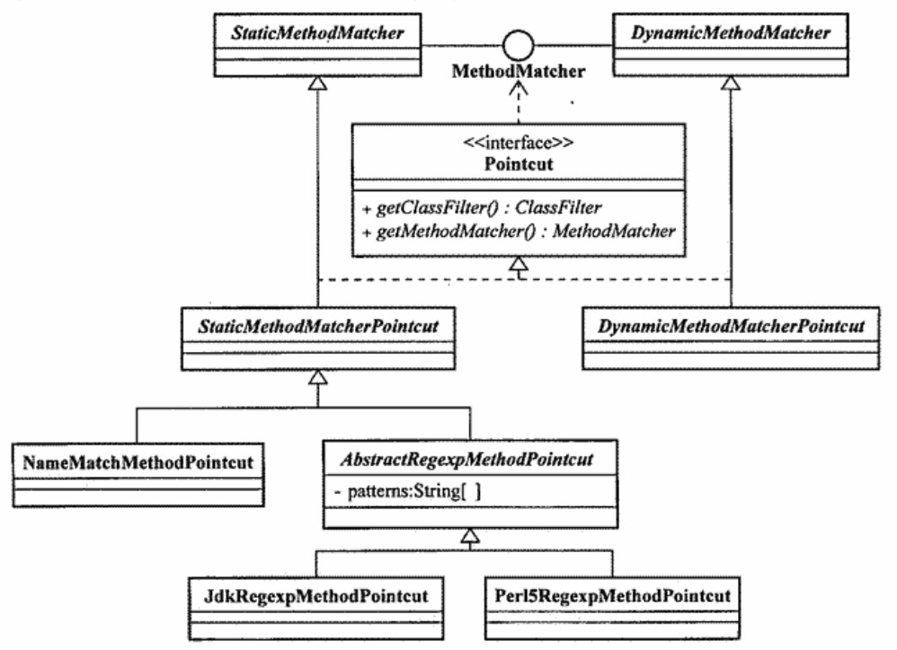
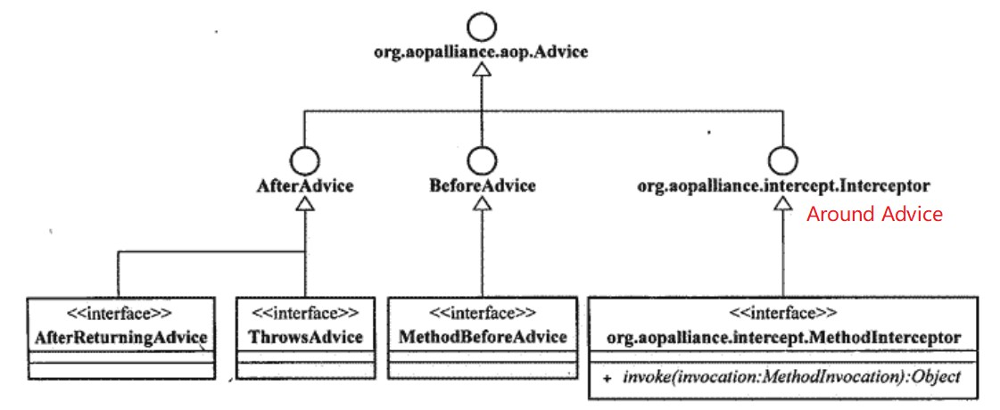

软件开发就是为了解决各种需求包括**业务需求**和**系统需求**。使用面向对象编程（OOP，Object-Oriented Programming）可以很好地对业务需求等普通关注点进行抽象和封装，使之模块化。但对于散落在系统中各处的系统需求的实现，OOP 无法从容应对。于是，**面向切面编程**（**AOP**，Aspect-Oriented Programming）这一理念被提了出来。

AOP 是一种理念，而不是一种新的开发模式。它需要借助某种语言（不一定是 Java）以实现相应的概念实体，这些语言则被成为 AOL（Aspect-Oriented Language）。譬如，**AspectJ** 就是一种扩展自 Java 语言的 AOL。

<!--more-->

#### 一、AOP 的分类

在 Java 语言范围内，常见的 AOP 框架有：**AspectJ**、**Spring AOP**、JBoss AOP 和 Nanning 等。AOP 可被划分为两种不同的类型：静态 AOP 和动态 AOP。

##### 1.1 静态 AOP

第一代 AOP 被称为静态 AOP，AspectJ 是其中典型的代表。

早期的 AspectJ 框架使用 ajc 编译器**将横切逻辑以 Java 字节码的形式编译到系统的对应模块中**。

- 优点：在编译时即将横切逻辑插入 Java 类中，因此运行时性能较高。
- 缺点：灵活性不够。


##### 1.2 动态 AOP 之动态代理

第二代 AOP 被称为动态 AOP。Spring AOP、JBoss AOP 以及 Nanning 等框架均为动态 AOP。此外，AspectJ 框架后来融合了 AspectWerkz 框架，开始支持动态 AOP。动态代理是动态 AOP 的实现方式之一。

动态代理实现 AOP：将横切逻辑封装到代理类的 InvocationHandler 方法中。在程序运行期间，利用**反射技术动态地生成代理对象并将横切逻辑加入代理对象中**。

- 优点：灵活性高。
- 缺点：
  - 被织入横切逻辑的 Java 类必须实现接口；
  - 运行时动态织入，性能不及静态织入。


##### 1.3 动态 AOP 之动态字节码增强

动态字节码技术也是动态 AOP 的实现方式之一。使用 ASM 或 CGLIB 等工具库，在程序运行期间，为需要织入横切逻辑的 Java 类**动态地生成子类并将横切逻辑加入子类中**。

- 优点：灵活性高。当 Java 类未实现接口时，不能使用动态代理，转而可以借用动态字节码技术。
- 缺点：对 final 修饰的类，无法使用此技术。

> Spring AOP 默认使用动态代理实现 AOP。当相应的 Java 类没有实现接口时，则采用 CGLIB 动态字节码技术实现 AOP。


#### 二、Spring AOP 的概念实体

AOP 的相关概念实体如下：

- Joinpoint（连接点）：目标对象中，允许增强的方法
- Pointcut（切入点）：可以插入增强处理的连接点
- Advice（通知）：增强代码
- Aspect（切面）：Pointcut + Advice
- Target（目标对象）：被代理对象
- Weaving（织入）：将 Advice 织入 Pointcut 的过程，完成方法的增强

> Spring AOP 中部分概念与上述概念存在差异，如 Spring 中无 Aspect，而是 Advisor。


##### 2.1 Joinpoint

AOP 的 Joinpoint 支持多种不同的类型，如方法调用、方法执行、字段设置和获取等，但 Spring AOP 仅支持**方法执行类型**的 Joinpoint。正是因为 Spring AOP 不支持构造器连接点，我们无法在创建 bean 的时候应用 AOP。


##### 2.2 Pointcut

Spring 提供 org.springframework.aop.Pointcut 接口作为切入点的顶级抽象，它定义了用于捕捉 Joinpoint 的方法。

```java
public interface Pointcut {
    // 获取切入点的ClassFilter对象，用于匹配将被织入的对象。
	ClassFilter getClassFilter(); 
    // 获取切入点的MethodMatcher对象，用于匹配相应的Joinpoint。 
	MethodMatcher getMethodMatcher(); 
    // 若Pointcut类型为TruePointcut，默认支持匹配所有对象上所有的Joinpoint。 
	Pointcut TRUE = TruePointcut.INSTANCE;
}
```

org.springframework.aop.MethodMatcher 接口定义了方法级别的拦截！

```java
public interface MethodMatcher {
	boolean matches(Method method, Class<?> targetClass);
	boolean isRuntime();
	boolean matches(Method method, Class<?> targetClass, Object... args);
	MethodMatcher TRUE = TrueMethodMatcher.INSTANCE;
}
```

Spring 提供两个重要的实现：Class StaticMethodMatcher 和 DynamicMethodMatcher。

- StaticMethodMatcher：isRuntime() 方法返回 false 时，调用两个参数的 matches 方法，表示不需要考虑 Joinpoint 的方法参数。方法的返回结果是可以缓存的。
- DynamicMethodMatcher：isRuntime() 方法返回 true 时，只有当两个参数的 matches 方法返回 true 时，三个参数的 matches 方法才会被执行。匹配的结果是无法缓存的。




##### 2.3 Advice

Advice 实现了被织入到 Joinpoint 中的横切逻辑，即增强代码。根据位置，Advice 可被细分为：

- Before Advice（前置通知）：在 Joinpoint 指定位置之前执行，可完成系统的初始化工作。
- After Advice（后置通知）：在 Joinpoint 指定位置之后执行，可继续细分
  - After Returning Advice（后置返回通知）：Joinpoint 处执行流程正常完成后执行；
  - Throws Advice（异常通知）：Joinpoint 处执行过程中抛出异常时执行；
  - After Advice：必须执行（Spring AOP 未提供）。
- Around Advice（环绕通知）：在 Joinpoint 前后分别执行指定的横切逻辑。Spring 未提供相应的接口，而是直接使用 AOP Alliance 提供的 **Interceptor（拦截器）** 接口。
- Introduction：无特定执行时机，用来为对象添加新的特性或行为。


在 Spring 中，依照 Advice 实例能否被共享，分为 per-class 类型和 per-instance 类型：

- per-class：可在目标对象类的所有实例间共享，包括 Before Advice、After Advice 和 Interceptor。
- per-instance：为不同的实例对象保存各自的状态和相关逻辑，Introduction。




（1）Before Advice

实现 org.springframework.aop.MethodBeforeAdvice 接口。此横切逻辑不能直接中断 Joinpoint 执行流程，除非 before 方法中抛出异常。

```java
public interface MethodBeforeAdvice extends BeforeAdvice {
	void before(Method method, Object[] args, Object target) throws Throwable;
}
```

（2）Throws Advice

通过 Throws Advice，可实现实时监控程序运行时产生的异常，并通过一定的机制（如发送邮件）告知管理者。

Spring 提供的 org.springframework.aop.ThrowsAdvice 接口没有定义任何方法，因为这些横切逻辑的调用依靠的是 **Java 的反射机制**。但在实现该接口的时候，所实现的方法应遵守一定的规则，常见三种形式如下：

```java
public class ExceptionThrowsAdvice implements ThrowsAdvice {
    // 普通异常处理
    public void afterThrowing(Exception ex){}
    // 运行时异常处理
    public void afterThrowing(RuntimeException ex){}
    // 程序运行时异常处理，可用于实时监控程序运行时产生的异常
    public void afterThrowing(Method m, Object[] args, 
                              Object target, RuntimeException ex){}
}
```

（3）After Returning Advice

Spring 提供的 org.springframework.aop.AfterReturningAdvice 接口定义的方法在 Joinpoint 执行完毕后，可访问 Joinpoint 处方法的返回值、方法参数、目标对象等，但**不能修改方法的返回值**。

```java
public interface AfterReturningAdvice extends AfterAdvice {
	void afterReturning(Object returnValue, Method method, Object[] args,
                        Object target) throws Throwable;

}
```

**（4）Interceptor**

Spring 未直接定义 Around Advice，而是直接使用 AOP Alliance 提供的 MethodInterceptor 接口。MethodInterceptor 接口提供的功能更加强大，可以完全覆盖前三种 Advice 所提供的功能。

```java
public interface MethodInterceptor extends Interceptor {
    Object invoke(MethodInvocation invocation) throws Throwable;
}
```

通过调用 MethodInvocation 的 **proceed() ** 方法，可让程序执行继续沿着调用链传播，即执行 Joinpoint 处原有的流程。**在 proceed() 方法前后可分别插入横切逻辑**。


##### 2.4 Advisor

Spring AOP 中无 Aspect 的概念，取而代之的是 Advisor。

> Aspect 可由多个 Pointcut 和多个 Advice 组成，而 Advisor 一般由一个 Pointcut 和一个 Advice 组成。

org.springframework.aop.Advisor 接口有两个常见子接口：PointcutAdvisor 和 IntroductionAdvisor。

PointcutAdvisor 支持任何类型的 Pointcut 和除 Introduction 外的任何类型的 Advice。

- DefaultPointcutAdvisor：支持任何类型的 Pointcut 和除 Introduction 外的任何类型的 Advice。
- NameMatchMethodPointcutAdvisor：支持 NameMatchMethodPointcut 类型的 Pointcut 和除 Introduction 外的任何类型的 Advice。
- RegexpMethodPointcutAdvisor：限定通过正则表达式为其设置相应的 Pointcut。


##### 2.5 织入

AspectJ 使用 ajc 编译器作为织入器，Spring AOP 基于**代理模式**使用 **ProxyFactory** 作为最基本的织入器实现。


#### 三、使用 Spring AOP 的两种方式

Spring AOP 有两种常见的使用方式：

- 基于 XML 的声明方式
- 基于 AspectJ 的注解方式


##### 3.1 基于 XML 的声明方式

编写切面类，类中定义了不同的增强方法。在 Spring 的 XML 配置文件中，声明切面、切点和相应的通知。

（1）业务接口

```java
package cn.merlin;

public interface UserService {
    public int service();
}
```

（2）业务实现类

```java
package cn.merlin;

import org.springframework.stereotype.Service;

@Service("userService")
public class UserServiceImpl implements UserService {
    @Override
    public int service() {
        System.out.println("为用户提供服务！");
        return 520;
    }
}
```

（3）**自定义切面类**

```java
package cn.merlin;

import org.aspectj.lang.ProceedingJoinPoint;
import org.springframework.stereotype.Component;

@Component("myAspect")
public class MyAspect {

    // 前置通知
    public void beforeAdvice(){
        System.out.println("===前置通知===");
    }

    // 后置通知
    public void afterAdvice(){
        System.out.println("===后置通知===");
    }

    // 后置返回通知
    public void afterReturningAdvice(Object result){
        System.out.println("===后置返回通知===");
        System.out.println("后置返回通知###方法的返回结果为：" + result.toString());
    }

    // 异常通知
    public void afterThrowingAdvice(Exception ex){
        System.out.println("抛出异常！异常信息如下：");
        ex.printStackTrace();
        System.out.println("===异常通知===");
    }

    // 环绕通知
    public Object aroundAdvice(ProceedingJoinPoint obj) throws Throwable{
        System.out.println("===环绕通知开始===");
        Object result = obj.proceed(); // 让程序执行继续沿着调用链传播
        System.out.println("环绕通知###方法的返回结果为：" + result);
        System.out.println("===环绕通知结束===");
        return 1314;
    }
}
```

（4）Spring 配置文件

```xml
<?xml version="1.0" encoding="UTF-8"?>
<beans xmlns="http://www.springframework.org/schema/beans"
       xmlns:xsi="http://www.w3.org/2001/XMLSchema-instance"
       xmlns:context="http://www.springframework.org/schema/context"
       xmlns:aop="http://www.springframework.org/schema/aop"
       xsi:schemaLocation="http://www.springframework.org/schema/beans
       http://www.springframework.org/schema/beans/spring-beans.xsd
       http://www.springframework.org/schema/context
       http://www.springframework.org/schema/context/spring-context.xsd
       http://www.springframework.org/schema/aop
       http://www.springframework.org/schema/aop/spring-aop.xsd ">

    <!--配置自动包扫描-->
    <context:component-scan base-package="cn.merlin" />

    <!--声明切面、切点和通知-->
    <aop:config>
        <aop:pointcut id="myPointcut" expression="execution(* cn.merlin.UserServiceImpl.service(..))"/>
        <aop:aspect ref="myAspect">
            <aop:before method="beforeAdvice" pointcut-ref="myPointcut" />
            <aop:after-returning method="afterReturningAdvice" pointcut-ref="myPointcut" returning="result" />
            <aop:after-throwing method="afterThrowingAdvice" pointcut-ref="myPointcut" throwing="ex" />
            <aop:after method="afterAdvice" pointcut-ref="myPointcut" />
            <aop:around method="aroundAdvice" pointcut-ref="myPointcut" />
        </aop:aspect>
    </aop:config>
</beans>
```

（5）测试类

```java
package cn.merlin;

import org.springframework.context.ApplicationContext;
import org.springframework.context.support.ClassPathXmlApplicationContext;

public class App {
    public static void main( String[] args ) {
        ApplicationContext applicationContext = new ClassPathXmlApplicationContext("ApplicationContext.xml");
        UserService userService = (UserService) applicationContext.getBean("userService");
        int result = userService.service();
        System.out.println("返回值为：" + result);
    }
}
```

（6）运行结果

```java
===前置通知===
===环绕通知开始===
为用户提供服务！
环绕通知###方法的返回结果为：520
===环绕通知结束===
===后置通知===
===后置返回通知===
后置返回通知###方法的返回结果为：1314
返回值为：1314
```


**注意：**

1. 根据运行结果不难发现，在环绕通知中，方法的返回值由 `520` 被修改为 `1314` 。可见，**环绕通知可以修改连接点方法的返回值**。
2. 在配置 `<aop:config>` 的时候，若切点元素 `<aop:pointcut>` 位于切面元素 `<aop:aspect>` 内，则该切点只对当前切面有效，对于 `<aop:config>` 中定义的其它切面是无效的。
3. 接第 2 条。当切点元素 `<aop:pointcut>` 在切面元素 `<aop:aspect>` **之前**被定义时，则该切点对于 `<aop:config>` 中定义的所有切面均有效。


##### 3.2 基于 AspectJ 的注解方式

与前述基于 XML 的声明方式不同的是，注解方式是通过不同的注解符号标识切面、切点，如 `@Aspect`、`@Before`、`@Around` 等。

> 业务接口、业务实现类、测试类同前

（1）切面类

```java
package cn.merlin;

import org.aspectj.lang.ProceedingJoinPoint;
import org.aspectj.lang.annotation.*;
import org.springframework.stereotype.Component;

@Component("myAspect")
@Aspect // 注解，标识切面
public class MyAspect {

    // 前置通知
    @Before("execution(* cn.merlin.UserServiceImpl.service(..))")
    public void beforeAdvice(){
        System.out.println("===前置通知===");
    }

    // 后置通知
    @After("execution(* cn.merlin.UserServiceImpl.service(..))")
    public void afterAdvice(){
        System.out.println("===后置通知===");
    }

    // 后置返回通知
    @AfterReturning(value = "execution(* cn.merlin.UserServiceImpl.service(..))", returning = "result")
    public void afterReturningAdvice(Object result){
        System.out.println("===后置返回通知===");
        System.out.println("后置返回通知###方法的返回结果为：" + result.toString());
    }

    // 异常通知
    @AfterThrowing(value = "execution(* cn.merlin.UserServiceImpl.service(..))", throwing = "ex")
    public void afterThrowingAdvice(Exception ex){
        System.out.println("抛出异常！异常信息如下：");
        ex.printStackTrace();
        System.out.println("===异常通知===");
    }

    // 环绕通知
    @Around("execution(* cn.merlin.UserServiceImpl.service(..))")
    public Object aroundAdvice(ProceedingJoinPoint obj) throws Throwable{
        System.out.println("===环绕通知开始===");
        Object result = obj.proceed(); // 让程序执行继续沿着调用链传播
        System.out.println("环绕通知###方法的返回结果为：" + result);
        System.out.println("===环绕通知结束===");
        return 1314;
    }
}
```

（2）运行结果

```java
===环绕通知开始===
===前置通知===
为用户提供服务！
环绕通知###方法的返回结果为：520
===环绕通知结束===
===后置通知===
===后置返回通知===
后置返回通知###方法的返回结果为：1314
返回值为：1314
```


##### 3.3 切点表达式

基于 3.1 和 3.2 小节不难发现，在使用 Spring AOP 时，重点在于切面类和类中的增强方法，以及切点表达式 execution。

切点表达式的基本格式如下（`?` 表示当前项是非必须的）

```java
execution(modifiers-pattern? ret-type-pattern declaring-type-pattern?name-pattern(param-pattern) throws-pattern?)
```

- modifiers-pattern：表示方法的修饰符，如 public；
- ret-type-pattern：方法的返回值类型，如 void；
- declaring-type-pattern：方法所在的**类的全路径名**；
- name-pattern：方法名；
- param-pattern：方法的形参列表；
- throws-pattern：方法抛出的异常类型。


如前述代码所示，

```java
execution(* cn.merlin.UserServiceImpl.service(..))
```

表示匹配 cn.merlin.UserServiceImpl 类的 service 方法，该方法返回值可为任意类型，形参列表也是任意的。


#### 四、总结

本文分别介绍了动态代理和动态字节码增强两种方式以实现 Spring AOP。动态代理是在程序运行期间，利用反射技术动态地生成代理对象并将横切逻辑加入代理对象中，因此要求被插入横切逻辑的 Java 类必须实现接口。否则，只能使用 CGLIB 动态代理技术生成子类并将横切逻辑放入子类中。

此外，本文还展示了基于 XML 的声明和基于 AspectJ 的注解两种使用 Spring AOP 的方式。需要注意的是，Spring 只支持方法级别的连接点，即切面的粒度是方法。


#### 参考资料

[1] 《Spring 揭秘》

[2] [Spring系列之AOP实现的两种方式](https://www.cnblogs.com/xiaoxi/p/5981514.html)

[3] [(一)spring aop的两种配置方式。](https://www.cnblogs.com/hang-on/p/11383289.html)