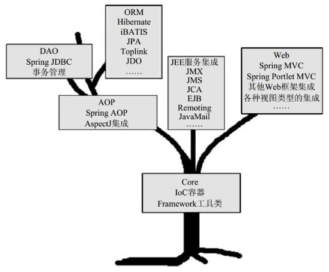
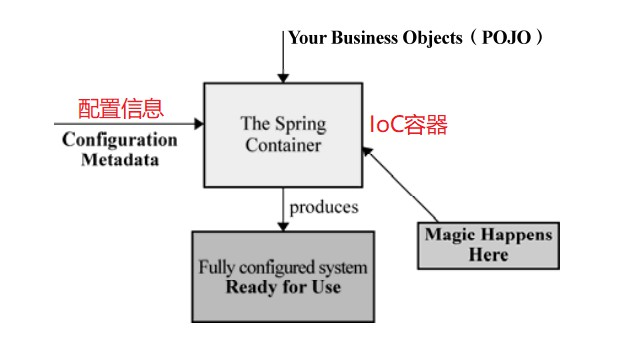
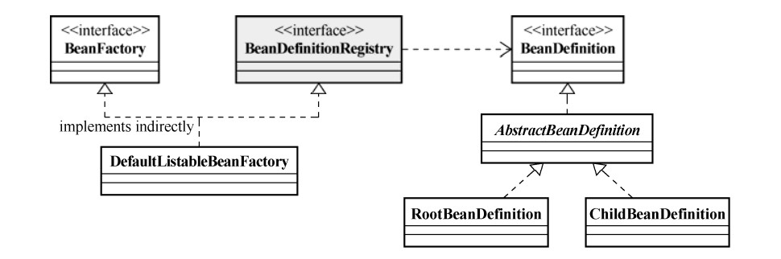
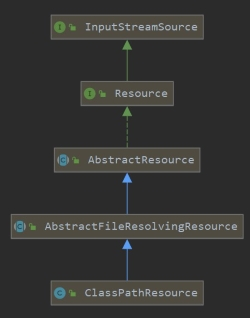
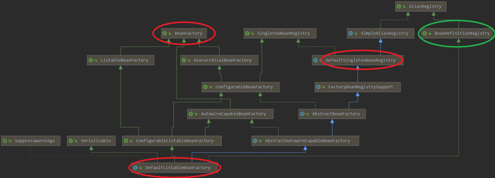
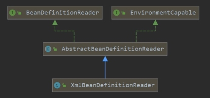
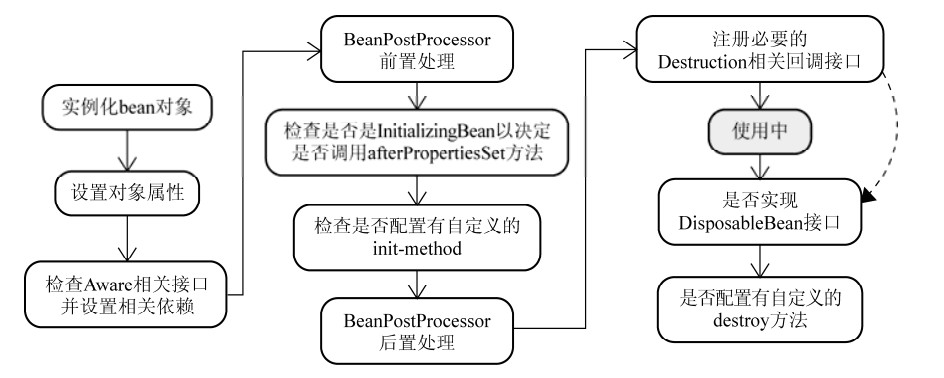

Spring 是基于 POJO（Plain Old Java Object，简单 Java 对象）的轻量级开发框架，由多个模块组成。其中，Core 模块是 Spring 框架的基石，它提供了 IoC 容器的实现，以及以依赖注入的方式管理对象之间的依赖关系。

在传统的开发中，对其它对象的引用或依赖关系的管理由具体的类负责，导致代码高度耦合、难以测试。通过 IoC容器（如 Spring 中的 IoC 容器）可以主动完成对象创建和依赖关系的注入，使得 Java 的类与类之间解耦合。

本文基于 Spring 4.2.5 版本，从以下五个方面介绍 Spring 中的 IoC 容器：

- Spring 提供的两种 IoC 容器（BeanFactory 和 ApplicationContext）
- IoC 容器启动与 bean 的实例化过程
- bean 的生命周期
- IoC 容器装配 bean 的方式
- IoC 容器依赖注入方式

<!--more-->

Spring 框架如下图所示：




#### 一、控制反转和依赖注入

**IoC（Inversion of Control，控制反转）**：在 IoC 容器之前，对象的引用或依赖关系的管理由具体的类负责，主动权在该具体类。IoC 容器之后，这些功能由容器负责，不同的类之间只要专注于自身即可。由之前的主动行为变成被动行为，故称之为控制反转。

**DI（Dependency Injection，依赖注入）**：所谓依赖注入，就是在 IoC 容器运行期间，动态地将依赖关系注入到对象之中。依赖注入是实现 IoC 的一种方式。


#### 二、BeanFactory

Spring 实现了两种 IoC 容器，分别是基础的 BeanFactory 容器和基于 BeanFactory 的 ApplicationContext 容器。

Spring 提供两种 IoC 容器：

- BeanFactory：基础的 IoC 容器，默认懒加载策略，**使用 bean 时才完成初始化及依赖注入**，因此容器启动速度快、所需资源少。
- ApplicationContext：基于 BeanFactory，额外实现 MessageSource（国际化）、ApplicationEvenPublisher（事件发布）、ResourcePatternResolver 接口。**在容器启动后，完成所有 bean 的初始化和依赖注入**。因此容器启动时间较长、所需资源较多。




##### 2.1 BeanFactory 容器底层结构

实现 BeanFactory 容器，常见的接口关系图如下：



实现 BeanFactory 容器涉及四个重要接口：**BeanFactory**、**BeanDefinitionRegistry**、**BeanDefinition**、**BeanDefinitionReader**。

- BeanFactory 接口：定义管理 bean 的方法。
- BeanDefinitionRegistry 接口：定义注册 bean 的方法。
- BeanDefinition 接口：保存 bean 的信息，包括对象的 Class 类型、构造方法参数以及其它属性等。
- BeanDefinitionReader 接口：读取配置文件内容、将其映射至 BeanDefinition，然后将映射后的 BeanDefinition 注册到 BeanDefinitionRegistry 中，由后者完成 bean 的注册和加载。常见实现类有两种：
  - XmlBeanDefinitionReader：读取 XML 格式的配置文件；
  - PropertiesBeanDefinitionReader：读取 Properties 格式的配置文件。


*BeanFactory 接口的源码如下*

```java
// 用于访问Spring Bean容器的根接口。使用此接口及其子接口可以实现Spring的依赖注入功能
// 通常，BeanFactory将加载存储在配置源中的bean的定义，并使用beans包来配置bean
public interface BeanFactory {
    // 区别FactoryBean。前缀为'&'表示获取工厂本身，而非工厂返回的bean
	String FACTORY_BEAN_PREFIX = "&";
    // 根据bean的名称获取bean
    Object getBean(String name) throws BeansException;
    // 根据bean的名称和类型获取bean
    <T> T getBean(String name, Class<T> requiredType) throws BeansException;
    // 根据类型获取bean，此类型可以是实现的接口或父类
    <T> T getBean(Class<T> requiredType) throws BeansException;
    // 判断给定名称的bean是否存在
    boolean containsBean(String name);
    // 判断给定名称的bean是否是单例模式
    boolean isSingleton(String name) throws NoSuchBeanDefinitionException;
    // 判断给定名称的bean是否是原型模式
    boolean isPrototype(String name) throws NoSuchBeanDefinitionException;
    // 返回给定bean名称的别名。若给定的是别名，则返回相应的规范bean名称和其它别名
    String[] getAliases(String name);
    ......
}
```


##### 2.2 启动 BeanFactory 容器

Spring IoC 容器的启动过程主要包括：

- 启动初始化与资源定位
- 载入并解析 BeanDefinition
- 注册 BeanDefinition


（1）BeanFactory 容器使用示例

```java
public class App {
    public static void main( String[] args ) {
        // 创建IoC配置文件的抽象资源
        ClassPathResource resource = new ClassPathResource("ApplicationContext.xml");
        // 获取bean实例的注册表
        DefaultListableBeanFactory beanRegistry = new DefaultListableBeanFactory();
        // 创建载入BeanDefinition的读取器
        XmlBeanDefinitionReader reader = new XmlBeanDefinitionReader(beanRegistry);
        // 加载配置文件
        reader.loadBeanDefinitions(resource);
        // 获取bean
        UserService userService = (UserService) beanRegistry.getBean("userService");
        // 使用bean
        userService.serviceFunction();
    }
}
```


（2）源码分析

1. 首先创建配置文件的抽象资源，规范资源路径，为加载资源文件做准备。

```java
ClassPathResource resource = new ClassPathResource("ApplicationContext.xml");
```

ClassPathResource 类的继承图谱如下图所示，可看出其继承自 AbstractResource 类，而后者实现了资源描述符接口 Resource。



调用 ClassPathResource 类的构造函数，获取对象。

```java
public class ClassPathResource extends AbstractFileResolvingResource {
    
    public ClassPathResource(String path) {
        this(path, (ClassLoader) null); // 调用重载的构造函数，类加载器为null
    }

    public ClassPathResource(String path, ClassLoader classLoader) {
        // 首先判断资源路径是否为空
        Assert.notNull(path, "Path must not be null");
        // 规范资源路径
        String pathToUse = StringUtils.cleanPath(path);
        if (pathToUse.startsWith("/")) {
            pathToUse = pathToUse.substring(1);
        }
        this.path = pathToUse;
        // 当类加载器为null时，使用默认的类加载器
        this.classLoader = (classLoader != null ? classLoader : 
                            ClassUtils.getDefaultClassLoader());
    }
}
```

进入 ClassUtils 类的 getDefaultClassLoader 方法，**先后尝试获取当前线程上下文类加载器、ClassUtils 类加载器、启动类加载器。**需要注意的是，尝试获取类加载器是按照一定顺序的。若已获得类加载器，就返回该类加载器，而不需要获取后续的类加载器。

```java
public static ClassLoader getDefaultClassLoader() {
    ClassLoader cl = null;
    try {
        // 尝试获取当前线程上下文类加载器。若有，则返回
        cl = Thread.currentThread().getContextClassLoader();
    }
    catch (Throwable ex) {}
    if (cl == null) {
        // 若线程上下文类加载器为空，则尝试获取ClassUtils的类加载器。若有，则返回
        cl = ClassUtils.class.getClassLoader();
        if (cl == null) {
            try {
                // 若前面均为空，则尝试获取启动类加载器并返回
                cl = ClassLoader.getSystemClassLoader();
            }
            catch (Throwable ex) {}
        }
    }
    return cl;
}
```


2. 随后获取 bean 实例的注册表，用于注册 BeanDefinition 对象。bean 名称与 BeanDefinition 对象的映射表`beanDefinitionMap` 和单例 bean 的缓存 `singletonObjects` 底层结构均为 ConcurrentHashMap。

   在创建 bean 时，默认采用 CGLIB 动态生成子类。

```java
DefaultListableBeanFactory beanRegistry = new DefaultListableBeanFactory();
```



DefaultListableBeanFactory 类是 Spring 的 ConfigurableListableBeanFactory 和 BeanDefinitionRegistry 接口的默认实现。它是基于 bean 定义元数据（bean definition metadata）的 bean 工厂，可通过后处理器进行扩展。

```java
public class DefaultListableBeanFactory extends AbstractAutowireCapableBeanFactory
	implements ConfigurableListableBeanFactory, BeanDefinitionRegistry, Serializable {
	
	// 调用DefaultListableBeanFactory类的空参构造函数完成实例化
	public DefaultListableBeanFactory() {
		super(); 
	}
}
```

实例化过程中，部分 DefaultListableBeanFactory 类及其父类字段被初始化。

```java
/*** 初始化的来自DefaultListableBeanFactory类的部分字段 ***/
// 允许使用相同的bean名称重新注册不同的bean，即以后一个bean覆盖前一个
private boolean allowBeanDefinitionOverriding = true;
// 允许预加载类，包括设置了懒加载的bean
private boolean allowEagerClassLoading = true;
// bean名称与BeanDefinition对象的映射表
private final Map<String, BeanDefinition> beanDefinitionMap = 
    							new ConcurrentHashMap<String, BeanDefinition>(256);

/*** 来自父类的部分字段 ***/
// 创建bean实例的策略，默认使用CGLIB动态生成子类
private InstantiationStrategy instantiationStrategy = 
    							new CglibSubclassingInstantiationStrategy();
// 获取类加载器
private ClassLoader beanClassLoader = ClassUtils.getDefaultClassLoader();
// true表示缓存bean元数据，false表示每次使用时获取
private boolean cacheBeanMetadata = true;
// 由FactoryBeans创建的单例对象的缓存，映射关系为“FactoryBean名称-->对象”
private final Map<String, Object> factoryBeanObjectCache = 
    							new ConcurrentHashMap<String, Object>(16);
// 单例bean缓存，映射关系为“bean名称-->bean实例”，底层结构为ConcurrentHashMap，初始容量为256
private final Map<String, Object> singletonObjects = 
    							new ConcurrentHashMap<String, Object>(256);
// 单例工厂缓存，映射关系为“bean名称-->工厂对象”，底层结构为HashMap，初始容量为16
private final Map<String, ObjectFactory<?>> singletonFactories = 
    							new HashMap<String, ObjectFactory<?>>(16);
// 早期的单例bean缓存
private final Map<String, Object> earlySingletonObjects = 
    							new HashMap<String, Object>(16);
// 已注册的单例bean名称集合，按照注册顺序，底层结构为LinkedHashSet
private final Set<String> registeredSingletons = 
    							new LinkedHashSet<String>(256);
// 当前正在创建的bean的名称
private final Set<String> singletonsCurrentlyInCreation =
   			 Collections.newSetFromMap(new ConcurrentHashMap<String, Boolean>(16));
// bean的规范命名与别名的映射表，底层结构为ConcurrentHashMap
private final Map<String, String> aliasMap = 
    							new ConcurrentHashMap<String, String>(16);
```


3. 创建载入BeanDefinition的读取器对象。

```java
XmlBeanDefinitionReader reader = new XmlBeanDefinitionReader(beanRegistry);
```



首先看 XmlBeanDefinitionReader 类源码。此类用于读取 XML 格式的 bean 配置文件， 将实际的 XML 文档读取委托给 BeanDefinitionDocumentReader 接口的实现。 文档阅读器将向给定的 bean 工厂注册每个 bean 定义。

```java
public class XmlBeanDefinitionReader extends AbstractBeanDefinitionReader {
    // 以给定的bean工厂创建阅读器对象
    // 给定的bean工厂以BeanDefinitionRegistry的形式注册bean
    public XmlBeanDefinitionReader(BeanDefinitionRegistry registry) {
		super(registry);
	}
    
    // 初始化字段（仅列举部分）
    // 使用Spring默认的DocumentLoader实现，它使用标准的JAXP配置的XML解析器加载文档
    private DocumentLoader documentLoader = new DefaultDocumentLoader();
    // 检测XML文档是否基于DTD或XSD的验证
    private final XmlValidationModeDetector validationModeDetector = new XmlValidationModeDetector();
}
```

接下来看 XmlBeanDefinitionReader 的抽象父类 AbstractBeanDefinitionReader 的源码。

AbstractBeanDefinitionReader 类为指定的 bean 工厂创建一个新的 AbstractBeanDefinitionReader 对象。

```java
public abstract class AbstractBeanDefinitionReader implements EnvironmentCapable, BeanDefinitionReader {
    protected AbstractBeanDefinitionReader(BeanDefinitionRegistry registry) {
		Assert.notNull(registry, "BeanDefinitionRegistry must not be null");
		this.registry = registry;

		// 如果registry对象除BeanDefinitionRegistry外还实现了ResourceLoader接口，
        // 则将传入的registry对象作为默认的资源加载器，如ApplicationContext容器
		if (this.registry instanceof ResourceLoader) {
			this.resourceLoader = (ResourceLoader) this.registry;
		}
		else {
            // 传入的registry对象未实现ResourceLoader接口，
            // 则默认使用PathMatchingResourcePatternResolver作为资源加载器
			this.resourceLoader = new PathMatchingResourcePatternResolver();
		}

		// Inherit Environment if possible
		if (this.registry instanceof EnvironmentCapable) {
			this.environment = ((EnvironmentCapable) this.registry).getEnvironment();
		}
		else {
			this.environment = new StandardEnvironment();
		}
	}
}
```


4. 加载bean的配置资源

```java
reader.loadBeanDefinitions(resource);
```

调用 XmlBeanDefinitionReader 类的 loadBeanDefinitions 方法加载资源

```java
public class XmlBeanDefinitionReader extends AbstractBeanDefinitionReader {
    // 1.调用loadBeanDefinitions方法
    @Override
	public int loadBeanDefinitions(Resource resource) throws BeanDefinitionStoreException {
		return loadBeanDefinitions(new EncodedResource(resource));
	}
    
    // 2.允许使用指定的编码格式解析资源文件
    public int loadBeanDefinitions(EncodedResource encodedResource) throws BeanDefinitionStoreException {
		Assert.notNull(encodedResource, "EncodedResource must not be null");
		if (logger.isInfoEnabled()) {
			logger.info("Loading XML bean definitions from " + encodedResource.getResource());
		}
		// XmlBeanDefinitionReader内部维护的resourcesCurrentlyBeingLoaded对象保存
        // 最近被加载的资源
		Set<EncodedResource> currentResources = this.resourcesCurrentlyBeingLoaded.get();
		// 若尚未加载资源，进行初始化操作
        if (currentResources == null) {
			currentResources = new HashSet<EncodedResource>(4);
			this.resourcesCurrentlyBeingLoaded.set(currentResources);
		}
        // 添加EncodedResource对象
		if (!currentResources.add(encodedResource)) {
			throw new BeanDefinitionStoreException(
					"Detected cyclic loading of " + encodedResource + " - check your import definitions!");
		}
		try {
            // 获取资源的输入流对象
			InputStream inputStream = encodedResource.getResource().getInputStream();
			try {
                // 将输入流对象封装成org.xml.sax包的InputSource对象
				InputSource inputSource = new InputSource(inputStream);
				if (encodedResource.getEncoding() != null) {
                    // 设置编码方式
					inputSource.setEncoding(encodedResource.getEncoding());
				}
                // 3.调用doLoadBeanDefinitions方法加载输入流
				return doLoadBeanDefinitions(inputSource, encodedResource.getResource());
			}
			finally {
				inputStream.close();
			}
		}
		catch (IOException ex) {
			throw new BeanDefinitionStoreException(
					"IOException parsing XML document from " + encodedResource.getResource(), ex);
		}
		finally {
			currentResources.remove(encodedResource);
			if (currentResources.isEmpty()) {
				this.resourcesCurrentlyBeingLoaded.remove();
			}
		}
	}
    
    // 3.调用doLoadBeanDefinitions方法加载输入流
    protected int doLoadBeanDefinitions(InputSource inputSource, Resource resource)
			throws BeanDefinitionStoreException {
		try {
            // 4.使用默认的DocumentLoader加载资源文档
			Document doc = doLoadDocument(inputSource, resource);
            // 5.注册BeanDefinition
			return registerBeanDefinitions(doc, resource);
		}
		catch (BeanDefinitionStoreException ex) {
			throw ex;
		}
		catch (SAXParseException ex) {
			throw new XmlBeanDefinitionStoreException(resource.getDescription(),
					"Line " + ex.getLineNumber() + " in XML document from " + resource + " is invalid", ex);
		}
		catch (SAXException ex) {
			throw new XmlBeanDefinitionStoreException(resource.getDescription(),
					"XML document from " + resource + " is invalid", ex);
		}
		catch (ParserConfigurationException ex) {
			throw new BeanDefinitionStoreException(resource.getDescription(),
					"Parser configuration exception parsing XML from " + resource, ex);
		}
		catch (IOException ex) {
			throw new BeanDefinitionStoreException(resource.getDescription(),
					"IOException parsing XML document from " + resource, ex);
		}
		catch (Throwable ex) {
			throw new BeanDefinitionStoreException(resource.getDescription(),
					"Unexpected exception parsing XML document from " + resource, ex);
		}
	}
    
    // 4.使用默认的DocumentLoader加载XML文档，返回获取的Document对象
    protected Document doLoadDocument(InputSource inputSource, Resource resource) throws Exception {
		return this.documentLoader.loadDocument(inputSource, getEntityResolver(), this.errorHandler,
				getValidationModeForResource(resource), isNamespaceAware());
	}
    
    // 5.注册BeanDefinition
    public int registerBeanDefinitions(Document doc, Resource resource) throws BeanDefinitionStoreException {
		// 默认获取DefaultBeanDefinitionDocumentReader实例
        BeanDefinitionDocumentReader documentReader = createBeanDefinitionDocumentReader();
		// 获取原注册表记录数
        int countBefore = getRegistry().getBeanDefinitionCount();
        // 注册BeanDefinition
		documentReader.registerBeanDefinitions(doc, createReaderContext(resource));
		// 返回新注册的记录数
        return getRegistry().DefinitionCount() - countBefore;
	}
}
```

在第 4 步中，调用 DefaultDocumentLoader 类的 loadDocument 方法加载 XML 文档。

```java
public class DefaultDocumentLoader implements DocumentLoader {
    /**
	 * @param inputSource 输入源
	 * @param entityResolver 实体解析器
	 * @param errorHandler 错误处理器
	 * @param validationMode XML文档验证类型，DTD或XSD
	 * @param namespaceAware 是否支持XML命名空间
   	 */
   @Override
	public Document loadDocument(InputSource inputSource, EntityResolver entityResolver,
			ErrorHandler errorHandler, int validationMode, boolean namespaceAware) throws Exception {
		// 创建工厂实例，此工厂可根据XML文档获取解析器并生成DOM对象树
		DocumentBuilderFactory factory = createDocumentBuilderFactory(validationMode, namespaceAware);
		if (logger.isDebugEnabled()) {
			logger.debug("Using JAXP provider [" + factory.getClass().getName() + "]");
		}
        // 创建一个JAXP DocumentBuilder对象，用于解析XML文档
		DocumentBuilder builder = createDocumentBuilder(factory, entityResolver, errorHandler);
		// 解析输入域，获取并返回Document对象
        return builder.parse(inputSource);
	}
}
```

至此，完成了 IoC 容器 BeanFactory 的启动工作，由 Spring 管理的 bean 被注册进容器中。需要注意的是，此时bean 尚未实例化。在使用 bean 时才完成初始化及依赖注入。


#### 三、ApplicationContext

ApplicationContext 容器是基于 BeanFactory 的。在前面学习了 BeanFactory 容器的启动过程。与 BeanFactory 容器启动时仅注册 bean 不同，ApplicationContext 容器在启动时就要完成 bean 的注册及实例化。故 ApplicationContext 容器的启动程序比 BeanFactory 要复杂。


##### 3.1 启动 ApplicationContext 容器

ApplicationContext 容器提供以下三种常用实现：

- ClassPathXmlApplicationContext：从类路径（Classpath） 载入资源配置文件
- FileSystemXmlApplicationContext：从文件系统载入资源配置文件
- XmlWebApplicationContext：从 Web 容器载入资源配置文件


与 BeanFactory 相似，使用 ApplicationContext 容器的简单示例如下：

```java
public class App {
    public static void main( String[] args ) {
        ApplicationContext applicationContext =
                new ClassPathXmlApplicationContext("classpath:ApplicationContext.xml");
        UserService userService = (UserService) applicationContext.getBean("userService");
        userService.serviceFunction();
    }
}
```

***接下来对上述过程进行源码分析***

最重要的类是 ClassPathXmlApplicationContext ，它是独立 XML 应用程序上下文，可从类路径中获取上下文定义文件。

*为便于阅读，对 ClassPathXmlApplicationContext 类的继承关系图进行了简化处理，主要删除 ApplicationContext 继承的接口。ApplicationContext 接口间接继承了 BeanFactory、ResourceLoader 接口，直接继承了 ApplicationEventPublisher、MessageSource、ResourcePatternResolver 等接口。*


1. 获取 ClassPathXmlApplicationContext 实例

```java
public class ClassPathXmlApplicationContext extends AbstractXmlApplicationContext {
    
    public ClassPathXmlApplicationContext(String configLocation) throws BeansException {
		// 调用重载的构造方法，其中refresh参数设置为true
        this(new String[] {configLocation}, true, null);
	}
    
    public ClassPathXmlApplicationContext(String[] configLocations, boolean refresh, ApplicationContext parent)
			throws BeansException {
		super(parent); // 调用父类的构造方法
		setConfigLocations(configLocations); // 设置应用程序上下文配置位置
		if (refresh) {
			refresh(); // 刷新
		}
	}
}
```

在获取 ClassPathXmlApplicationContext 实例过程中，涉及的部分父类实例化过程如下。

在 AbstractApplicationContext 类中获取默认的 PathMatchingResourcePatternResolver 对象，用于解析资源。

```java
public abstract class AbstractApplicationContext extends DefaultResourceLoader
		implements ConfigurableApplicationContext, DisposableBean {
	// 用于刷新的beanFactoryPostProcessors
	private final List<BeanFactoryPostProcessor> beanFactoryPostProcessors =
			new ArrayList<BeanFactoryPostProcessor>();
    // 记录当前上下文是否处于活跃状态        
    private final AtomicBoolean active = new AtomicBoolean();
    // 记录当前上下文是否被关闭
    private final AtomicBoolean closed = new AtomicBoolean();
    // 刷新和销毁操作的同步监视器
    private final Object startupShutdownMonitor = new Object();
    // 静态、指定的监听器
    private final Set<ApplicationListener<?>> applicationListeners = 
    		new LinkedHashSet<ApplicationListener<?>>();
    // 构造方法
    public AbstractApplicationContext() {
    	// 获取ResourcePatternResolver实例，默认PathMatchingResourcePatternResolver
    	// 用于将指定的资源解析为Resource实例
		this.resourcePatternResolver = getResourcePatternResolver();
	}
}
```

在 DefaultResourceLoader 类中获取类加载器

```java
public class DefaultResourceLoader implements ResourceLoader {
    public DefaultResourceLoader() {
        // 先后尝试获取当前线程上下文类加载器、ClassUtils 类加载器、启动类加载器
		this.classLoader = ClassUtils.getDefaultClassLoader();
	}
}
```


2. 调用 AbstractApplicationContext 类的 refresh 方法，完成 bean 的加载与实例化工作

refresh 方法是一种启动方法，在 ConfigurableApplicationContext 接口中被定义。在调用 refresh 方法之后应实例化所有的单例。如果失败，应销毁已创建的单例。

> 本小节列出的所有方法，若无特别说明，均是 AbstractApplicationContext 类提供的方法。

```java
@Override
public void refresh() throws BeansException, IllegalStateException {
    synchronized (this.startupShutdownMonitor) {
        prepareRefresh(); // 2.1 准备上下文，以进行刷新
		// 2.2 告知子类，刷新内部bean工厂，至此完成了bean的加载工作
        ConfigurableListableBeanFactory beanFactory = obtainFreshBeanFactory();
        prepareBeanFactory(beanFactory); // 2.3 为上一步获得的bean工厂设置属性

        try {
            // 允许在上下文子类中对bean工厂进行后处理，即在加载bean后、实例化bean前，修改
            // bean定义或者增加自定义的bean
            postProcessBeanFactory(beanFactory);
            // 调用上下文中注册的bean工厂处理器，后者已经注册为bean
            invokeBeanFactoryPostProcessors(beanFactory);
            // 注册bean处理器
            registerBeanPostProcessors(beanFactory);
            // 初始化与国际化相关的属性
            initMessageSource();
            // 初始化事件广播器对象
            initApplicationEventMulticaster();
            // 在特定的context子类中初始化其它特殊的bean，在SpringBoot中主要用于启动内嵌的web服务器
            onRefresh();
            // 搜索监听器ApplicationListener对象并注册
            registerListeners();
            // 实例化非延迟加载的单例bean
            finishBeanFactoryInitialization(beanFactory);
            // 发布相应事件
            finishRefresh();
        }
        catch (BeansException ex) {
            if (logger.isWarnEnabled()) {
                logger.warn("Exception encountered during context initialization - " +
                            "cancelling refresh attempt: " + ex);
            }
			// 启动过程中出现异常，则销毁所有已创建的bean
            destroyBeans();
			// 重置active字段
            cancelRefresh(ex);
            throw ex;
        }
        finally {
            resetCommonCaches(); // 清除缓存
        }
    }
}
```

*2.1 prepareRefresh 方法*

```java
protected void prepareRefresh() {
    this.startupDate = System.currentTimeMillis(); // 设置上下文启动时间
    this.closed.set(false);
    this.active.set(true);
    if (logger.isInfoEnabled()) {
        logger.info("Refreshing " + this);
    }
    initPropertySources(); // 在上下文环境中初始化任何占位符属性源
    // 验证标记为必须的所有属性都是可解析的，使用默认的StandardEnvironment对象
    getEnvironment().validateRequiredProperties(); 
    this.earlyApplicationEvents = new LinkedHashSet<ApplicationEvent>();
}
```

*2.2 obtainFreshBeanFactory 方法*

```java
protected ConfigurableListableBeanFactory obtainFreshBeanFactory() {
    refreshBeanFactory(); // 调用AbstractRefreshableApplicationContext类的相应方法
    ConfigurableListableBeanFactory beanFactory = getBeanFactory();
    if (logger.isDebugEnabled()) {
        logger.debug("Bean factory for " + getDisplayName() + ": " + beanFactory);
    }
    return beanFactory;
}
```

*AbstractRefreshableApplicationContext 类的  refreshBeanFactory 方法*

```java
@Override
protected final void refreshBeanFactory() throws BeansException {
    // 如果已存在bean工厂，则销毁之
    if (hasBeanFactory()) { 
        destroyBeans(); // 销毁已实例化的bean
        closeBeanFactory(); // 关闭bean工厂
    }
    try {
        // 获取bean工厂，默认为DefaultListableBeanFactory
        DefaultListableBeanFactory beanFactory = createBeanFactory();
        beanFactory.setSerializationId(getId());
        customizeBeanFactory(beanFactory);
        loadBeanDefinitions(beanFactory); // 加载BeanDefinition
        synchronized (this.beanFactoryMonitor) {
            this.beanFactory = beanFactory;
        }
    }
    catch (IOException ex) {
        throw new ApplicationContextException("I/O error parsing bean definition source for " + getDisplayName(), ex);
    }
}
```

*调用 AbstractXmlApplicationContext 类的 loadBeanDefinitions 方法以加载 BeanDefinition*

```java
@Override
protected void loadBeanDefinitions(DefaultListableBeanFactory beanFactory) throws BeansException, IOException {
    // 获取XmlBeanDefinitionReader读取器对象
    XmlBeanDefinitionReader beanDefinitionReader = new XmlBeanDefinitionReader(beanFactory);

    // 使用此上下文的资源加载环境配置阅读器
    beanDefinitionReader.setEnvironment(this.getEnvironment()); // StandardEnvironment
    beanDefinitionReader.setResourceLoader(this); // PathMatchingResourcePatternResolver
    beanDefinitionReader.setEntityResolver(new ResourceEntityResolver(this));

    initBeanDefinitionReader(beanDefinitionReader);
    loadBeanDefinitions(beanDefinitionReader); // 加载bean定义
}
```

------

*2.3 prepareBeanFactory 方法*

```java
protected void prepareBeanFactory(ConfigurableListableBeanFactory beanFactory) {
    // 设置类加载器
    beanFactory.setBeanClassLoader(getClassLoader());
    // 设置bean工厂的表达式语言处理器，默认使用EL表达式
    beanFactory.setBeanExpressionResolver(new StandardBeanExpressionResolver(beanFactory.getBeanClassLoader()));
    beanFactory.addPropertyEditorRegistrar(new ResourceEditorRegistrar(this, getEnvironment()));

    // 配置bean工厂的上下文回调
    // 添加bean工厂后置处理器ApplicationContextAwareProcessor
    beanFactory.addBeanPostProcessor(new ApplicationContextAwareProcessor(this));
    beanFactory.ignoreDependencyInterface(ResourceLoaderAware.class);
    beanFactory.ignoreDependencyInterface(ApplicationEventPublisherAware.class);
    beanFactory.ignoreDependencyInterface(MessageSourceAware.class);
    beanFactory.ignoreDependencyInterface(ApplicationContextAware.class);
    beanFactory.ignoreDependencyInterface(EnvironmentAware.class);

    // BeanFactory interface not registered as resolvable type in a plain factory.
    // MessageSource registered (and found for autowiring) as a bean.
    beanFactory.registerResolvableDependency(BeanFactory.class, beanFactory);
    beanFactory.registerResolvableDependency(ResourceLoader.class, this);
    beanFactory.registerResolvableDependency(ApplicationEventPublisher.class, this);
    beanFactory.registerResolvableDependency(ApplicationContext.class, this);

    // Detect a LoadTimeWeaver and prepare for weaving, if found.
    if (beanFactory.containsBean(LOAD_TIME_WEAVER_BEAN_NAME)) {
        beanFactory.addBeanPostProcessor(new LoadTimeWeaverAwareProcessor(beanFactory));
        // Set a temporary ClassLoader for type matching.
        beanFactory.setTempClassLoader(new ContextTypeMatchClassLoader(beanFactory.getBeanClassLoader()));
    }

    // Register default environment beans.
    if (!beanFactory.containsLocalBean(ENVIRONMENT_BEAN_NAME)) {
        beanFactory.registerSingleton(ENVIRONMENT_BEAN_NAME, getEnvironment());
    }
    if (!beanFactory.containsLocalBean(SYSTEM_PROPERTIES_BEAN_NAME)) {
        beanFactory.registerSingleton(SYSTEM_PROPERTIES_BEAN_NAME, getEnvironment().getSystemProperties());
    }
    if (!beanFactory.containsLocalBean(SYSTEM_ENVIRONMENT_BEAN_NAME)) {
        beanFactory.registerSingleton(SYSTEM_ENVIRONMENT_BEAN_NAME, getEnvironment().getSystemEnvironment());
    }
}
```

至此，完成了 ApplicationContext 容器的启动以及实例化非延迟加载的 bean。启动完成后，通过 ApplicationContext 对象的 getBean() 方法即可根据 beanName 获取相应的实例。


#### 四、bean 的生命周期

在第二、三节分别分析了 BeanFactory 容器和 ApplicationContext 容器的启动流程。无论是 BeanFactory 容器在调用 getBean() 方法时才会实例化 bean，还是 ApplicationContext 容器在启动时就会实例化 bean，二者均涉及 bean 的实例化过程。接下来介绍 bean 由“生”至“死”的全过程。




##### 第一步：实例化 bean 对象

接口 org.springframework.beans.factory.support.InstantiationStrategy 定义了实例化策略，常见的策略有：

- **CglibSubclassingInstantiationStrategy**：通过 CGLIB 动态字节码技术，动态生成子类，是默认的实现类。它支持方法注入。
- SimpleInstantiationStrategy：基于反射技术，不支持方法注入。


##### 第二步：设置对象属性

第一步实例化得到的是 BeanWrapper 对象，而非相应的 bean。这是因为 BeanWrapper 对象可以方便地对 bean 进行操作，包括**属性设置**、**类型转换**等。

BeanWrapper 接口间接继承了下述接口：

- PropertyAccessor：定义了访问对象属性的方法
- TypeConverter：定义了类型转换的方法
- PropertyEditorRegistry：定义了注册 PropertyEditors 的方法


##### 第三步：检查 bean 是否实现多种 Aware 接口

当对象实例化完成并且相关属性以及依赖设置完成之后，Spring 容器会检查**当前对象实例是否实现一系列以 Aware 命名结尾的接口**。若有，则将相应的依赖注入到当前 bean 实例中。

- BeanNameAware：将该对象实例的 bean 定义对应的 beanName 设置到当前对象实例。
- BeanClassLoaderAware：将对应加载当前 bean 的类加载器注入当前对象实例。
- BeanFactoryAware：将 BeanFactory 容器注入当前对象实例。
- ApplicationContextAware、ResourceLoaderAware、ApplicationEventPublisherAware 和 MessageSourceAware：将 ApplicationContext 容器注入当前对象实例。


##### 第四步：BeanPostProcessor 前置处理

BeanPostProcessor 接口定义了在 bean 实例化阶段进行扩展的方法，借此可“插手” bean 的实例化。

（1）编写实现此接口的处理类，重写 postProcessBeforeInitialization 和 postProcessAfterInitialization 方法，其中后者对应 BeanPostProcessor 的后置处理，稍后进行介绍。

```java
import cn.merlin.service.UserService;
import org.springframework.beans.BeansException;
import org.springframework.beans.factory.config.BeanPostProcessor;

public class MyBeanPostProcessor implements BeanPostProcessor {
    @Override
    public Object postProcessBeforeInitialization(Object bean, String beanName) throws BeansException {
        // 扩展点：在bean实例化前调用此方法
        if(bean instanceof UserService){
            System.out.println("UserService实例化前");
        }
        return bean;
    }
}
```

（2）在配置文件中添加 bean 定义， ApplicationContext 容器可以自动识别并加载注册到容器的 BeanPostProcessor 。

```xml
<bean name="myBeanPostProcessor" class="cn.merlin.MyBeanPostProcessor" />
```


##### 第五步：检查是否实现 InitializingBean 接口

在 BeanPostProcessor 前置处理后，Spring 容器会检查当前对象实例是否实现了 InitializingBean 接口。若是，则调用 afterPropertiesSet() 方法进一步处理当前对象实例，譬如校验是否注入所有必须属性，或者在当前实例化进程的基础上添加额外的实例化方法。

（1）当前对象实例对应的类需要实现 InitializingBean 接口，重写其 afterPropertiesSet() 方法。

```java
public class UserServiceImpl implements UserService, InitializingBean {

    private UserDao userDao; // 待注入的对象

    public void setUserDao(UserDao userDao){
        this.userDao = userDao;
    }

    @Override
    public void serviceFunction() {
        userDao.daoFunction();
    }

    @Override
    public void afterPropertiesSet() throws Exception {
        if(userDao!=null){
            System.out.println("UserDao已注入");
        }
    }
}
```


##### 第六步：检查是否配置 init-method

检查 Spring 对应的 XML 配置文件中 <bean></bean> 定义是否设置了 `init-method` 属性。通过设置该属性值，可以自定义初始化操作方法名。其作用与 InitializingBean 接口的 afterPropertiesSet() 方法一致，只是后者方法名是固定的，前者则比较灵活。


##### 第七步：BeanPostProcessor 后置处理

参考第四步。具体实现逻辑依靠重写 postProcessAfterInitialization 方法。


##### 第八步：检查是否实现 DisposableBean 接口

Spring 容器将会检查**单例 bean** 是否实现 DisposableBean 接口。此接口定义了对象销毁的方法。常用来在关闭 Spring 容器时释放数据库连接池资源。

（1）实现 DisposableBean 接口，重写  方法。

```java
public class UserServiceImpl implements UserService, DisposableBean {

    private UserDao userDao; // 待注入的对象

    public void setUserDao(UserDao userDao){
        this.userDao = userDao;
    }

    @Override
    public void serviceFunction() {
        userDao.daoFunction();
    }

    @Override
    // 单例bean销毁前，执行销毁逻辑
    public void destroy() throws Exception {
        System.out.println("UserService被销毁");
    }
}
```

（2）在 ApplicationContext 容器中注册并触发对象销毁逻辑回调行为。

```java
import cn.merlin.service.UserService;
import org.springframework.context.ApplicationContext;
import org.springframework.context.support.AbstractApplicationContext;
import org.springframework.context.support.ClassPathXmlApplicationContext;

public class App {
    public static void main( String[] args ) {
        ApplicationContext applicationContext =
                new ClassPathXmlApplicationContext("classpath:ApplicationContext.xml");
        // 在ApplicationContext容器中注册并触发对象销毁逻辑回调行为
        ((AbstractApplicationContext) applicationContext).registerShutdownHook();
        UserService userService = (UserService) applicationContext.getBean("userService");
        userService.serviceFunction();
    }
}
```


##### 第九步：检查是否配置 destory

类似于第六步，检查 Spring 对应的 XML 配置文件中 <bean></bean> 定义是否设置了 `destory-method` 属性，即销毁方法，常用于关闭数据库连接池。

```xml
<bean id="dataSource" class="com.mchange.v2.c3p0.ComboPooledDataSource" 
      destory-method="close">
    ......
</bean>
```


至此，由 Spring 管理的某个 bean 走完了它的一生！


#### 五、容器装配 bean 的三种方式

Spring IoC 容器装配 bean 的三种常见方式如下：

- **注解方式**【常用】
- XML 文件配置
- Java 类配置方式


##### 5.1 注解方式

使用注解方式，常用的几个注解如下：

- @Component  不识别 bean 所在的层次
- @Controller  控制层
- @Service  业务逻辑层（service 层）
- @Repository  数据访问层（dao 层）
- @Autowired  自动装配

（1）DAO 层接口与实现类

```java
public interface UserDao {
    public void daoFunction();
}

@Repository("userDao")
public class UserDaoImpl implements UserDao {
    @Override
    public void daoFunction() {
        System.out.println("Hello World!");
    }
}
```

（2）Service 层接口与实现类：**不需要被注入 UserDao 对象的 setter 方法**

```java
public interface UserService {
    public void serviceFunction();
}

@Service("userService")
public class UserServiceImpl implements UserService {

    @Autowired // 自动装配
    private UserDao userDao; // 待注入的对象

    @Override
    public void serviceFunction() {
        userDao.daoFunction();
    }
}
```

（3）在 Spring 的配置文件中配置自动扫描

```xml
<?xml version="1.0" encoding="UTF-8"?>
<beans xmlns="http://www.springframework.org/schema/beans"
       xmlns:xsi="http://www.w3.org/2001/XMLSchema-instance"
       xmlns:context="http://www.springframework.org/schema/context"
       xsi:schemaLocation="http://www.springframework.org/schema/beans http://www.springframework.org/schema/beans/spring-beans.xsd http://www.springframework.org/schema/context http://www.springframework.org/schema/context/spring-context.xsd">

    <!-- 设置包扫描，使得Spring能扫描到相关包中对外暴露的bean -->
    <context:component-scan base-package="cn.merlin.dao" />
    <context:component-scan base-package="cn.merlin.service" />
</beans>
```

（4）使用时，加载 Spring 配置文件获取 ApplicationContext 对象，调用 getBean 方法获取相应的 bean。

```java
public class App {
    public static void main( String[] args ) {
        // 加载Spring配置文件
        ApplicationContext applicationContext = new ClassPathXmlApplicationContext("ApplicationContext.xml");
        // 获取UserService对象
        UserService userService = (UserService) applicationContext.getBean("userService");
        userService.serviceFunction();
    }
}
```


##### 5.2 XML 文件配置

（1）DAO 层接口与实现类

```java
public interface UserDao {
    public void daoFunction();
}

public class UserDaoImpl implements UserDao {
    @Override
    public void daoFunction() {
        System.out.println("Hello World!");
    }
}
```

（2）Service 层接口与实现类：**需要有相应的 setter 方法**

```java
public interface UserService {
    public void serviceFunction();
}

public class UserServiceImpl implements UserService {

    private UserDao userDao; // 待注入的对象

    public void setUserDao(UserDao userDao){
        this.userDao = userDao; // setter方式注入依赖
    }

    @Override
    public void serviceFunction() {
        userDao.daoFunction();
    }
}
```

（3）在 Spring 的 XML 配置文件中声明需要交由 Spring 管理的 bean 以及依赖关系

```xml
<?xml version="1.0" encoding="UTF-8"?>
<beans xmlns="http://www.springframework.org/schema/beans"
       xmlns:xsi="http://www.w3.org/2001/XMLSchema-instance"
       xsi:schemaLocation="http://www.springframework.org/schema/beans http://www.springframework.org/schema/beans/spring-beans.xsd">

    <!-- 声明UserDao对象，交由Spring管理 -->
    <bean name="userDao" class="cn.merlin.dao.impl.UserDaoImpl" />
    <!-- 声明UserService对象，交由Spring管理 -->
    <bean name="userService" class="cn.merlin.service.impl.UserServiceImpl">
        <!-- 通过setter方法注入UserDao对象 -->
        <property name="userDao" ref="userDao" />
    </bean>
</beans>
```

（4）使用时，加载 Spring 配置文件获取 ApplicationContext 对象，调用 getBean 方法获取相应的 bean。

```java
public class App {
    public static void main( String[] args ) {
        // 加载Spring配置文件
        ApplicationContext applicationContext = new ClassPathXmlApplicationContext("ApplicationContext.xml");
        // 获取UserService对象
        UserService userService = (UserService) applicationContext.getBean("userService");
        userService.serviceFunction();
    }
}
```


##### 5.3 Java 类配置方式

常用的注解：

- @Configuration  声明 BeanConfiguration类
- @Bean  声明 bean

（1）DAO 层接口与实现类

```java
public interface UserDao {
    public void daoFunction();
}

public class UserDaoImpl implements UserDao {
    @Override
    public void daoFunction() {
        System.out.println("Hello World!");
    }
}
```

（2）Service 层接口与实现类

```java
public interface UserService {
    public void serviceFunction();
}

public class UserServiceImpl implements UserService {

    private UserDao userDao; // 待注入的对象

    public void setUserDao(UserDao userDao){
        this.userDao = userDao; // setter方式注入依赖
    }

    @Override
    public void serviceFunction() {
        userDao.daoFunction();
    }
}
```

（3）**新建 Java 类：BeanConfiguration**

```java
@Configuration
public class BeanConfiguration {

    @Bean
    public UserDao userDao(){
        return new UserDaoImpl();
    }

    @Bean
    public UserService userService(){
        UserServiceImpl userServiceImpl = new UserServiceImpl();
        userServiceImpl.setUserDao(userDao()); // 注入UserDao对象
        return userServiceImpl;
    }
}
```

（4）使用 AnnotationConfigApplicationContext 类加载 BeanConfiguration 配置类

```java
public class App {
    public static void main( String[] args ) {
        AnnotationConfigApplicationContext config = new AnnotationConfigApplicationContext(BeanConfiguration.class);
        UserService userService = (UserService) config.getBean("userService");
        userService.serviceFunction();
    }
}
```


#### 六、容器依赖注入的三种方式

- 构造方法注入
- setter 方法注入
- **注解方式**【常用】


> 此部分代码与第五节基本相同，可参考之。

##### 6.1 构造方法

通过构造方法注入 bean 的依赖关系！

```java
public class UserServiceImpl implements UserService {

    private UserDao userDao; // 待注入的对象

    public UserServiceImpl(UserDao userDao){ // 构造方法注入依赖关系
        this.userDao = userDao;
    }

    @Override
    public void serviceFunction() {
        userDao.daoFunction();
    }
}
```

在 Spring 的 XML 配置文件中声明

```xml
<bean name="userDao" class="cn.merlin.dao.impl.UserDaoImpl" />
<bean name="userService" class="cn.merlin.service.impl.UserServiceImpl">
    <!-- 通过构造方法注入UserDao对象 -->
    <constructor-arg name="userDao" ref="userDao" />
</bean>
```


##### 6.2 setter 方法注入

通过 setter 方法注入 bean 的依赖关系！

在 Spring 的 XML 配置文件中声明需要交由 Spring 管理的 bean 以及依赖关系。

```xml
<bean name="userDao" class="cn.merlin.dao.impl.UserDaoImpl" />
<bean name="userService" class="cn.merlin.service.impl.UserServiceImpl">
    <!-- 通过setter方法注入UserDao对象 -->
    <property name="userDao" ref="userDao" />
</bean>
```


##### 6.3 注解方式

@Autowired  自动装配

（代码参考 5.1 注解方式）


#### 参考资料

[1] 《Spring揭秘》

[2] [深究Spring中Bean的生命周期](https://www.cnblogs.com/javazhiyin/p/10905294.html)

[3] [spring-bean 全生命周期时序图](https://blog.csdn.net/yzqingqing/article/details/84888911)