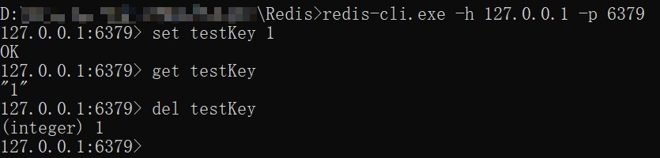

通过阅读GitHub上开源的[xmall项目](https://github.com/Exrick/xmall)深入学习分布式项目，初步了解Spring Boot框架及多种中间件的使用、原理。

<!-- more -->

### 一、前期配置学习

#### 1. ZooKeeper

##### 1.1 ZooKeeper概述

ZooKpeeper用于分布式应用程序的高性能协调服务。（“ZooKeeper is a high-performance coordination service for distributed applications.”）

ZooKeeper可提供用于命名，配置管理，同步和组服务等高级别的服务，目的在于减轻分布式应用程序从头开始实施协调服务的责任。

*ZooKeeper服务如下图*


ZooKeeper允许分布式进程通过共享的**层次命名空间**相互协调。ZooKeeper命名空间中的每个节点都可以具有与其关联的数据以及子节点。将ZooKeeper数据节点称为**znode**。

*ZooKeeper的层次命名空间*


##### 1.2 ZooKeeper的特点

1. ZooKeeper数据保存在内存中，因此具备高吞吐量和低延迟。
2. ZooKeeper的所有服务器维护内存中的状态图像，以及持久存储事务日志和数据库快照。
3. 只要大多数服务器可用，ZooKeeper服务将正常服务。
4. 标记每一次更新，可用于实现同步。
5. 在“读取为主”的工作负载中，ZooKeeper非常快。

##### 1.3 ZooKeeper的配置及运行

（1）从[ZooKeeper官网](http://zookeeper.apache.org/)下载压缩包 `apache-zookeeper-3.5.7-bin.tar.gz` ，解压至本地文件夹。

（2）解压后有两个文件夹：`apache-zookeeper-3.5.7-bin` 和 `PaxHeaders.X` ，前者的 `conf` 和 `bin` 文件夹较为重要。

（3）将 apache-zookeeper-3.5.7-bin\conf\ 目录下的 `zoo_sample.cfg` 文件重命名为 `zoo.cfg` ，并修改配置，如下所示。

```
# The number of milliseconds of each tick
# 用作"心跳"，且最小会话超时为tickTime的两倍
tickTime=2000
# The number of ticks that the initial 
# synchronization phase can take
initLimit=10
# The number of ticks that can pass between 
# sending a request and getting an acknowledgement
syncLimit=5
# the directory where the snapshot is stored.
# do not use /tmp for storage, /tmp here is just 
# example sakes.
# 内存数据库快照
dataDir=D:\\...(模糊化处理)\\Zookeeper\\dataDir
# 日志文件目录
dataLogDir=D:\\...(模糊化处理)\\Zookeeper\\dataLogDir
# the port at which the clients will connect
# 用于侦听客户端连接的端口
clientPort=2181
# the maximum number of client connections.
# increase this if you need to handle more clients
#maxClientCnxns=60
#
# Be sure to read the maintenance section of the 
# administrator guide before turning on autopurge.
#
# http://zookeeper.apache.org/doc/current/zookeeperAdmin.html#sc_maintenance
#
# The number of snapshots to retain in dataDir
#autopurge.snapRetainCount=3
# Purge task interval in hours
# Set to "0" to disable auto purge feature
#autopurge.purgeInterval=1
```

注意：`dataDir` 和 `dataLogDir` 两项，地址中分隔符应为 `\\` 而不是 `\` ，后者在ZooKeeper运行时将在 apache-zookeeper-3.5.7-bin\bin\ 目录下生成文件夹存放日志文件和快照，而不是在指定位置。


#### 2. Redis

##### 2.1 Redis概述

Redis是用C语言编写的、基于**内存数据集（in-memory dataset）**的内存数据存储结构，可用来实现**数据库**、**缓存**（cache）和**消息代理**（message broker）。

Redis是**键值存储**的形式，支持常见的字符串，哈希，列表（list），集合（set）、有序集合、位图和超日志等。

Redis具备：

- 事务。
- 不同级别的磁盘持久化（on-disk persistence），可一次全部持久化，也可以通过将每个命令附加到log来持久化它，还可以选择禁用持久化（用于网络内存缓存）。
- 通过**哨兵**（Redis Sentinel）和 Redis Cluster自动分区提供高可用性。
- 对数据进行原子操作（如 *INCR* 命令），如追加到字符串，在哈希中增加值，将元素推送到列表等。


##### 2.2 在Windows环境下安装、测试Redis

（1）[下载Redis](https://github.com/microsoftarchive/redis/releases)，解压到本地目录。

- redis-server.exe：Redis服务器
- redis-cli.exe：Redis客户端
- redis-check-aof.exe：更新日志检查
- redis-benchmark.exe：性能测试，模拟N个客户端同时发送M个set/get查询

（2）命令行窗口，输入 `redis-server.exe redis.windows.conf` 以启动Redis服务器。此窗口保持常开。

（3）另开命令行窗口，输入 `redis-cli.exe -h 127.0.0.1 -p 6379`，客户端连接服务器，其中 Redis服务器监听 **6379 端口**。

（4）测试

- 设置键值对： `set testKey 1`

- 取出键值对： `get testKey`

- 删除键值对： `del testKey`



删除键值对后，返回 `1` 说明删除成功，返回 `0` 说明删除失败。

