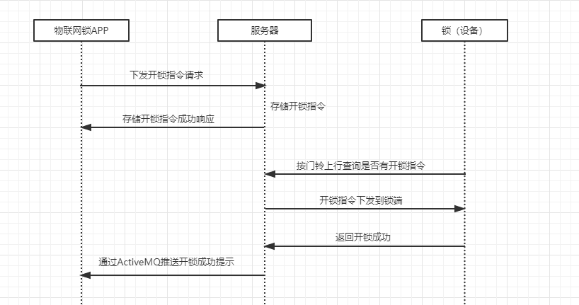
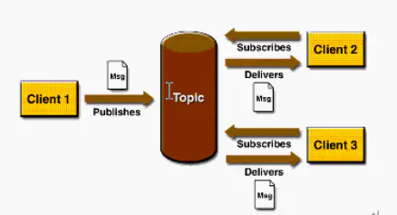
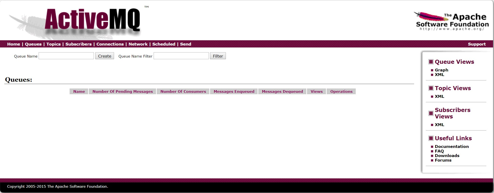
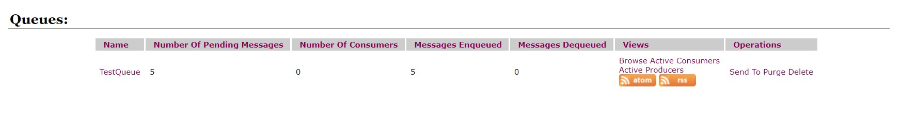
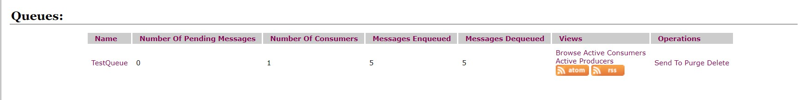

通过阅读GitHub上开源的[xmall项目](https://github.com/Exrick/xmall)深入学习分布式项目，初步了解SpringBoot框架及多种中间件的使用、原理。

<!-- more -->

### 一、前期配置学习

#### 1. ZooKeeper

##### 1.1 ZooKeeper概述

ZooKpeeper用于分布式应用程序的高性能协调服务。（“ZooKeeper is a high-performance coordination service for distributed applications.”）

ZooKeeper可提供用于命名，配置管理，同步和组服务等高级别的服务，目的在于减轻分布式应用程序从头开始实施协调服务的责任。

*ZooKeeper服务如下图*


ZooKeeper允许分布式进程通过共享的**层次命名空间**相互协调。ZooKeeper命名空间中的每个节点都可以具有与其关联的数据以及子节点。将ZooKeeper数据节点称为**znode**。

*ZooKeeper的层次命名空间*


##### 1.2 ZooKeeper的特点

1. ZooKeeper数据保存在内存中，因此具备高吞吐量和低延迟。
2. ZooKeeper的所有服务器维护内存中的状态图像，以及持久存储事务日志和数据库快照。
3. 只要大多数服务器可用，ZooKeeper服务将正常服务。
4. 标记每一次更新，可用于实现同步。
5. 在“读取为主”的工作负载中，ZooKeeper非常快。


##### 1.3 ZooKeeper的配置及运行

（1）从[ZooKeeper官网](http://zookeeper.apache.org/)下载压缩包 `apache-zookeeper-3.5.7-bin.tar.gz` ，解压至本地，重命名为 `zookeeper`。

（2）在ZooKeeper目录下新建data和dataLog文件夹，用于存储内存数据库快照和日志文件。

（3）将 zookeeper\conf\ 目录下的 `zoo_sample.cfg` 文件重命名为 `zoo.cfg` ，并修改配置，如下所示。

```
# The number of milliseconds of each tick
# “心跳”，最小会话超时为tickTime的两倍
tickTime=2000
# The number of ticks that the initial 
# synchronization phase can take
initLimit=10
# The number of ticks that can pass between 
# sending a request and getting an acknowledgement
syncLimit=5
# the directory where the snapshot is stored.
# do not use /tmp for storage, /tmp here is just 
# example sakes.
# 内存数据库快照
dataDir=/.../zookeeper/data
# 日志文件目录
dataLogDir=/.../zookeeper/dataLog
# the port at which the clients will connect
# 侦听客户端连接的端口
clientPort=2181
# the maximum number of client connections.
# increase this if you need to handle more clients
#maxClientCnxns=60
#
# Be sure to read the maintenance section of the 
# administrator guide before turning on autopurge.
#
# http://zookeeper.apache.org/doc/current/zookeeperAdmin.html#sc_maintenance
#
# The number of snapshots to retain in dataDir
#autopurge.snapRetainCount=3
# Purge task interval in hours
# Set to "0" to disable auto purge feature
#autopurge.purgeInterval=1

## Metrics Providers
#
# https://prometheus.io Metrics Exporter
#metricsProvider.className=org.apache.zookeeper.metrics.prometheus.PrometheusMetricsProvider
#metricsProvider.httpPort=7000
#metricsProvider.exportJvmInfo=true
```


#### 2. Redis

##### 2.1 Redis概述

Redis是用C语言编写的、基于**内存数据集（in-memory dataset）**的内存数据存储结构，可用来实现**数据库**、**缓存**（cache）和**消息代理**（message broker）。

Redis是**键值存储**的形式，支持常见的字符串，哈希，列表（list），集合（set）、有序集合、位图和超日志等。

Redis具备：

- 事务。
- 不同级别的磁盘持久化（on-disk persistence），可一次全部持久化，也可以通过将每个命令附加到log来持久化它，还可以选择禁用持久化（用于网络内存缓存）。
- 通过**哨兵**（Redis Sentinel）和 Redis Cluster自动分区提供高可用性。
- 对数据进行原子操作（如 *INCR* 命令），如追加到字符串，在哈希中增加值，将元素推送到列表等。


##### 2.2 安装与启动

（1）在Ubuntu系统中，直接使用apt包管理器安装Redis。

（2）启动Redis服务器：redis-server。

（3）Redis客户端连接本地Redis服务器： redis-cli。


#### 3. ActiveMQ

##### 3.1 ActiveMQ概述

ActiveMQ 是一种基于 Java 消息服务（Java Message Service）的消息中间件。

在**高并发**的条件下，由于来不及同步处理，请求往往会发生阻塞。例如大量的 update 请求同时到达 MySQL 服务器，造成请求大量堆积。通过使用 ActiveMQ，**异步处理已到达的请求**，缓解服务器压力。

（图源：https://www.cnblogs.com/xiguadadage/p/11217604.html）



如上图所示，通过 ActiveMQ 保存开锁指令，随后异步执行耗时的开锁操作，以减轻服务器的压力。


##### 3.2 ActiveMQ消息类型

JMS 消息通常有两种类型，ActiveMQ 是基于 JMS 的，所以介绍 ActiveMQ 的两种消息类型：**点对点**（Point-to-Point）和**发布/订阅**（Publish/Subscribe）。

（1）点对点

生产者与消费者点对点发送消息，借助队列（javax.jms.Queue）存储消息。


点对点类型的要点：

- 每个消息只有一个消费者 `Consumer` ，一旦被消费，消息就不再在队列中。
- 生产者 `Producer` 发送消息不受消费者状态的影响。（无依赖性）
- 消费者在成功接收消息后，需要向队列应答成功。

（2）发布/订阅

生产者发布事件，不同的消费者订阅并使用感兴趣的事件。此类型一般与特定的主题（javax.jms.Topic）关联。



发布/订阅类型的要点：

- 每个消息可以有**多个消费者**。
- 针对某个主题（Topic）的订阅者，它必须创建一个订阅者之后，才能消费发布者的消息。（有依赖性）
- 为了消费消息，订阅者必须**保持运行**的状态。


##### 3.3 ActiveMQ的使用

下载并解压至本地，在bin目录下执行相应命令：

- 启动：./activemq start
- 查看状态：./activemq status
- 关闭：./activemq stop

在浏览器中输入http://localhost:8161/admin/ 可访问控制台，账户/密码为 admin/admin。

接下来测试 ActiveMQ 应用于简单的 Java 程序中。

（1）Maven中引入依赖

```xml
<dependency>
    <groupId>org.apache.activemq</groupId>
    <artifactId>activemq-all</artifactId>
    <version>5.9.0</version>
</dependency>
```

（2）生产者

```java
import javax.jms.Connection;
import javax.jms.Destination;
import javax.jms.JMSException;
import javax.jms.MessageProducer;
import javax.jms.Session;
import javax.jms.TextMessage;
import org.apache.activemq.ActiveMQConnectionFactory;

public class Producer {
	
	private static final String brokerURL = "tcp://127.0.0.1:61616";
	
	public static void main (String[] args) throws JMSException {
		// 创建连接工厂
		ActiveMQConnectionFactory factory = new ActiveMQConnectionFactory(brokerURL);
		// 建立连接
		Connection conn = factory.createConnection();
		conn.start();
		// 创建会话
		Session session = conn.createSession(false, Session.AUTO_ACKNOWLEDGE);
		// 创建队列目标，并标识队列名称，消费者将依据队列名称接收数据
		Destination dest = session.createQueue("TestQueue");
		// 创建生产者
		MessageProducer producer = session.createProducer(dest);
		// 发送消息
		for(int i=1; i<6; i++) {
			TextMessage message = session.createTextMessage("第"+i+"条消息");
			producer.send(message);
			System.out.println(message.getText());
		}
		// 关闭连接
		conn.close();
	}
}
```

运行生产者之前，控制台如下：



运行生产者，发送5条消息，控制台发生了变化：



如图，队列中等待的消息 `Pending Message` 有5条，当前无消费者。

（3）消费者

```java
import javax.jms.Connection;
import javax.jms.Destination;
import javax.jms.JMSException;
import javax.jms.Message;
import javax.jms.MessageConsumer;
import javax.jms.MessageListener;
import javax.jms.Session;
import javax.jms.TextMessage;
import org.apache.activemq.ActiveMQConnectionFactory;

public class Consumer {

	private static final String brokerURL = "tcp://127.0.0.1:61616";
	
	public static void main (String[] args) throws JMSException {
		// 创建连接工厂
		ActiveMQConnectionFactory factory = new ActiveMQConnectionFactory(brokerURL);
		// 建立连接
		Connection conn = factory.createConnection();
		conn.start();
		// 创建会话
		Session session = conn.createSession(false, Session.AUTO_ACKNOWLEDGE);
		// 创建队列目标，并标识队列名称，消费者将依据队列名称接收数据
		Destination dest = session.createQueue("TestQueue");
		// 创建消费者
		MessageConsumer consumer = session.createConsumer(dest);
		// 消费者监听
		consumer.setMessageListener(new MessageListener() {
			@Override
			public void onMessage(Message message) {
				TextMessage textMessage = (TextMessage) message;
				try {
					System.out.println(textMessage.getText());
				}catch (JMSException e) {
					e.printStackTrace();
				}
			}
		});
	}
}
```

消费者启动后，控制台又发生了变化：



显示此时有1个消费者，刚入队的5条消息均已出队，当前队列中无消息。

注意创建会话的方法，其中有两个参数。

```java
// 创建会话
Session session = conn.createSession(false, Session.AUTO_ACKNOWLEDGE);
```

1. false: 表示 *不使用事务* 。事务：生产者在发送消息后等待消息代理的确认，没有回应则抛出异常，并由生产者负责处理。
2. *确认模式* ：
   - `AUTO_ACKNOWLEDGE`：指定消息接收者在每次收到消息时自动发送确认。消息只向目标发送一次，但传输过程中可能因为错误而丢失消息。
   - `CLIENT_ACKNOWLEDGE`：由消息接收者确认收到消息，通过调用消息的 `acknowledge()` 方法（会通知消息提供者收到了消息）。
   - `DUPS_OK_ACKNOWLEDGE`：指定消息提供者在消息接收者没有确认发送时重新发送消息（这种确认模式不在乎接收者收到重复的消息）。


##### 3.4 ActiveMQ进阶之多种MQ简要比较

- ActiveMQ 适用于解耦和异步操作，简单易用，对队列数较多的情况支持不好。
- RabbitMQ，erlang开发，性能较稳定，社区活跃度高，但是不利于做二次开发和维护。
- RocketMQ 支持海量消息，但未实现 JMS 规范。
- Kafka 适用于大数据领域、日志采集等场景。


##### 3.5 ActiveMQ进阶之持久化

为避免意外丢失数据，也为重启时可恢复至重启前的正常状态，ActiveMQ 需要实现持久化。

ActiveMQ的消息持久化机制有 **JDBC，AMQ，KahaDB** 和 **LevelDB**。

**持久化原理**：在发送者将消息发送出去后，消息中心首先将消息存储到本地数据文件、内存数据库或者远程数据库等，然后试图将消息发送给接收者，发送成功则将消息从存储中删除，失败则继续尝试。

消息中心启动以后首先要检查指定的存储位置，如果有未发送成功的消息，则需要把消息发送出去。

（1）JDBC

数据库会创建3个表：`activemq_msgs`，`activemq_acks` 和 `activemq_lock`。

`activemq_msgs `用于存储消息，`Queue` 和 `Topic` 都存储在这个表中。

（2）AMQ

- 以顺序追加的方式将消息写入日志文件。
- 创建消息主键索引，且提供缓存。综上，AMQ 性能优于 JDBC。

AMQ 的缺点：

- 重建索引时间长，且索引文件占用磁盘空间较大。

（3）KahaDB（默认）

从 ActiveMQ 5.4 开始成为默认的持久化插件。

- 基于日志文件，支持索引和缓存。
- 使用更少的数据文件，恢复时间远小于 AMQ。

（4）LevelDB

5.6 版本推出的持久化引擎，性能高于 KahaDB。可见这几种持久化方式中，LevelDB 性能最好。


#### 4. Elasticsearch

##### 4.1 Elasticsearch概述

Elasticsearch是一个基于Apache Lucene的开源搜索引擎，使用Java语言开发并使用Lucene作为其核心来实现索引和搜索。

Elasticsearch通过集成的RESTful API来隐藏Lucene的复杂性，它是：

- 分布式的实时文件存储，每个字段都被索引且可被搜索；
- 分布式的实时分析搜索引擎；
- 可扩展性，处理PB级结构化或非结构化数据。


##### 4.2 运行Elasticsearch

（1）前台启动：./bin/elasticsearch

（2）关闭：Ctrl+c


##### 4.3 节点与集群

- 节点（Node）：一个运行着的Elasticsearch实例。
- 集群（cluster）：一组具有相同的 `cluster.name` 的节点的集合。集群内的节点共享数据，提供故障转移和扩展功能。


#### 参考资料

[1] [消息中间件之ActiveMQ](https://www.jianshu.com/p/cd8e037e11ff)

[2] [浅谈ActiveMQ与使用](https://www.cnblogs.com/xiguadadage/p/11217604.html)

[3] [Elasticsearch 权威指南（中文版）](https://es.xiaoleilu.com/)