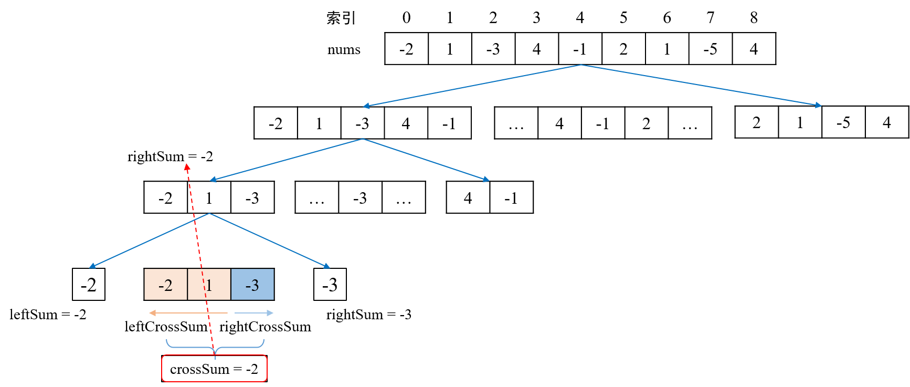

[分治法](https://baike.baidu.com/item/%E5%88%86%E6%B2%BB%E6%B3%95/2407337?fr=aladdin)是一种十分重要的算法思想，其精髓是"分而治之"，即把复杂的问题分解成数个小规模的、形式相同的子问题，再逐个"击破"子问题，最后合并所有子问题的解以解决原问题。诸如快速排序、归并排序、快速傅里叶变换等算法均是分治法思想的重要体现。

<!--more-->

#### 一、概念

分治法（Divide and Conquer）与**动态规划**类似，二者最大的区别在于：适用于分治法求解的问题，经分解后得到的**子问题往往是相互独立的**。


分治法可解决的问题，应具备如下特征：

（1）问题的规模缩小后，更容易解决。

（2）该问题可分解为若干个小规模的、形式相同的问题，即该问题具有最优子结构性质。这体现了**递归思想**在分治法中的应用。

**（3）利用该问题分解出的子问题的解能够合并为该问题的解。**这决定了某一问题是否适用于分治法。不符时应考虑贪心法或[动态规划](https://merlinhu0112.github.io/2020/01/02/%E4%BA%94%E5%A4%A7%E5%B8%B8%E7%94%A8%E7%AE%97%E6%B3%95%E4%B9%8B%E5%8A%A8%E6%80%81%E8%A7%84%E5%88%92/)。

（4）子问题是相互独立的。子问题若不独立，应考虑[动态规划](https://merlinhu0112.github.io/2020/01/02/%E4%BA%94%E5%A4%A7%E5%B8%B8%E7%94%A8%E7%AE%97%E6%B3%95%E4%B9%8B%E5%8A%A8%E6%80%81%E8%A7%84%E5%88%92/)。


#### 二、二分查找

二分查找是分治思想的重要且常用的实现算法之一。

二分查找的基本思路是：将目标对象（一般为数组）一分为二，递归地进入子对象继续进行二分查找，直至子问题可以很容易被解决。其核心代码如下。

```java
// 二分查找
while(lo<=hi){
    mid = (hi+lo)>>1;
    if(nums[mid]==target){
        return mid; // 最小规模的子问题，直接返回子问题的结果
    }else if(nums[mid]>target){
        hi = mid-1;
    }else{
        lo = mid+1;
    }
}
```


#### 三、最大子序和问题

最大子序和问题是一道经典的算法题，可参见LeetCode[第53题](https://leetcode-cn.com/problems/maximum-subarray/ )。

问题描述：求最大子序和。给定一个整数数组 `nums` ，找到一个具有最大和的连续子数组（子数组最少包含一个元素），返回其最大和。

用例：[-2, 1, -3, 4, -1, 2, 1, -5, 4]

正确输出结果：6


分治法的核心在于如何将目标数组划分为若干个子数组并分别求出子数组的最大子序和。容易想到，将数组沿 `(left+right)/2` 划分为两段，分别递归求解两段的最大子序和，随后合并结果（即从两个值中选择较大者）。

那么，取上述两段最大子序和中的较大者就是数组 `nums` 的最大子序和了吗？

显然，上述结论是不成立的。因为将数组一分为二，没有考虑到**数组跨越中间元素组成的序列**的情况。那么，考虑它就是咯！

就测试用例而言，我们可沿索引为 `4` 的元素将 `nums` 划分为：

-  [-2, 1, -3, 4, -1]，左半段，leftSum；
- [2, 1, -5, 4]，右半段，rightSum；
- [ ... , 4, **-1**, 2, ... ]，跨越中间元素的数组，crossSum。
- 取上述三者的最大值。


对于左右半段，递归调用函数即可求解。如何求解跨越中间元素数组的最大子序和（crossSum）呢？

如图，以已经划分至最小规模的 `[-2, 1, -3]` 为例。我们从 `-1` 出发，扫描至左端边界，求得跨越中间元素数组的**含边界** `-1` 的最大子序和 `leftCrossSum` ；再从 `-3` 出发，扫描至右端边界，求得跨越中间元素数组的含边界 `-3` 的最大子序 `rightCrossSum` ；二者之和即为 `crossSum` 。




算法实现如下：

```java
public int maxSubArray(int[] nums) {
    return recursion(nums, 0, nums.length-1);
}

private int recursion(int[] nums, int left, int right) {
    if(left==right) {
        return nums[left];
    }

    int mid = (left+right)>>1;
    int leftSum = recursion(nums, left, mid); // 继续划分，递归求解，左段
    int rightSum = recursion(nums, mid+1, right); // 继续划分，递归求解，右段
    int crossSum = crossSum(nums, left, right); // 求解跨越中间元素时的最大序列和

    return Math.max(Math.max(leftSum, rightSum), crossSum);
}

// 求解跨越中间元素时的最大序列和
private int crossSum(int[] nums, int left, int right) {
    int mid = (left+right)>>1;

    int leftCrossSum = Integer.MIN_VALUE;
    int leftCurrSum = 0;
    for(int i=mid; i>=left; i--) {
        // 扫描左边
        leftCurrSum += nums[i];
        leftCrossSum = Math.max(leftCrossSum, leftCurrSum);
    }

    int rightCrossSum = Integer.MIN_VALUE;
    int rightCurrSum = 0;
    for(int i=mid+1; i<=right; i++) {
        // 扫描右边
        rightCurrSum += nums[i];
        rightCrossSum = Math.max(rightCrossSum, rightCurrSum);
    }

    return leftCrossSum+rightCrossSum;
}
```

算法总结：

- 时间复杂度：O(n log n)；
- 空间复杂度：O(log n)。