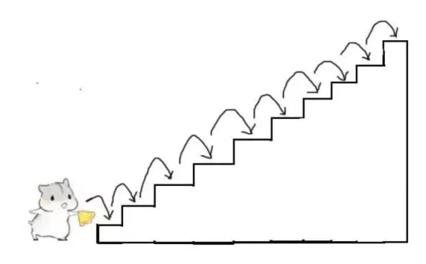
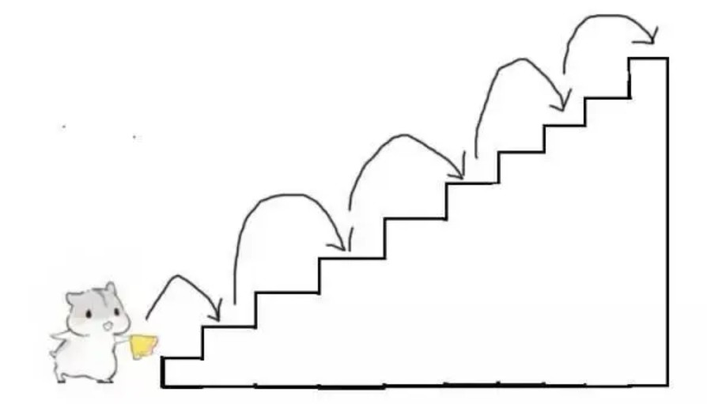
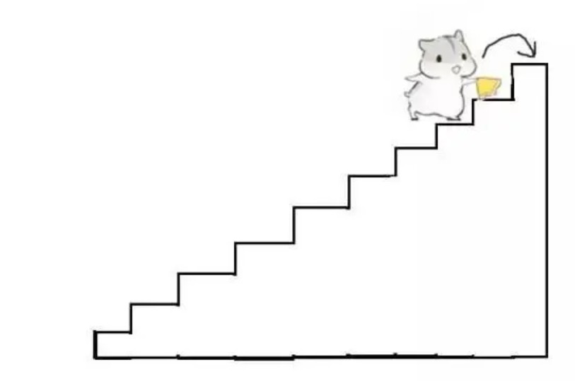
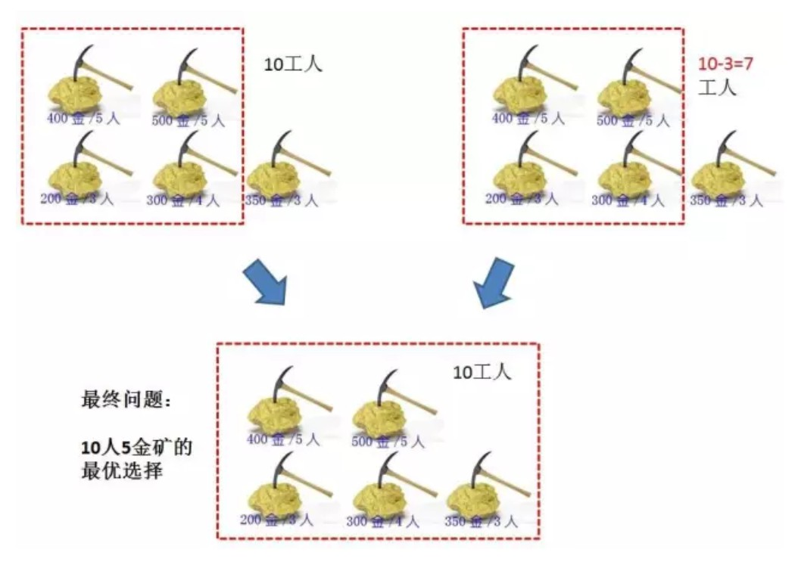

通过阅读他人优秀的文章，基于经典的青蛙跳台阶问题，深入地学习动态规划建模过程。通过递归算法、自顶向下的备忘录算法及自低向上的动态规划算法，解决实际问题。

<!--more-->

#### 一、概念

动态规划（Dynamic Programming）与**分治法**类似，其基本思想也是将待求解问题分解成若干个子问题，先求解子问题，然后从这些子问题的解得到原问题的解。

与分治法不同的是，适合于用动态规划求解的问题，经分解得到**子问题往往不是互相独立的**。

用一个表来记录所有已解的子问题的答案，不管该子问题以后是否被用到，只要它被计算过，就将其结果填入表中，这就是动态规划法的基本思路。


#### 二、建模

对问题建模前，须明确以下三个重要概念：

>1、最优子结构
>
>2、边界
>
>3、状态转移方程


#### 三、以青蛙跳台阶问题为例，深入剖析动态规划建模过程

##### 1. 对青蛙跳台阶问题的图解

（本小节图源：https://mp.weixin.qq.com/s/3h9iqU4rdH3EIy5m6AzXsg ）

- 每次跳1级台阶




- 或每次跳2级台阶




如果站在第n级台阶的角度上，如何到达该层？

> a. 从第n-1级台阶，跳1级台阶，到达第n级


> b. 从第n-2级台阶，跳2级台阶，到达第n级



显然，**到达第n级台阶的路线总数等于到达第n-1级和第n-2级之和**。


##### 2. 建模

- 最优子结构

  如上所述，第n级台阶的路线总数等于到达第n-1级和第n-2级之和，即 F(n) = F(n-1) + F(n-2)。

- 状态转移方程

  **F(n) = F(n-1) + F(n-2)**

- 边界

  F(1) = 1, F(2) = 2


##### 3. 算法实现

（1）递归

```java
public int frogJump(int N){
    if(N<=0){
        return 0
    }
    if(N<=2){
        return N;
    }
    return frogJump(N-1) + frogJump(N-2);
}
```

算法复杂度分析：

- 时间复杂度：O(2^N)
- 空间复杂度：O(N)


（2）备忘录算法（自顶向下）

利用集合Map，避免递归算法中的重复计算部分，提高算法效率

```java
public int frogJump(int N, HashMap<Integer, Integer> map){
    if(N<=0){
        return 0
    }
    if(N<=2){
        return N;
    }
    if(map.containsKey(N)){
        return map.get(N);
    }else{
        int val = frogJump(N-1) + frogJump(N-2);
        map.put(N, val);
        return val;
    }
}
```

算法复杂度分析：

- 时间复杂度：O(N)
- 空间复杂度：O(N)


（3）动态规划（自底向上）

备忘录算法中须保存所有子状态，若仅仅保存递推所需的前两个子状态，便能优化算法的空间复杂度。

>通过自底向上的递推，仅仅利用常数额外空间，优化算法的时间和空间复杂度，这便是动态规划

```java
public int frogJump(int N){
   if(N<=0){
        return 0
    }
    if(N<=2){
        return N;
    }
    
    int a = 1;
    int b = 2;
    int tmp = 0;
    for(int i=3;i<=N;i++){
        tmp = a + b;
        a = b;
        b = tmp; // 更新最新的子状态
    }
    return tmp;
}
```

算法复杂度分析：

- 时间复杂度：O(N)
- 空间复杂度：O(1)


#### 四、更加复杂的动态规划——国王与金矿问题

问题：有一个国家发现了n座金矿，每座金矿的黄金储量不同，且每座金矿需要参与挖掘的工人数也不同。参与挖矿工人的总数是w。每座金矿要么全挖，要么不挖，不能派出一半人挖取一半金矿。要想得到尽可能多的黄金，应该选择挖取哪几座金矿？

（本小节图源：https://www.cnblogs.com/hczd123/p/7412950.html ）


##### 1. 建模

> n：金矿数量；w：总的工人数；g[]：保存每座金矿的矿藏量；p[]：保存每座金矿的用工数

建模过程中，需要明确最优子结构、状态转移方程和边界这三个要素。


（1）确定最优子结构

以10名工人开挖5座金矿为例。其最优子结构分为如下两种情况：

- 若不挖第5座金矿，则最优解为10人开挖4座金矿的最优解；
- 若挖第5座金矿，则需要找到剩下的人挖剩余的4座金矿的最优解；



> 显然，10人挖5座金矿的最优解是这两种子状态的较大值


（2）确定状态转移方程

- 若第n座金矿有足够的人工开挖，则w个工人开挖n座金矿的情形，满足下列方程：

> F(n, w) = max(F(n-1, w), F(n-1, w-p[n-1])+g(n-1)), n>1, w>=p[n-1]

- 若w个工人不能满足开采第n座金矿所需的工人数，则满足下列方程：

> F(n, w) = F(n-1, w), n>1, w<p[n-1]


（3）确定边界

- 若金矿数仅为1，且工人数能满足开采该金矿所需的工人数，则有：

> F(n, w) = g[0], n==1, w>=p[0]

- 若金矿数为1，但工人总数不满足要求，则有：

> F(n, w) = 0, n==1, w<p[0]


##### 2. 算法实现

（1）递归解法

```java
public int getMaxGold(int n, int w, int[] g, int[] p){
    if(n<=0 || w<=0 || g==null || p==null){
        return 0;
    }
    if(n==1 && w<p[0]){
        return 0;
    }
    if(n==1 && w>=p[0]){
        return g[0];
    }
    
    int a = getMaxGold(n-1, w, g, p);
    if(w<p[n-1]){
        return a;
    }
    int b = getMaxGold(n-1, w-p[n-1], g, p) + g[n-1];
    return Math.max(a, b);
}
```

算法复杂度分析：

- 时间复杂度：O(2^n)
- 空间复杂度：O(n)


（2）备忘录算法

> 类似于青蛙跳问题中的备忘录算法，利用集合Map保存子状态，其中HashMap的Key是包含金矿数n和工人数w的对象，Value是最多的开采量。

```java
int getMaxGold(int n, int w, int[] g, int[] p, HashMap<KeyObject, Integer> map){
    if(n<=0 || w<=0 || g==null || p==null){
        return 0;
    }
    if(n==1 && w<p[0]){
        return 0;
    }
    if(n==1 && w>=p[0]){
        return g[0];
    }

    KeyObject a_obj = new KeyObject(n-1, w);
    int a = 0;
    if(map.containsKey(a_obj)) {
        a = map.get(a_obj);
    }else {
        a = getMaxGold(n-1, w, g, p, map);
        map.put(a_obj, a);
    }

    if(w<p[n-1]) {
        return a;
    }

    KeyObject b_obj = new KeyObject(n-1, w-p[n-1]);
    int b = 0;
    if(map.containsKey(b_obj)) {
        b = map.get(b_obj) + g[n-1];
    }else {
        b = getMaxGold(n-1, w-p[n-1], g, p, map);
        map.put(b_obj, b);
        b += g[n-1];
    }

    return Math.max(a, b);   
}

// 内部类用于HashMap中的Key
private static class KeyObject{
    private int n;
    private int w;

    public KeyObject(int n, int w) {
        this.n = n;
        this.w = w;
    }
}
```

算法复杂度分析：

- 时间复杂度：O(n*w)
- 空间复杂度：O(n*w)


==（3）动态规划算法==

以10名工人挖5座金矿为例，可作下表


表中，每一行的所有数据均可**由上一行数据推导得到**，因而动态规划算法可基于此规律，利用前一行数据推导当前行数据。

```java
int getMaxGold(int n, int w, int[] g, int[] p){
    if(n<=0 || w<=0 || g==null || p==null){
        return 0;
    }

    int[] preResult = new int[w+1]; // w+1列，保存上一行数据
    int[] result = new int[w+1];

    // 填充边界
    for(int j=0;j<=w;j++) {
        if(j<p[0]) {
            preResult[j] = 0; // 当金矿数为1，但工人总数无法满足开采要求时
        }else {
            preResult[j] = g[0]; // 金矿数为1，且工人总数满足要求
        }
    }

    if(n==1) {
        return preResult[w];
    }

    // 状态转移方程
    // 外循环中，i为当前金矿索引；内循环中，j为工人数
    for(int i=1;i<n;i++) {
        for(int j=0;j<=w;j++) {
            if(j<p[i]) {
                // 若j个工人不能满足开采第i+1座金矿所需的工人数
                result[j] = preResult[j];
            }else {
                // 若第i+1座金矿有足够的人工开挖，则j个工人开挖i+1座金矿
                result[j] = Math.max(preResult[j], preResult[j-p[i]]+g[i]);
            }
        }
        // 更新子状态
        for(int j=0;j<=w;j++) {
            preResult[j] = result[j];
        }
    }

    return result[w];
}
```

算法复杂度分析：

- 时间复杂度：O(n*w)
- 空间复杂度：O(w)


#### 参考资料：

[1] https://mp.weixin.qq.com/s/3h9iqU4rdH3EIy5m6AzXsg

[2] https://www.cnblogs.com/hczd123/p/7412950.html