基于八皇后问题给出回溯算法的解析过程。回溯算法是真的难，过于抽象，还需反反复复地看看看！

<!--more-->

#### 一、基本概念

回溯法（探索与回溯法）是一种选优搜索法，按选优条件向前搜索，以达到目标。但当探索到某一步时，发现原先选择并不优或达不到目标，就退回一步重新选择，这种走不通就退回再走的技术为回溯法，而满足回溯条件的某个状态的点称为“**回溯点**”。

其基本思想是，在包含问题的所有解的解空间树中，按照**深度优先搜索**的策略，从根结点出发深度探索解空间树。当探索到某一结点时，要先判断该结点是否包含问题的解，如果包含，就从该结点出发继续探索下去，如果该结点不包含问题的解，则逐层向其祖先结点回溯。


#### 二、典型应用之八皇后问题

题干：八皇后问题由马克斯·贝瑟尔于1848年提出：在8×8格的国际象棋上摆放八个皇后，使其不能互相攻击，即任意两个皇后都不能处于同一行、同一列或同一斜线上。试问总共有多少种摆放的方法？==（92种）==


##### 1. 分析

* 显然，棋盘上每一行（或每一列）上只能同时出现一个皇后。要解决此问题，可先摆放第1行的皇后，紧接着摆放第2行的皇后。

* 在摆放第i行的皇后时，需要判断其是否与前面所有行已存在的皇后产生冲突。

* 若无，直接放置，并继续下一行，直至摆放完最后一行。

* 若产生冲突，则调整此行的皇后位置。若此行所有位置均不符合要求，则需要**回溯至第i-1行，调整改行皇后的位置**，直至回溯至第1行。


##### 2. 图解

（1）放置第1行的皇后：8格均可，先尝试放置在第1格。红色表示**下一行**对应位置已被锁定。

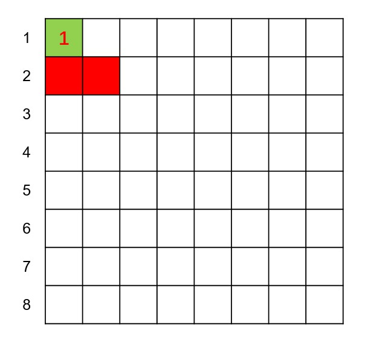

（2）放置第2行的皇后：前两格已被第1行的皇后锁定，故只能在后6格中任选，选第3格。相应的，前两行放置好的皇后也锁定了第3行部分位置。

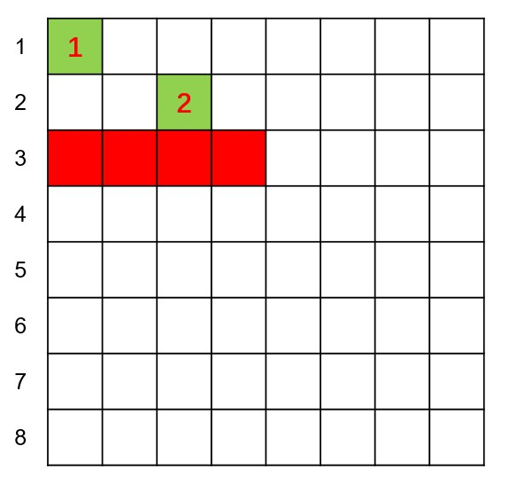

（3）放置第3行的皇后：在未被锁定的后4格中任选，选第5格。

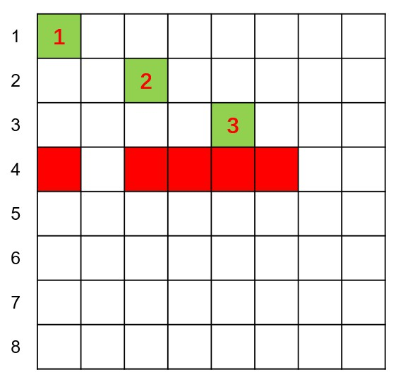

（4）放置第4行的皇后：只有3格可选，选第2格。

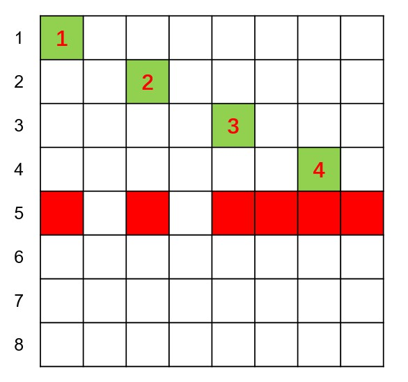

（5）放置第5行的皇后：只剩2格可选，选第1格。

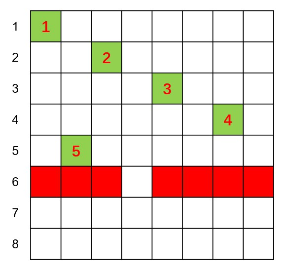

（6）放置第6行的皇后：只能选择第4格。

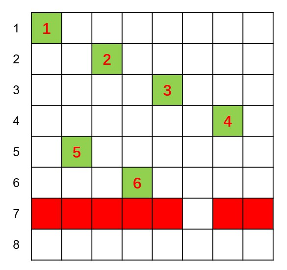

（7）放置第7行的皇后：只能选择第6格。

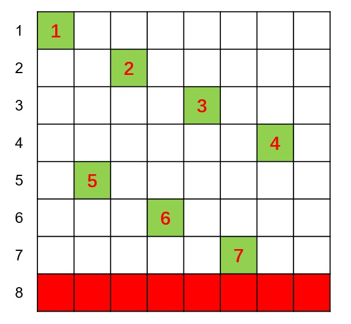

（8）放置完前7行后可发现，第8行所有位置均被锁定。故回溯至第7行。

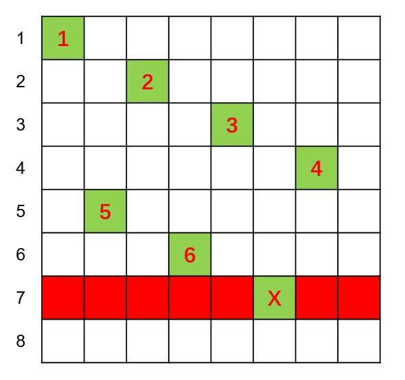

（9）第7行仅有一个位置，且已尝试过，故继续回溯至第6行。

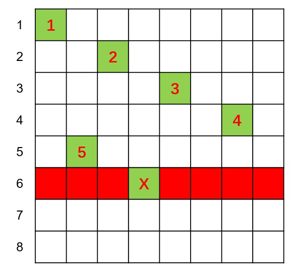

（10）同样地，继续回溯至第5行。

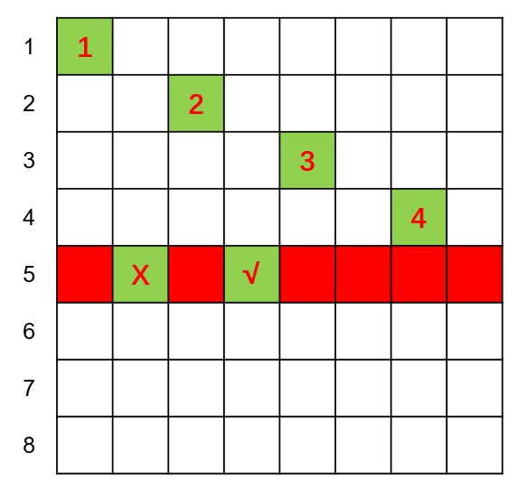

（11）第5行有两个位置，前一个已被尝试过，故选择第4格作为第5行皇后的新位置。

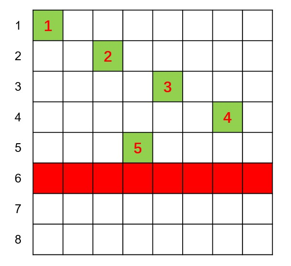

> 很不幸，第5行重新放置后，第6行所有位置被锁定，故仍需回溯至第4行。在此就不继续演示了。


##### 3. 算法实现

```java
/**
 * 八皇后问题，基于递归的回溯思想，解决此问题
 * 2020-01-13
 * @author Merlin
 */
public class EightQueens {
	
	private static int[] checkerboard = new int[8]; // 棋盘的列投影，记录每一行的皇后存放的列索引值
	private static final int len = 8; // 棋盘的行或列长度为8
	private static final int queens = 8; // 皇后数，为8
	private int total = 0; // 记录总共的解法数，对八皇后问题，应为92
	
	public EightQueens() {}
	
	/**
	 * 递归地放置皇后到第i+1行合适的位置
	 * 放置第i+1行的皇后之后，需要判断其是否与之前的皇后冲突，若无，递归进入下一行；
	 * 若产生冲突，将其往后移动一列，避免冲突
	 * 注意for循环内部是递归嵌套的，若到最后某一行皇后已无法移动，则会逐步返回上一层，直至
	 * 调整首行以实现放入所有皇后
	 * @param i 行序号，[0, 7]
	 */
	private void putQueen(int i) {
		if(i==queens) {
			total++; // 此语句执行则说明当前结果是一种可行解法，故总解法数加1
		}else {
			for(int col=0; col<len; col++) {
				checkerboard[i] = col; // 对于第i+1行，该行的皇后放在第col+1列；若if语句为false，则调整第i+1行的皇后位置
				if(check(i)) {
					putQueen(i+1); // 若检查发现，第i+1行及之前各行皇后位置均满足题意，则递归移动下一行
				}
			}
		}
	}
	
	/**
	 * 判断第i+1行放入的皇后是否与之前的皇后产生冲突
	 * @param i 行序号，[0, 7]
	 * @return
	 */
	private boolean check(int i) {
		for(int j=0; j<i; j++) {
			// j为第i+1行之前的所有行，需要逐一比较
			if(checkerboard[i]==checkerboard[j] || i-checkerboard[i]==j-checkerboard[j] ||
					i+checkerboard[i]==j+checkerboard[j]) {
				// checkerboard[i]==checkerboard[j] 判断不同行的皇后是否在同一列
				// i-checkerboard[i]==j-checkerboard[j] 判断不同行的皇后是否在左对角线上
				// i+checkerboard[i]==j+checkerboard[j] 判断不同行的皇后是否在右对角线上
				return false;
			}
		}
		return true;
	}
	
	// 辅助方法，启动putQueen
	public void run() {
		putQueen(0); // 从第1行开始，其行序号为0
	}
	
	public int getTotal() {
		return total;
	}
}
```


#### 参考资料

[1] https://www.php.cn/faq/415926.html

[2] https://www.jianshu.com/p/dd3c3f3e84c0