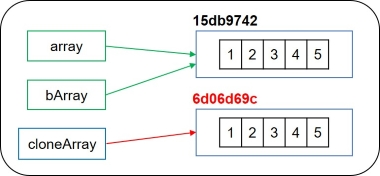
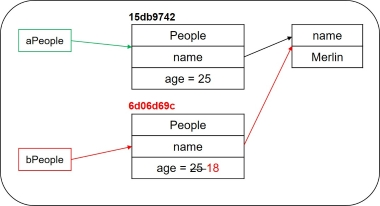
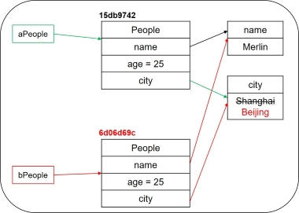
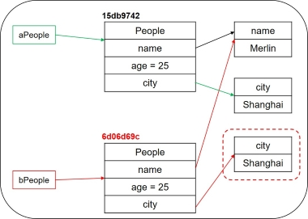
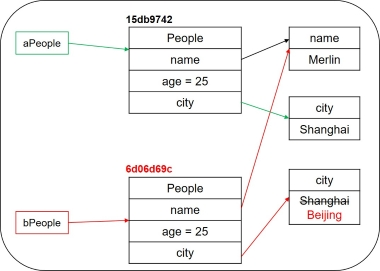

浅拷贝（shallow copy）与深拷贝（deep copy）有何区别？浅克隆与深克隆又有何区别？Object基类中受保护的（protected）clone( )方法与Cloneable接口又有何联系？

<!-- more -->

### 一、克隆对象

#### 1. 复制对象引用与建立副本

在Java中，对于**基本数据类型**的变量，为其建立副本的过程较为简单。

```java
int a = 1; // 基本数据类型之一的int变量
b = a; // 变量b为变量a的副本，值与a相同，b = 1
```

如果为**引用类型**的变量建立副本，会发生什么呢？

```java
public class People {
    
    private String name;
	private int age;
	
    // get/set方法省略
    
	public People(String name, int age) {
		this.name = name;
		this.age = age;
	}

	public void print() {
		System.out.println("name = " + name + ", age = " + age);
	}
}
```

为 `People` 类实例化一个新对象 `aPeople`，并将其初始化。为 `aPeople` 建立副本，为 `bPeople`。

```java
public class ObjectCloneDemo {
	public static void main(String[] args) {
		People aPeople = new People("Merlin", 25);
		aPeople.print();
		People bPeople = aPeople; // 副本
		bPeople.print();
		bPeople.setAge(18); // 修改
		aPeople.print();
	}
}
```

尝试修改 `bPeople` ，发现 `aPeople` 的成员变量也随之发生变化。

```java
// 修改前
aPeople: name = Merlin, age = 25;
bPeople: name = Merlin, age = 25;
// 修改后
aPeople: name = Merlin, age = 18; // age发生变化
```

对象 `aPeople` 的 `age` 属性发生变化的原因在于， `People bPeople = aPeople` 语句是将 `aPeople` 的**内存地址**赋予 `bPeople` 。

`aPeople` 和 `bPeople` **同时指向堆内存中的同一地址**。修改变量 `bPeople` 引用的对象的属性，会立即被 `aPeople` 看见。（注：字符串 `Merlin` 保存在常量池中，在此简化之。）


#### 2. Object类的clone方法

如上所述，为引用类型变量 `aPeople` 进行复制对象引用并赋值给 `bPeople` 的操作后，无法单独操作两个对象。

那么，如何在保留一个对象原有状态数据的前提下对新对象进行操作呢？

**克隆对象**，用新对象保存当前对象的状态，在克隆的副本上对对象进行操作。这与 `new` 操作得到一个初始化的新对象是不同的。 

在Java的Object基类中，提供一种受保护的（protected）的**clone()**方法，实现克隆对象。

```java
protected native Object clone() throws CloneNotSupportedException;
```

基于JDK 1.8的源码，对clone()方法有如下规定：

一般地，对任意对象，以下三种语句均返回 `true`，但都无强制性规定。

- x .clone( ) != x ;
- x .clone( ) .getClass( ) == x .getClass ;
- x .clone( ) .equals(x) ; 


#### 3. 克隆对象演示

数组已实现 `Cloneable` 接口，可直接使用 `clone()` 方法。

```java
public static void main(String[] args) {
    int[] array = {1, 2, 3, 4, 5};
    int[] cloneArray = array.clone(); // 数组均实现了Cloneable接口
    System.out.println(array); // 打印原始数组的内存地址
    System.out.println(cloneArray); // 打印克隆数组的内存地址
    System.out.println(array==cloneArray);

    int[] bArray = array;
    System.out.println(bArray); // 打印复制对象引用并赋值给新对象的内存地址
    System.out.println(array==bArray);
}
```

为对象 `array` 复制对象引用并赋值给 `bArray` ，及克隆对象 `array` 得到 `cloneArray` 。

输出结果显示，克隆对象指向**新的内存地址**。

```java
[I@15db9742 // 原始对象内存地址
[I@6d06d69c // 克隆对象内存地址
false 
[I@15db9742 // 复制对象引用并赋值给新对象
true
```




### 二、浅克隆和深克隆

> 浅克隆（浅拷贝）与深克隆（深拷贝）

#### 1. 浅克隆

仅支持拷贝**基本数据类型的成员变量**：对基本数据类型的成员变量，复制**值副本**给克隆对象；对引用类型的成员变量，**仅复制内存地址**给克隆对象。

*浅克隆代码示例*

基于前述 `People` 类，必须实现 `Cloneable` 接口，重写 `clone()` 方法。注意：

- 提高方法的访问权限，以便包外访问。
- 调用父类（Object类）的clone方法。

```java
public class People implements Cloneable {
    // 其余代码同前
	@Override
	// 实现标记接口Cloneable，重写Object类的
	// clone方法，提高访问权限，调用父类的clone方法
	public Object clone() {
		People people = null;
		try {
			people = (People) super.clone();
		}catch (CloneNotSupportedException e) {
			e.printStackTrace();
		}
		return people;
	}
}
```

修改克隆对象 `bPeople` 的属性，不影响原始对象 `aPeople` 。

```java
public static void main(String[] args) {
    People aPeople = new People("Merlin", 25);
    aPeople.print();
    System.out.println(aPeople);
    People bPeople = (People) aPeople.clone();
    // 尝试修改bPeople对象
    bPeople.setAge(18); 
    bPeople.print();
    System.out.println(bPeople);
}
```

输出结果

```java
aPeople: name = Merlin, age = 25;
bPeople: name = Merlin, age = 18;
aPeople地址：copy_object.People@15db9742
bPeople地址：copy_object.People@6d06d69c // 克隆后，地址发生了改变
```

值得注意的是，拷贝对象 `aPeople`（浅克隆）时，在堆内存中新开辟了一块内存空间以存放新的对象，并将克隆对象 `bPeople` 指向该引用。基本数据类型的属性 `age` 的值被复制到新的对象中，而引用类型的属性**仅复制内存地址**。

修改 `bPeople` 对象的属性 `age` 时，仅修改内存地址为 `6d06d69c ` 的对象，不影响原始对象 `aPeople`。

在浅克隆时，修改克隆对象引用类型的属性时可能会影响到原始对象。在此例中，`String` 属于不可变对象，属特殊情况。 




#### 2. 浅克隆在面对引用变量时面临的问题

如前所示，在浅克隆时，修改克隆对象引用类型的属性（不可变的对象除外）时可能会影响到原始对象。

在 `People` 中添加引用类型属性 `city`。

```java
public class City {
	
	private String city;
	
    // get/set，构造方法均略
}
```

重新 `clone()` 方法，实现浅克隆。

```java
public class People implements Cloneable {
	
	private String name;
	private int age;
	private City city; // 引用类型的成员变量
	
	@Override
	public Object clone() {
		People people = null;
		try {
			people = (People) super.clone(); // 浅克隆
		}catch (CloneNotSupportedException e) {
			e.printStackTrace();
		}
		return people;
	}

	// 其余同前
}
```

测试方法

```java
public static void main(String[] args) {
    City city = new City("Shanghai");
    People aPeople = new People("Merlin", 25, city);
    People bPeople = (People) aPeople.clone();
    aPeople.print();
    bPeople.print();
    // 修改city变量
    city.setCity("Beijing");
    aPeople.print();
    bPeople.print();
}
```

输出结果

```java
aPeople: name = Merlin, age = 25, city = Shanghai;
bPeople: name = Merlin, age = 25, city = Shanghai;
aPeople: name = Merlin, age = 25, city = Beijing; // 修改bPeople影响了aPeople
bPeople: name = Merlin, age = 25, city = Beijing;
```

可见，修改克隆对象 `bPeople` 的**可变引用类型的成员变量**，影响了原始对象 `aPeople` 。内存示意图如下：




#### 3. 深克隆

支持拷贝**基本类型和引用类型的成员变量**：对基本数据类型和引用类型的成员变量，都是复制值副本给克隆对象。

深克隆示意图如下：



深克隆与浅克隆的区别在于，对**可变的引用类型的成员变量，深克隆时为其开辟新的内存空间，浅克隆时仅复制内存地址**。

*深克隆代码实现*

对可变的引用类型，也要实现 `Cloneable` 接口。

```java
public class City implements Cloneable {
	// 其余同前
	@Override
	public Object clone() {
		City city = null;
		try {
			city = (City) super.clone(); // 浅克隆
		}catch(CloneNotSupportedException e) {
			e.printStackTrace();
		}
		return city;
	}
	
}
```

重写 `People` 类的 `Clone()` 方法。

```java
@Override
public Object clone() {
    People people = null;
    try {
        people = (People) super.clone();
        people.city = (City) city.clone(); // 深克隆
    }catch (CloneNotSupportedException e) {
        e.printStackTrace();
    }
    return people;
}
```

核心在于：

>people.city = (City) city.clone();

测试方法

```java
public static void main(String[] args) {
    City city = new City("Shanghai");
    People aPeople = new People("Merlin", 25, city);
    People bPeople = (People) aPeople.clone();
    aPeople.print();
    bPeople.print();
    // 修改city变量
    city.setCity("Beijing");
    aPeople.print();
    bPeople.print();
}
```

输出结果

```java
aPeople: name = Merlin, age = 25, city = Shanghai;
bPeople: name = Merlin, age = 25, city = Shanghai;
aPeople: name = Merlin, age = 25, city = Beijing;
bPeople: name = Merlin, age = 25, city = Shanghai; // 独立修改
```

修改过程的内存示意图如下：




### 三、两种实现深克隆方式的差异

#### 1. clone方法

实现Cloneable接口，重写Object类的clone()方法，并适当提高重写的clone()方法的访问权限

**问题：**如上代码所示，在 `People` 类中存在引用类型 `City`，因此在实现深克隆时，首先需要对City对象实现浅克隆，随后再实现深克隆。**克隆过程是嵌套的**。

对于多层嵌套的引用类型，这一方法显然很麻烦。

采用序列化可简化深度克隆过程。

#### 2. 序列化

`City` 类实现 `Serializable` 接口。

```java
public class City implements Serializable {
	
	private static final long serialVersionUID = 1L;
	
    // 删除clone()方法，其余同前
}
```

`City` 类实现 `Serializable` 接口。

```java
public class People implements Serializable {
	
	private static final long serialVersionUID = 1L;
	
    // 删除clone()方法，其余同前
}
```

测试方法

```java
public static void main(String[] args) {
    City city = new City("Shanghai");
    People aPeople = new People("Merlin", 25, city);
    try {
        People bPeople = MyCloneUtil.deepClone(aPeople);
        aPeople.print();
        bPeople.print();
        // 修改city变量
        city.setCity("Beijing");
        aPeople.print();
        bPeople.print();
    }catch(Exception ex) {
        ex.printStackTrace();
    }
}
```

输出结果：

```java
bPeople: name = Merlin, age = 25, city = Shanghai;
aPeople: name = Merlin, age = 25, city = Beijing;
bPeople: name = Merlin, age = 25, city = Shanghai; 
```


### 四、总结

1、为什么要实现克隆？

想对一个对象进行处理，又想保留原有的状态数据进行接下来的操作，这就需要克隆。

Java语言中克隆针对的是**类的实例**。

2、浅克隆与深克隆的区别？

核心差异在于是否复制引用类型变量。

### 参考资料

[1] [Java提高篇——对象克隆（复制）](https://www.cnblogs.com/Qian123/p/5710533.html)