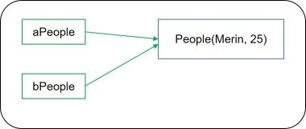

浅拷贝（shallow copy）与深拷贝（deep copy）有何区别？浅克隆与深克隆又有何区别？Object基类中受保护的（protected）clone( )方法与Cloneable接口又有何联系？

<!-- more -->

### 一、克隆对象

#### 1. 建立副本

在Java中，对于**基本数据类型**的变量，为其建立副本的过程较为简单。

```java
int a = 1; // 基本数据类型之一的int变量
b = a; // 变量b为变量a的副本，值与a相同，b = 1
```

如果为**引用类型**的变量建立副本，会发生什么呢？

```java
public class People {
    
    private String name;
	private int age;
	
    // get/set方法省略
    
	public People(String name, int age) {
		this.name = name;
		this.age = age;
	}

	public void print() {
		System.out.println("name = " + name + ", age = " + age);
	}
}
```

为 `People` 类实例化一个新对象 `aPeople`，并将其初始化。为 `aPeople` 建立副本，为 `bPeople`。

```java
public class ObjectCloneDemo {
	public static void main(String[] args) {
		People aPeople = new People("Merlin", 25);
		aPeople.print();
		People bPeople = aPeople; // 副本
		bPeople.print();
		bPeople.setAge(18); // 修改
		aPeople.print();
	}
}
```

尝试修改 `bPeople` ，发现 `aPeople` 的成员变量也随之发生变化。

```java
// 修改前
aPeople: name = Merlin, age = 25;
bPeople: name = Merlin, age = 25;
// 修改后
aPeople: name = Merlin, age = 18; // age发生变化
```

对象 `aPeople` 的 `age` 属性发生变化的原因在于， `People bPeople = aPeople` 语句是将 `aPeople` 的**内存地址**赋予 `bPeople` 。

`aPeople` 和 `bPeople` 同时指向**堆内存**中的同一地址。修改变量 `bPeople` 引用的对象的属性，会立即被 `aPeople` 看见。（注：字符串 `Merlin` 保存在常量池中，在此简化之。）



#### 2. 克隆对象

如上所述，为引用类型变量建立副本后，基于副本的操作也会影响到原始变量。

在Java的Object基类中，提供一种受保护的（protected）的**clone()**方法，实现克隆对象。


```java
public static void main(String[] args) {
		int[] array = {1, 2, 3, 4, 5};
		int[] cloneArray = array.clone(); // 数组均实现了Cloneable接口
		System.out.println(array); // 打印原始数组的内存地址
		System.out.println(cloneArray); // 打印克隆数组的内存地址
		System.out.println(array==cloneArray);
		
		int[] bArray = array;
		System.out.println(array); // 打印原始数组的内存地址
		System.out.println(bArray); // 打印==得到的数组的内存地址
		System.out.println(array==bArray);
	}

[I@15db9742
[I@6d06d69c
false
[I@15db9742
[I@15db9742
true
// 可见，==得到的新对象与原始对象指向同一堆内存地址，而clone()得到的新对象开辟了新的堆内存地址
```


### 二、深克隆和浅克隆

浅克隆：仅支持拷贝**基本数据类型的成员变量**：对基本数据类型的成员变量，复制值副本给克隆对象；对引用类型的成员变量，仅复制内存地址给克隆对象。

深克隆：支持拷贝**基本类型和引用类型的成员变量**：对基本数据类型和引用类型的成员变量，都是复制值副本给克隆对象。

*浅克隆*

```java
public class People implements Cloneable {
    // 其余代码同前
	@Override
	// 实现标记接口Cloneable，重写Object类的
	// clone方法，提高访问权限，调用父类的clone方法
	public Object clone() {
		People people = null;
		try {
			people = (People) super.clone();
		}catch (CloneNotSupportedException e) {
			e.printStackTrace();
		}
		return people;
	}
}

public static void main(String[] args) {
		People aPeople = new People("Merlin", 25);
		People bPeople = (People) aPeople.clone();
		// 尝试修改bPeople对象
		bPeople.setAge(18);
		// 发现修改bPeople对象的age属性，aPeople的age属性随之发生变化
		aPeople.print();
		bPeople.print();
		System.out.println(aPeople);
		System.out.println(bPeople);
	}

name = Merlin, age = 25;
name = Merlin, age = 18;
copy_object.People@15db9742
copy_object.People@6d06d69c // 克隆后，地址发生了改变
```

*浅克隆在面对引用变量（除String类型外）时面临的问题*

```java
public class City {
	
	private String city;
	
	public City(String city) {
		this.city = city;
	}

	public String getCity() {
		return city;
	}

	public void setCity(String city) {
		this.city = city;
	}
	
}

public class People implements Cloneable {
	
	private String name;
	private int age;
	private City city; // 引用类型的成员变量
	
	public People(String name, int age, City city) {
		this.name = name;
		this.age = age;
		this.city = city;
	}
	
	@Override
	public Object clone() {
		People people = null;
		try {
			people = (People) super.clone(); // 浅克隆
		}catch (CloneNotSupportedException e) {
			e.printStackTrace();
		}
		return people;
	}

	public String getName() {
		return name;
	}

	public void setName(String name) {
		this.name = name;
	}

	public int getAge() {
		return age;
	}

	public void setAge(int age) {
		this.age = age;
	}
	
	
	public City getCity() {
		return city;
	}

	public void setCity(City city) {
		this.city = city;
	}

	public void print() {
		System.out.print("name = " + name + ", age = " + age + ", city = " + city.getCity());
		System.out.println(";");
	}
}

public static void main(String[] args) {
		City city = new City("Shanghai");
		People aPeople = new People("Merlin", 25, city);
		People bPeople = (People) aPeople.clone();
		aPeople.print();
		bPeople.print();
		// 修改city变量
		city.setCity("Beijing");
		aPeople.print();
		bPeople.print();
	}

aPeople: name = Merlin, age = 25, city = Shanghai;
bPeople: name = Merlin, age = 25, city = Shanghai;
aPeople: name = Merlin, age = 25, city = Beijing;
bPeople: name = Merlin, age = 25, city = Beijing;
```

*深克隆*

```java
public class City implements Cloneable {
	
	private String city;
	
	public City(String city) {
		this.city = city;
	}

	public String getCity() {
		return city;
	}

	public void setCity(String city) {
		this.city = city;
	}
	
	@Override
	public Object clone() {
		City city = null;
		try {
			city = (City) super.clone(); // 浅克隆
		}catch(CloneNotSupportedException e) {
			e.printStackTrace();
		}
		return city;
	}
	
}

public class People implements Cloneable {
	
	private String name;
	private int age;
	private City city; // 引用类型的成员变量
	
	public People(String name, int age, City city) {
		this.name = name;
		this.age = age;
		this.city = city;
	}
	
	@Override
	public Object clone() {
		People people = null;
		try {
			people = (People) super.clone(); // 浅克隆
			people.city = (City) city.clone(); // 深克隆
		}catch (CloneNotSupportedException e) {
			e.printStackTrace();
		}
		return people;
	}

	public String getName() {
		return name;
	}

	public void setName(String name) {
		this.name = name;
	}

	public int getAge() {
		return age;
	}

	public void setAge(int age) {
		this.age = age;
	}
	
	
	public City getCity() {
		return city;
	}

	public void setCity(City city) {
		this.city = city;
	}

	public void print() {
		System.out.print("name = " + name + ", age = " + age + ", city = " + city.getCity());
		System.out.println(";");
	}
}

public static void main(String[] args) {
		City city = new City("Shanghai");
		People aPeople = new People("Merlin", 25, city);
		People bPeople = (People) aPeople.clone();
		aPeople.print();
		bPeople.print();
		// 修改city变量
		city.setCity("Beijing");
		aPeople.print();
		bPeople.print();
	}

aPeople: name = Merlin, age = 25, city = Shanghai;
bPeople: name = Merlin, age = 25, city = Shanghai;
aPeople: name = Merlin, age = 25, city = Beijing;
bPeople: name = Merlin, age = 25, city = Shanghai;
```


### 三、两种实现克隆方式的差异

#### 1. clone方法

实现Cloneable接口，重写Object类的clone()方法，并适当提高重写的clone()方法的访问权限

问题：

如上代码所示，在People类中存在引用类型City，因此在实现深度复制时，首先需要对City对象实现浅克隆，随后再实现深克隆。相当于克隆是嵌套的。

对于多层嵌套的引用类型，这一方法显然很麻烦。

于是采用序列化可简化深度克隆过程。

#### 2. 序列化

```java
public class City implements Serializable {
	
	private static final long serialVersionUID = 1L;
	
	private String city;
	
	public City(String city) {
		this.city = city;
	}

	public String getCity() {
		return city;
	}

	public void setCity(String city) {
		this.city = city;
	}
	
	@Override
	public Object clone() {
		City city = null;
		try {
			city = (City) super.clone(); // 浅克隆
		}catch(CloneNotSupportedException e) {
			e.printStackTrace();
		}
		return city;
	}
	
}

// 序列化
public class People implements Serializable {
	
	private static final long serialVersionUID = 1L;
	
	private String name;
	private int age;
	private City city; // 引用类型的成员变量
	
	public People(String name, int age, City city) {
		this.name = name;
		this.age = age;
		this.city = city;
	}
	
	public String getName() {
		return name;
	}

	public void setName(String name) {
		this.name = name;
	}

	public int getAge() {
		return age;
	}

	public void setAge(int age) {
		this.age = age;
	}
	
	
	public City getCity() {
		return city;
	}

	public void setCity(City city) {
		this.city = city;
	}

	public void print() {
		System.out.print("name = " + name + ", age = " + age + ", city = " + city.getCity());
		System.out.println(";");
	}
}

public static void main(String[] args) {
		City city = new City("Shanghai");
		People aPeople = new People("Merlin", 25, city);
		try {
			People bPeople = MyCloneUtil.deepClone(aPeople);
			aPeople.print();
			bPeople.print();
			// 修改city变量
			city.setCity("Beijing");
			aPeople.print();
			bPeople.print();
		}catch(Exception ex) {
			ex.printStackTrace();
		}
	}

aPeople: name = Merlin, age = 25, city = Shanghai;
bPeople: name = Merlin, age = 25, city = Shanghai;
aPeople: name = Merlin, age = 25, city = Beijing;
bPeople: name = Merlin, age = 25, city = Shanghai; 
```


参考资料

[1] [Java提高篇——对象克隆（复制）](https://www.cnblogs.com/Qian123/p/5710533.html)