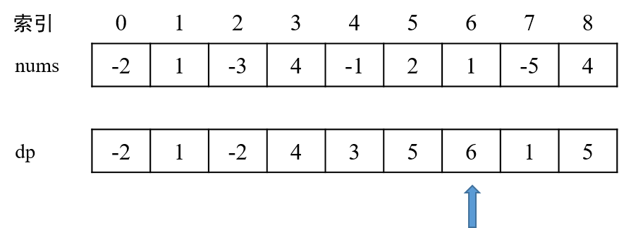

基于LeetCode[第53题](https://leetcode-cn.com/problems/maximum-subarray/ )，总结[动态规划](https://baike.baidu.com/item/%E5%8A%A8%E6%80%81%E8%A7%84%E5%88%92/529408?fr=aladdin)和[分治法](https://baike.baidu.com/item/%E5%88%86%E6%B2%BB%E6%B3%95/2407337?fr=aladdin)的解题思路，同时涉及经典的Kadane算法。

<!--more-->

#### 一、题目介绍

题目：求最大子序和。给定一个整数数组 `nums` ，找到一个具有最大和的连续子数组（子数组最少包含一个元素），返回其最大和。

用例：[-2, 1, -3, 4, -1, 2, 1, -5, 4]

正确输出结果：6


#### 二、动态规划法

在[五大常用算法之动态规划](https://merlinhu0112.github.io/2020/01/02/%E4%BA%94%E5%A4%A7%E5%B8%B8%E7%94%A8%E7%AE%97%E6%B3%95%E4%B9%8B%E5%8A%A8%E6%80%81%E8%A7%84%E5%88%92/)中学习了动态规划中首先需要确定的三个要素：

- 最优子结构

- 边界

- 状态转移方程


在本题中，对于数组 `nums` 中索引为 `i` 的元素，其**当前最大子序和**为下列二者中的较大者：

- 索引 `i-1` 处的当前最大子序和，加上索引 `i` 处的 `nums` 数组元素值；
- 索引 `i` 处的 `nums` 数组元素值。

设 `dp` 数组保存每个元素位置的**当前最大子序和**。

状态转移方程为：`dp[i] = max( (dp[i-1]+nums[i]), (nums[i]) )`；边界条件为：`dp[0] = nums[0]`。


算法过程的图示如下：




算法实现如下：

```java
public int maxSubArray(int[] nums) {
    int[] dp = new int[nums.length]; // dp数组存储nums数组每个元素位置的当前最大子序和
    dp[0] = nums[0]; // 边界条件
    for(int i=1; i<nums.length; i++) {
        dp[i] = Math.max((dp[i-1]+nums[i]), nums[i]); // 状态转移方程
    }

    int res = dp[0];
    for(int i=1; i<dp.length; ++i) {
        res = Math.max(dp[i], res); // 遍历dp数组，找出最大值
    }
    return res;
}
```

算法总结：

- 时间复杂度：O(n)
- 空间复杂度：O(n)


#### 三、Kadane算法

> Kadane算法是一种动态规划算法。

在上述动态规划算法中，使用 `dp` 数组保存数组 `nums` 所有位置的最大子序和。在经典的 kadane算法中，对此进行了优化。

Kadane算法采用两个辅助变量：

- currSum：当前位置 `i` 的最大子序和，对应的是 `dp` 中 `i` 位置的元素值；
- maxSum：保存全局最大子序和。


算法过程的图示如下：


算法实现如下：

```java
public int maxSubArray(int[] nums) {

    int currSum = nums[0];
    int maxSum = nums[0];

    for(int i=1; i<nums.length; i++) {
        currSum = Math.max((currSum+nums[i]), nums[i]);
        maxSum = Math.max(maxSum, currSum);
    }
    return maxSum;
}
```

算法总结：

- 时间复杂度：O(n)
- 空间复杂度：O(1)


#### 四、分治法

关于分治法求解过程，详见[五大常用算法之分治法](https://merlinhu0112.github.io/2020/02/26/%E4%BA%94%E5%A4%A7%E5%B8%B8%E7%94%A8%E7%AE%97%E6%B3%95%E4%B9%8B%E5%88%86%E6%B2%BB%E6%B3%95/)。


#### 五、算法性能总结：

暴力法的时间复杂度较高，为 O(n^3) 或 O(n^2)。

分治法的思路较为复杂，从是否跨越中间元素出发，将数组分为三个不会重合的子序列，对其分别求出最大子序和，取三者中的较大者即可。该算法的时间复杂度为 O(n log n)，空间复杂度为 O(log n)。

动态规划法的思路更加直观、易理解。算法性能也是最优的，时间复杂度可达 O(n)，空间复杂度为 O(1)。