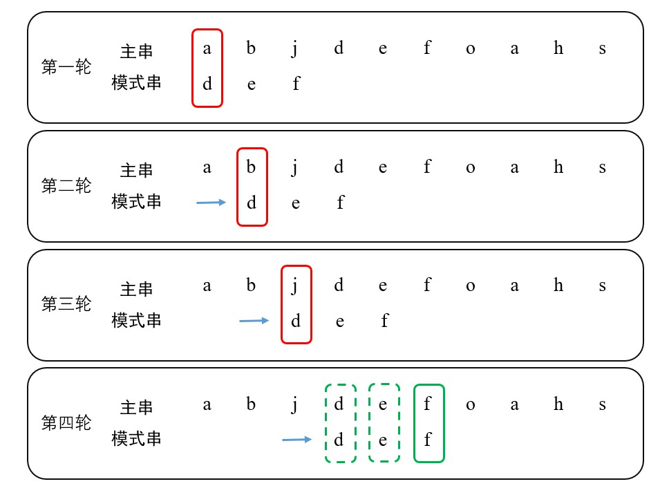
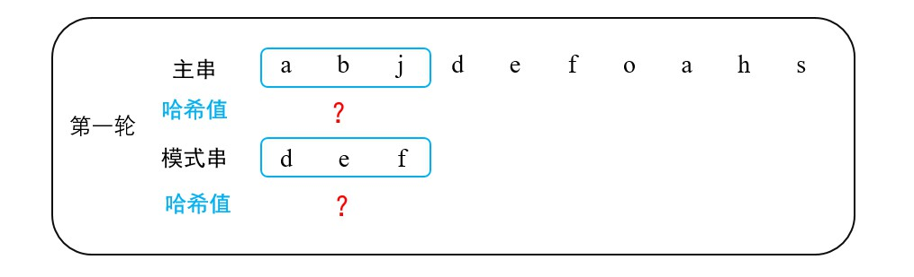
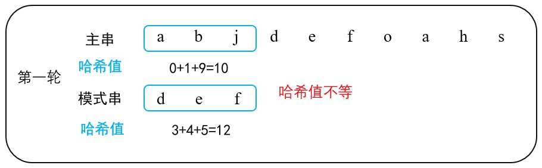
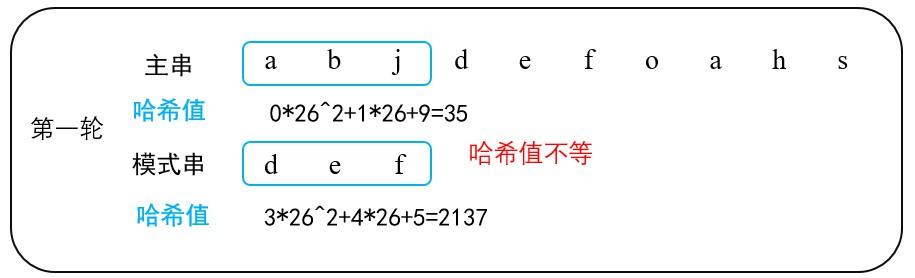
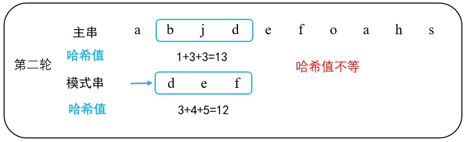
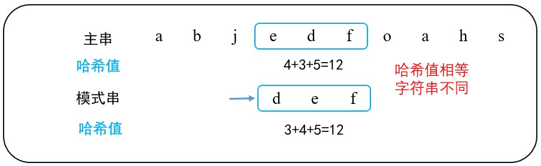
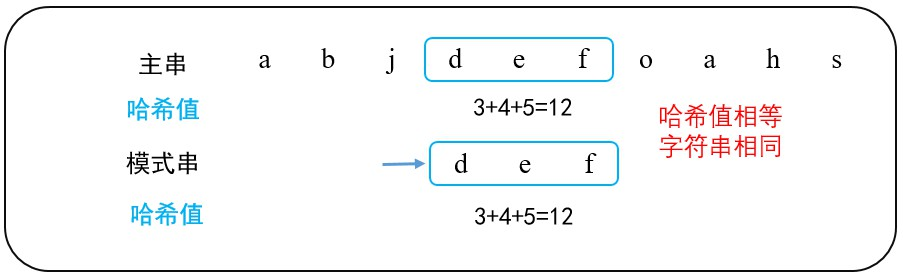

字符串匹配算法，给定主串（string）和模式串（pattern），要求返回模式串在主串中首次出现的位置，若无则返回 `-1` 。比如主串为 `abjdefoahs` ，模式串为 `def` ，算法返回结果为 `3` 。又比如主串为 `abjdfeoahs`，模式串为 `wyz` ，算法返回结果为 `-1` 。

常见的字符串匹配算法有：BF（Brute Force）、RK（Robin-Karp）、**KMP**、BM（Boyer Moore）、Sunday等。

<!-- more -->

### 一、BF算法

遇到任何困难，都不要怕，先试试暴力法！

#### 1. BF算法流程：

在前三轮中，模式串首位字符与主串对应位置字符不匹配，将模式串“向右移动一位”。在第四轮匹配中，模式串的首位字符与主串对应位置的字符匹配，则继续比较第二位，直到完成全部匹配。



#### 2. BF算法实现：

```java
/**
 * @param string 主串
 * @param pattern 模式串
 * @return 返回模式串在主串中首次出现的位置，若无则返回-1。
 */
public int bruteForce(String string, String pattern) {
    for(int i=0; i<=((string.length())-(pattern.length())); ++i) {
        int j = 0;
        while(j<pattern.length()) {
            if(string.charAt(i+j) != pattern.charAt(j)) {
                break;
            }
            j++;
        }
        if(j == pattern.length()) {
            return i;
        }
    }
    return -1;
}
```

#### 3. BF算法的性能

BF算法不需要前期预处理，它的时间复杂度取决于内外循环，为 `O ( ( m - n + 1 ) * n ) = O ( m * n )` 。其中， `m` 为主串长度， `n` 为 模式串长度。

---

### 二、RK算法

BF算法在最坏情况下，外层循环执行 `m - n + 1` 次，内层循环执行 `n` 次。RK（Robin-Karp）算法利用字符串本身，通过**比较字符串哈希值** 和 **逐位字符匹配** 相结合的方式，提高算法性能。

#### 1. RK算法流程

##### 1.1 计算模式串哈希值以及首次计算部分主串哈希值

计算长度为 `n` 的模式串的哈希值。

截取主串 `[0, n-1]` 段，**首次**计算部分主串哈希值



那么如何计算哈希值呢？

（1）按位相加

按位相加意指将字符串 `a - z` 视为 `0 - 25` ，取每一位字符的"和"。

示例如图：



算法实现如下：

```java
// 首次计算主串和模式串的哈希值
int firstHash(String str) {
    int hashcode = 0;
    // 这里采用最简单的哈希值计算方式：
    // 把a当做0，把b当中1，把c当中2.....然后按位相加
    for(int i = 0; i < str.length(); i++) { 
        hashcode += str.charAt(i)-'a'; 
    }
    return hashcode;
}
```

（2）转换成二十六进制

转换成二十六进制是指将字符串 `a - z` 视为 `0 - 25` ，且将每一位字符当成二十六进制数来计算。

示例如图：



算法实现如下：

```java
int d = 26;
// 用计算得到的哈希值对q取模，防止哈希值溢出
// q为满足(q*d < MAX_INT)的随机素数
int q = 144451;
// h标记字符串高位字符的基数
int h = 1;
// 主串的初始哈希值
int strCode = string.charAt(0)-'a';
// 模式串的初始哈希值
int patternCode = pattern.charAt(0)-'a';
// 首次计算主串和模式串的哈希值
for(int i=1; i<n; ++i) {
    strCode = (strCode * d + string.charAt(i)-'a') % q;
    patternCode = (patternCode * d + pattern.charAt(i)-'a') % q;
    h = (h * d) % q;
}
```

值得注意的是，为防止哈希值溢出，需要对其取模。

##### 1.2 比较哈希值

对每一轮计算得到的哈希值进行比较。

- 哈希值不等，模式串“向右移动一位“，重新计算主串部分的哈希值，模式串不变。

- 哈希值相等，进入逐位匹配。

##### 1.3 移动主串，重新计算主串部分哈希值

显然，第一轮两种哈希值计算方法得到的结果均不等，需要重新计算主串部分的哈希值。

在首次计算哈希值过程中，循环语句执行 `n` 次，即计算哈希值的算法时间复杂度为 `O (n)`。如果在**重新计算主串部分的哈希值**过程中**完全重新**计算，时间复杂度仍为 `O(n)`。

将模式串移动一位，**主串部分**去除首位元素并添加末位元素，中间部分并未改变。中间部分的哈希值保存在上一次计算结果当中。故，若是能利用上一次的哈希值计算本次哈希值，则**将时间复杂度优化为** `O(1)`。



（1）按位相加

按位相加计算哈希值的算法，其重新计算哈希值的过程较为简单：减去当前主串部分首位字符的值，再加上下一位待添加字符的值。

```java
int nextHash(String string, int hashCode, int index, int n){ 
    hashCode -= string.charAt(index)-'a'; // 减去当前主串部分首位字符的值
    hashCode += string.charAt(index+n)-'a'; // 加上下一位待添加字符的值
    return hashCode;
}
```

（2）二十六进制算法

按位相加计算哈希值的算法，其重新计算哈希值的过程稍复杂。变量 `h` 记录了字符串首位字符的基数，重新计算时，将其乘以首位字符的值，得到的是首位字符的哈希值。

```java
// 更新主串从i到i+n的哈希值
strCode = ((strCode - h*(string.charAt(i)-'a'))*d + (string.charAt(i+n)-'a')) % q;
if(strCode < 0) {
    strCode += q;
}
```

##### 1.4 逐位匹配

两个字符串的哈希值相同，并不意味着字符串一定相同，这是**哈希冲突**。



当字符串的哈希值相同时，仍需要进一步逐位匹配字符。

- 哈希值相同的两个字符串，逐位匹配成功，则返回结果。
- 否则，重新计算哈希值（步骤1.3）。

```java
// 因存在哈希冲突，当哈希值相同时，仍需要额外逐位比对字符串
boolean compareString(int start, String string, String pattern){ 
    String subString = string.substring(start, start+pattern.length());
    return subString.equals(pattern);
}
```



#### 2. RK算法的完整实现

##### 2.1 按位相加

```java
/**
 * @param string 主串
 * @param pattern 模式串
 * @return 返回模式串在主串中首次出现的位置，若无则返回-1。
 */
public static int robinKarp(String string, String pattern) {
    // 主串长度
    int m = string.length();
    // 模式串的长度
    int n = pattern.length();
    // 计算模式串的哈希值
    int patternCode = firstHash(pattern);
    // 计算主串当中第一个和模式串等长的子串哈希值
    int strCode = firstHash(string.substring(0, n));
    // 用模式串的哈希值和主串的局部哈希值比较。
    // 如果匹配，则进行精确比较；如果不匹配，计算主串中相邻子串的哈希值。
    // 外层循环的最大循环次数为 m-n+1。
    for (int i=0; i<m-n+1; i++) {
        if(strCode == patternCode && compareString(i, string, pattern)){
            return i; 
        }
        // 如果不是最后一轮，更新主串从i到i+n的哈希值
        if(i<m-n){
            strCode = nextHash(string, strCode, i, n); 
        } 
    }
    return -1;
}

// 首次计算主串和模式串的哈希值
private static int firstHash(String str) {
    int hashcode = 0;
    // 这里采用最简单的哈希值计算方式：
    // 把a当做0，把b当中1，把c当中2.....然后按位相加
    for(int i = 0; i < str.length(); i++) { 
        hashcode += str.charAt(i)-'a'; 
    }
    return hashcode;
}

private static int nextHash(String string, int hashCode, int index, int n){ 
    hashCode -= string.charAt(index)-'a'; 
    hashCode += string.charAt(index+n)-'a';
    return hashCode;
}

// 因存在哈希冲突，当哈希值相同时，仍需要额外逐位比对字符串
private static boolean compareString(int start, String string, String pattern){ 
    String subString = string.substring(start, start+pattern.length());
    return subString.equals(pattern);
}
```

##### 2.2 二十六进制法

```java
/**
 * @param string 主串
 * @param pattern 模式串
 * @return 返回模式串在主串中首次出现的位置，若无则返回-1。
 */
public static int improvedRobinKarp(String string, String pattern) {
    // 主串长度
    int m = string.length();
    // 模式串的长度
    int n = pattern.length();
    // 26个字母，二十六进制
    int d = 26;
    // 用计算得到的哈希值对q取模，防止哈希值溢出
    // q为满足(q*d < MAX_INT)的随机素数
    int q = 144451;
    // h标记字符串高位字符的基数
    int h = 1;

    // 主串的初始哈希值
    int strCode = string.charAt(0)-'a';
    // 模式串的初始哈希值
    int patternCode = pattern.charAt(0)-'a';

    // 首次计算主串和模式串的哈希值
    for(int i=1; i<n; ++i) {
        strCode = (strCode * d + string.charAt(i)-'a') % q;
        patternCode = (patternCode * d + pattern.charAt(i)-'a') % q;
        h = (h * d) % q;
    }

    // 用模式串的哈希值和主串的局部哈希值比较。
    // 如果匹配，则进行精确比较；如果不匹配，计算主串中相邻子串的哈希值。
    for (int i=0; i<m-n+1; i++) {
        if(strCode == patternCode && compareString(i, string, pattern)){
            return i; 
        }
        if(i < m-n) {
            // 更新主串从i到i+n的哈希值
            strCode = ((strCode - h*(string.charAt(i)-'a'))*d + (string.charAt(i+n)-'a')) % q;
        }
        if(strCode < 0) {
            strCode += q;
        }
    }
    return -1;
}

private static boolean compareString(int start, String string, String pattern){ 
    String subString = string.substring(start, start+pattern.length());
    return subString.equals(pattern);
}
```

#### 3. RK算法的性能

RK算法首次计算哈希值过程可视为预处理，其时间复杂度为 `O(n)`。优化后的重新计算哈希值的算法，其时间复杂度为 `O(1)`。

模式串的哈希值和主串的局部哈希值比较过程，在较好的情况下（即哈希冲突少），最大循环次数为 `m - n + 1`，故其时间复杂度为 `O( m - n + 1 )`。

综上，RK算法在**较好的情况下**，时间复杂度为 `O(m)`。

当然，RK算法也有不足。**当哈希冲突频繁时**，算法性能会下降（即RK算法性能不稳定），**严重时RK算法会退化成BF算法。**

---

### 参考资料

[1] [漫画：什么是字符串匹配算法？](https://blog.csdn.net/bjweimengshu/article/details/103966767)

[2] [面试算法之字符串匹配算法，Rabin-Karp算法详解](https://blog.csdn.net/tyler_download/article/details/52457108?depth_1-utm_source=distribute.pc_relevant.none-task&utm_source=distribute.pc_relevant.none-task)