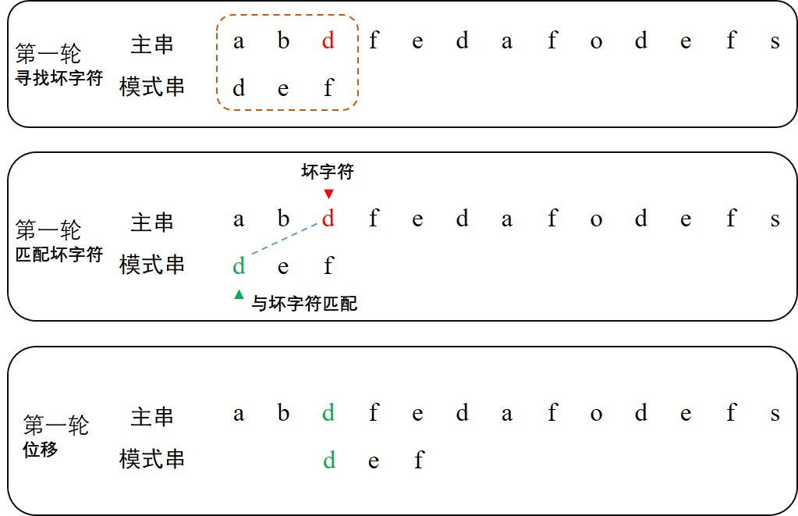
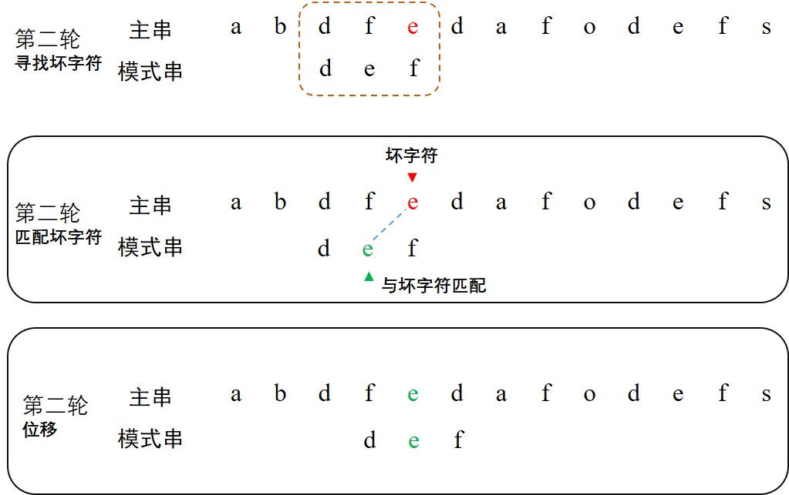
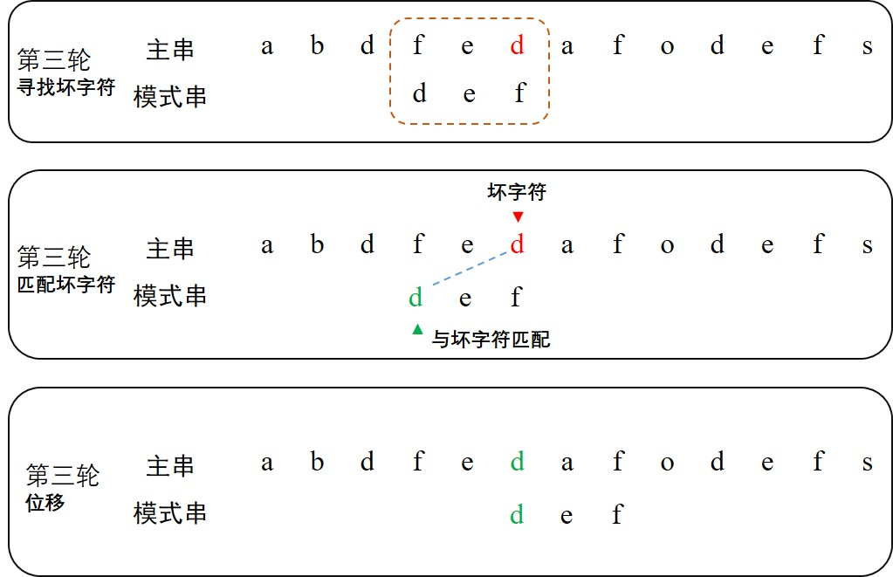
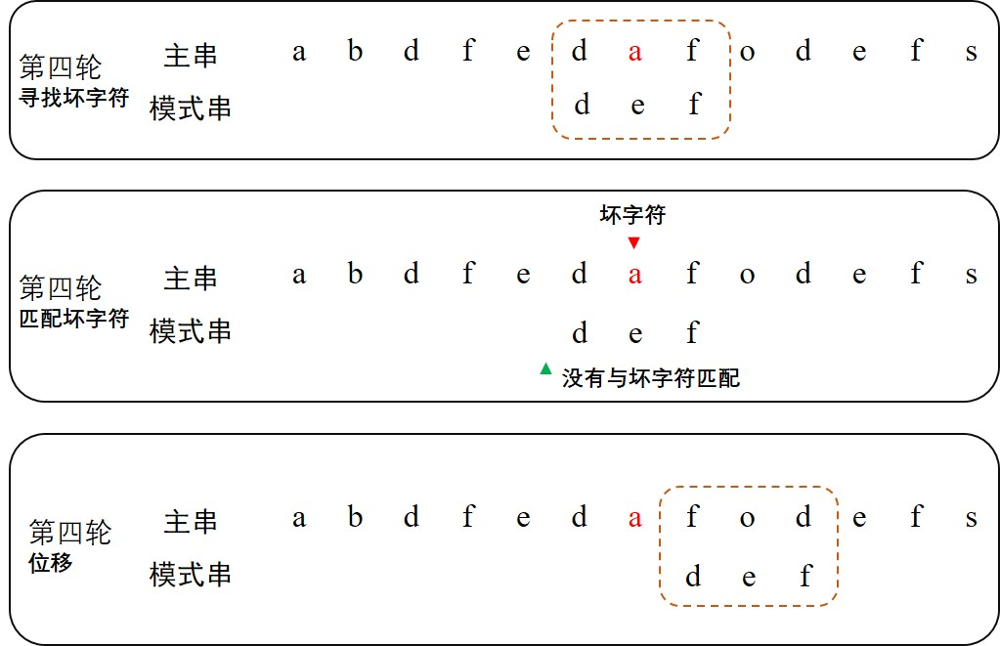
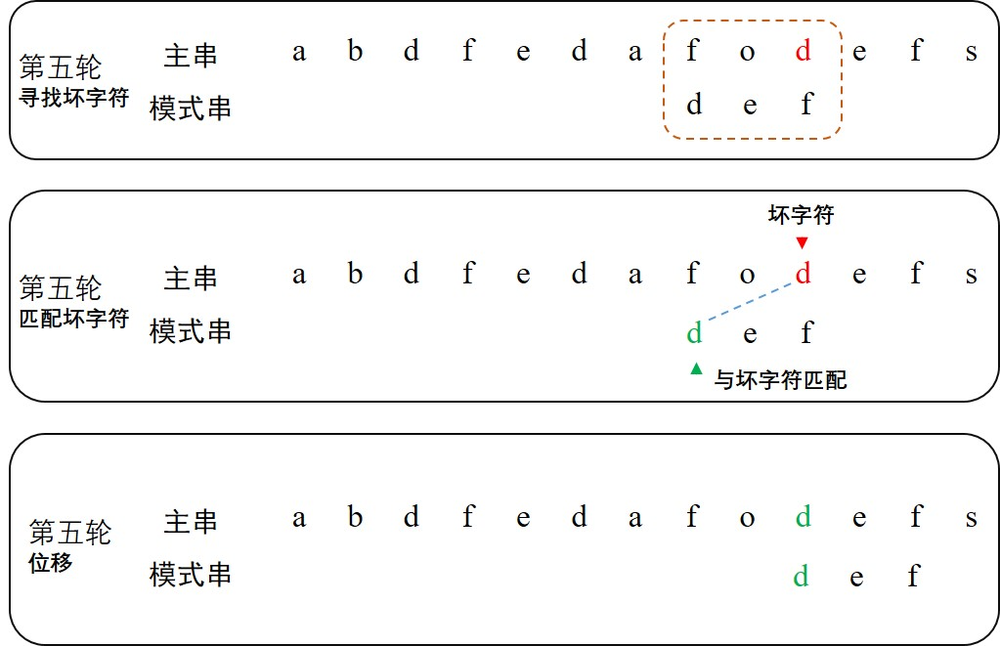
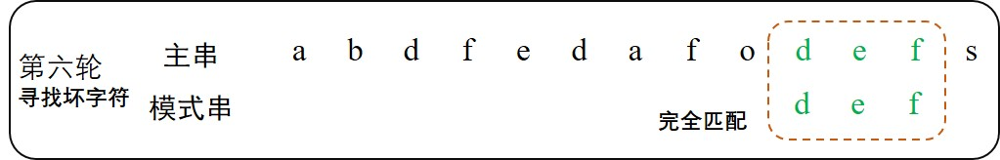

---

title: 字符串匹配之BM、KMP算法
comments: true
top: false
date: 2020-03-06
tags:
	- String Matching
	- BM
	- KMP
categories:
	- 算法
---

字符串匹配算法，给定主串（string）和模式串（pattern），要求返回模式串在主串中首次出现的位置，若无则返回 `-1` 。比如主串为 `abjdefoahs` ，模式串为 `def` ，算法返回结果为 `3` 。又比如主串为 `abjdfeoahs`，模式串为 `wyz` ，算法返回结果为 `-1` 。

常见的字符串匹配算法有：BF（Brute Force）、RK（Robin-Karp）、**KMP**、BM（Boyer Moore）、Sunday等。

<!-- more -->

### 一、BM算法

在[字符串匹配之BF、RK算法]()部分已学习了BF、RK两种算法。

BF算法过于暴力，时间复杂度较高。

RK算法针对BF算法进行了优化，在较好的示例中时间复杂度较好。但RK算法不稳定，当样本哈希冲突严重时，RK算法一路退化至BF算法。

本小节学习的BM算法时间复杂度仅为 `O( )`，且稳定，常用于文本编辑器中的查找功能。

在BM算法中，有两个非常重要的概念：**坏字符规则** 和 **好后缀规则**。

#### 1. 坏字符规则

坏字符规则是指，对于模式串和等长的主串子串，子串从右向左出现的第一个不与模式串对应位置字符匹配的子串字符，称之为坏字符。**根据坏字符在模式串中是否出现，将模式串移动不等距离**。

在第一轮中，从右向左第一个字符 `d` 就是坏字符。随后在模式串中同样地**从左向右**找到首个字符d。移动模式串不再像BF/RK算法那样单次移动一位，而是直接**将坏字符对齐**。




第二轮与第一轮相似。对比前两轮可发现，**每轮移动模式串的距离不一定是相等的！**这与坏字符的位置有关。

正是这一特性，有效降低了算法的比较次数，提高了性能。




第三轮类似。




第四轮中遇见**模式串中不存在坏字符**的情况，这时直接**将模式串移动至主串子串的坏字符下一位**。




第五轮类似。




第六轮，顺利完成匹配。




坏字符规则代码实现：

```java
/**
 * @param string 主串
 * @param pattern 模式串
 * @return 返回模式串在主串中首次出现的位置，若无则返回-1。
 */
int boyerMoore(String string, String pattern) {
    int m = string.length();
    int n = pattern.length();

    // 开始时，主串和模式串从0至pattern.length-1位一一对应
    int start = 0; // 模式串对应主串的起始位置

    while(start <= (m-n)) {
        // 从右往左寻找坏字符，其中坏字符位于主串
        int i;
        for(i = n-1; i >= 0; i--) {
            if(string.charAt(start+i) != pattern.charAt(i)) {
                break;
            }
        }

        // 未找到坏字符，即一一匹配，返回结果
        if(i < 0) {
            return start;
        }

        // 找到坏字符，确定模式串移动距离
        int badCharIndex = findBadCharacter(string.charAt(start+i), pattern, i); // 模式串中寻找坏字符从i-1开始
        // 计算坏字符产生的位移
        int offset = badCharIndex >= 0 ? i-badCharIndex : i+1;
        start += offset;
    }
    return -1;
}

/**
 * @param badChar 坏字符
 * @param pattern 模式串
 * @param start 坏字符索引
 * @return 返回模式串中坏字符的位置，不存在则返回-1
 */
int findBadCharacter(char badChar, String pattern, int start) {
    for(int i = start-1; i>=0; i--) {
        if( badChar == (pattern.charAt(i)) ) {
            return i;
        }
    }
    return -1;
}
```


---

### 参考资料

[1] [漫画：如何优化 “字符串匹配算法”？](https://blog.csdn.net/bjweimengshu/article/details/104368394)