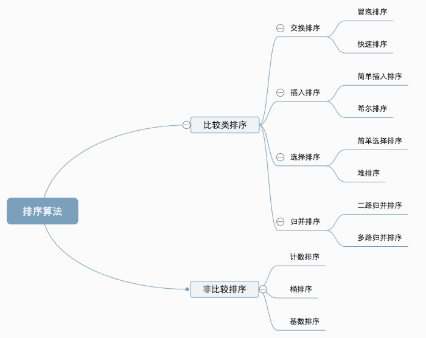
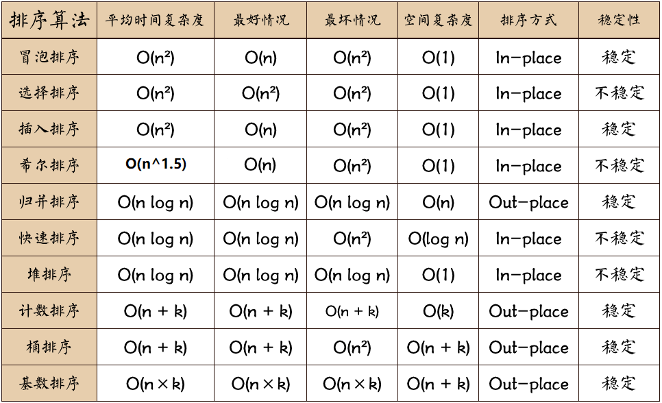

复习常用的排序算法，如冒泡排序、选择排序、插入排序、希尔排序、归并排序、堆排序、快速排序等。结合《剑指Offer》、LeetCode和面试题中涉及的单链表排序问题，使用多种排序算法分别实现单链表排序。

<!--more-->

本文主题结构转载自[十大经典排序算法（动图演示）](https://www.cnblogs.com/onepixel/p/7674659.html)，代码部分为自行实现。

>原文标题：十大经典排序算法（动图演示）
>
>作者：一像素
>
>原文链接：https://www.cnblogs.com/onepixel/p/7674659.html

---

#### 1. 概述

##### 1.1 常用排序算法分类

十种常见排序算法可以分为两大类：

- **比较类排序**：通过比较来决定元素间的相对次序，由于其时间复杂度不能突破**O(N logN)**，因此也称为**非线性时间**比较类排序。
- **非比较类排序**：不通过比较来决定元素间的相对次序，它可以突破基于比较排序的时间下界，以线性时间运行，因此也称为线性时间非比较类排序。



##### 1.2 算法性能总结



> **稳定**：如果a原本在b前面，而a=b，排序之后a仍然在b的前面。
>
> **不稳定**：如果a原本在b的前面，而a=b，排序之后 a 可能会出现在 b 的后面。

##### 1.3 单链表排序总结

- 对于冒泡、选择和插入排序，设置`tail`或`start`指针，标识**内循环**的终点或起点。

---

#### 2 算法实现

##### 2.1 冒泡排序

重复地遍历数组，每次循环结束，当前最大值会“浮动”至数组尾部（或当前最小值“浮动”至数组头部），称之为冒泡。

- 比较相邻的元素。如果第一个比第二个大，就交换它们两个。
- 对每一对相邻元素作同样的工作，从开始第一对到结尾的最后一对，这样在最后的元素应该会是最大的数。
- 针对所有的元素重复以上的步骤，除了最后一个。
- 重复步骤1~3，直到排序完成。


```java
void sort(int[] arr) {
    if(arr==null || arr.length==0) {
        return;
    }
    for(int i=1; i<arr.length; i++) {
        for(int j=0; j<arr.length-i; j++) {
            if(arr[j] > arr[j+1]) {
                Utils.exch(arr, j, j+1);
            }
        }
    }
}
```

---

##### 2.2 选择排序

核心：寻找剩余元素的最小者，并将其放置在数组前端对应位置。


 ```java
void sort(int[] arr) {
    if(arr==null) {
        return;
    }
    for(int i=0; i<arr.length; i++) {
        int min = i; // 当前内循环最小值索引
        // 内循环从i开始，即[0,i-1]区间已有序
        for(int j=i; j<arr.length; j++) {
            if(arr[j] < arr[min]) {
                min = j;
            }
        }
        int temp = arr[min];
        arr[min] = arr[i];
        arr[i] = temp;
    }
}
 ```

---

##### 2.3 插入排序

*算法思想*

- 从第一个元素开始，该元素可以认为已经被排序。
- 取出下一个元素，**在已经排序的元素序列中从后向前扫描**。
- 如果该元素（已排序）大于新元素，将该元素移到下一位置。
- 重复步骤3，直到找到已排序的元素小于或者等于新元素的位置。
- 将新元素插入到该位置后；
- 重复步骤2~5。


```java
void sort(int[] arr) {
    if(arr==null) {
        return;
    }
    // 从第一个元素开始，该元素可以认为已经被排序。
    for(int i=1; i<arr.length; i++) {
        int temp;
        // 取出下一个元素，在已经排序的元素序列中从后向前扫描。
        for(int j=i; j>0 && (arr[j] < arr[j-1]); j--) {
            temp = arr[j];
            arr[j] = arr[j-1];
            arr[j-1] = temp;
        }
    }
}
```


**改进**：在内循环中，较大的元素向右移动，而不是频繁交换。

```java
void sort(int[] arr) {
    if(arr==null) {
        return;
    }
    // 从第一个元素开始，该元素可以认为已经被排序。
    for(int i=1; i<arr.length; i++) {
        int temp = arr[i];
        int j;
        // 取出下一个元素，在已经排序的元素序列中从后向前扫描。
        // 通过内循环找到temp插入的位置
        for(j=i; j>0 && (temp < arr[j-1]); j--) {
            arr[j] = arr[j-1];
        }
        arr[j] = temp;
    }
}
```

---

##### 2.4 希尔排序

> 基于插入排序，分为间隔为h的小序列，通过使小序列依次有序从而实现排序。

- 选择一个增量序列h，如1, 4, 13, 40, ... 。

- 按增量序列个数k，对序列进行k趟排序。
- 每趟排序，根据对应的增量值h，将待排序列分割成若干长度为m的子序列，分别对各子表进行**直接插入排序**。当h=1时，完成排序。


```java
void sort(int[] arr) {
    if(arr==null) {
        return;
    }
    int len = arr.length;
    int h = 1;
    int temp;
    while(h < len/3) {
        h = 3*h + 1; // 设置间隔h的递增序列为1, 4, 13, 40, ...
    }
    while(h>=1) {
        for(int i=h; i<len; i++) {
            for(int j=i; j>=h && (arr[j] < arr[j-h]); j-=h) {
                temp = arr[j];
                arr[j] = arr[j-h];
                arr[j-h] = temp;
            }
        }
        h = h/3;
    }
}
```


---

#### 3. 单链表排序

*单链表的节点结构为*

```java
class ListNode {
	int val;
	ListNode next;
	public ListNode(int val) {
		this.val = val;
		this.next = null;
	}
}
```


##### 3.1 单链表冒泡排序

使用辅助的`tail`指针标定每一次内循环的结束位置，且在内循环结束后将其置为前驱节点的索引，直至`tail==head`时完成排序。

考虑到在最后一定次数的内循环中，数组已经有序。通过`count`交换次数计数器来判断是否数组是否已有序，以提高算法性能。

```java
void sort(ListNode head) {
    if(head==null) {
        return;
    }

    ListNode p;
    ListNode tail = null; // 标记内循环的结束位置
    int temp;
    int count; // 记录每次内循环时交换元素的次数
    while(tail!=head) {
        count = 0;
        p = head; // 内循环总是从头节点开始
        while(p.next!=tail) {
            if(p.val > p.next.val) {
                temp = p.val;
                p.val = p.next.val;
                p.next.val = temp;
                count++;
            }
            p = p.next;
        }
        // 内循环结束时，p指针位置是
        // 下一轮内循环tail指针的位置
        tail = p;
        // 经过一次内循环，count仍为0，
        // 说明未发生交换，即链表已有序。
        if(count==0) {
            return;
        }
    }
}
```

---

##### 3.2 单链表选择排序

同样使用辅助指针`start`，只是这次辅助指针标识内循环的起始节点，即`head`节点和`start`前驱节点是局部有序的。

```java
void sort(ListNode head) {
    if(head==null) {
        return;
    }
    ListNode p;
    ListNode start = head; // 内循环起始节点
    ListNode minNode; // 当前内循环最小值节点
    int temp;
    while(start.next!=null) {
        minNode = start;
        p = start.next;
        while(p!=null) {
            if(p.val < minNode.val) {
                minNode = p;
            }
            p = p.next;
        }
        // 结束内循环，交换元素
        temp = start.val;
        start.val = minNode.val;
        minNode.val = temp;
        start = start.next; // 每结束一次内循环，起始节点变为后继节点
    }
}
```

---

##### 3.3 单链表插入排序

```java
void sort(ListNode head) {
    if(head==null) {
        return;
    }
    ListNode tail = head.next; // 内循环结束节点
    ListNode p;
    int temp;
    while(tail!=null) {
        p = head; // 内循环每次从头节点开始
        while(p!=tail) {
            if(p.val > tail.val) {
                temp = p.val;
                p.val = tail.val;
                tail.val = temp;
            }
            p = p.next;
        }
        tail = tail.next;
    }
}
```

---

##### 3.4 单链表希尔排序


---

#### 参考资料

[1] https://blog.csdn.net/weixin_41190227/article/details/86600821